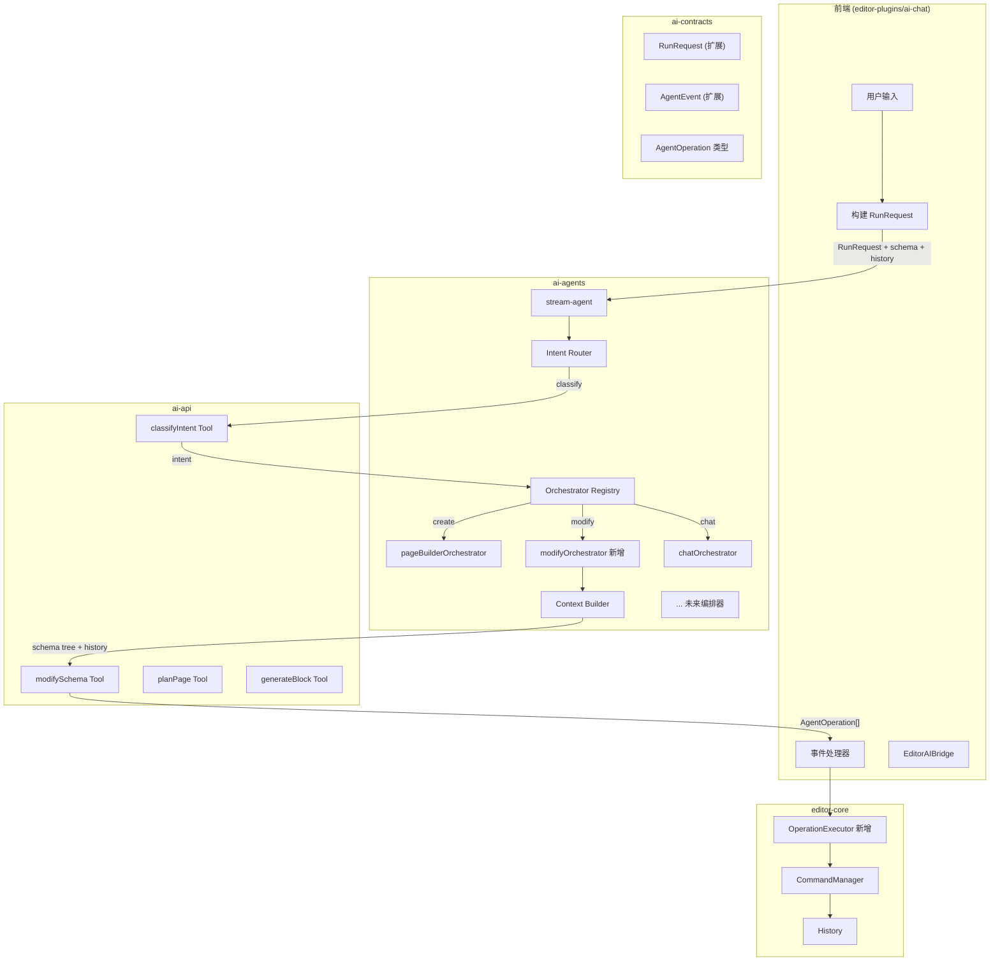

# 对话式修改系统 — 面向扩展的完整架构方案

## 现状分析

当前系统有一条完整的生成管线，但存在四个结构性缺陷：

1. **无意图路由** — 所有请求都走 `pageBuilderOrchestrator`（硬编码的 `hasPageBuilderTools` 判断）
2. **对话历史断路** — `AgentMemoryStore` 已存历史，`AgentRuntimeContext.recentConversation` 已有字段，但所有 prompt 构建函数**完全不使用它**
3. **Schema 上下文太薄** — 只传 `pageId=xxx; nodeCount=N; components=...` 摘要，LLM 看不到页面结构
4. **只有"全量替换"一种输出模式** — 无论改一个字还是建整页，都走 plan→generate→assemble→schema.replace

## 核心设计理念

### "操作指令"作为一等公民

关键洞察：AI 的输出不应该只是"一个完整的 PageSchema"，而应该是**一组操作指令**。全量生成只是操作指令的一种特例（`schema.replace`）。

```
当前：  LLM → PageSchema → schema.replace（唯一路径）
目标：  LLM → AgentOperation[] → 逐条执行（灵活路径）
         ├─ schema.replace（全量生成）
         ├─ schema.patchProps（修改属性）
         ├─ schema.insertNode（插入节点）
         ├─ schema.removeNode（删除节点）
         └─ file.create / file.update（未来：多文件）
```

### 编排器注册制

不再硬编码 `if (hasPageBuilderTools)` 选择编排器，而是引入**编排器注册表**，新编排器只需注册即可接入：

```
当前：  hasPageBuilderTools ? pageBuilder : chat （二选一）
目标：  classifyIntent → orchestratorRegistry.resolve(intent) → execute
```

### 分层职责不变

严格遵循现有分层：

```
ai-contracts   — 定义类型（AgentOperation、AgentEvent 扩展、RunRequest 扩展）
ai-agents      — 编排逻辑（意图路由、编排器注册表、上下文构建）
ai-api         — LLM 实现（prompt 构建、工具实现、模型调用）
editor-core    — 编辑器域模型（命令系统不变，新增操作执行器）
editor-plugins — 插件适配（ai-chat 传完整 schema、处理新事件）
```

---

## 整体架构




---

## Phase 0: 契约层扩展

**目标**：定义所有新类型，不改任何逻辑，让后续各层有类型可依赖。

### 改动文件：[packages/ai-contracts/src/index.ts](packages/ai-contracts/src/index.ts)

#### 0.1 AgentOperation — 操作指令类型

```typescript
export type AgentOperation =
  | { op: 'schema.patchProps'; nodeId: string; patch: Record<string, unknown> }
  | { op: 'schema.patchStyle'; nodeId: string; patch: Record<string, unknown> }
  | { op: 'schema.patchEvents'; nodeId: string; patch: Record<string, unknown> }
  | { op: 'schema.patchLogic'; nodeId: string; patch: Record<string, unknown> }
  | { op: 'schema.insertNode'; parentId: string; index?: number; node: SchemaNode }
  | { op: 'schema.removeNode'; nodeId: string }
  | { op: 'schema.replaceNode'; nodeId: string; node: SchemaNode }
  | { op: 'schema.replace'; schema: PageSchema };
```

说明：`op` 使用 `namespace.action` 格式（`schema.*`），未来扩展 `file.*`、`api.*` 等不会冲突。

#### 0.2 RunRequest 扩展

```typescript
export interface RunRequest {
  prompt: string;
  conversationId?: string;
  selectedNodeId?: string;
  // ... existing fields
  context: {
    schemaSummary: string;
    componentSummary: string;
    schemaJson?: PageSchema;       // 新增：完整 schema（修改场景）
    workspaceFileIds?: string[];   // 预留：工作区文件列表
  };
}
```

#### 0.3 AgentEvent 扩展

```typescript
export type AgentEvent =
  // ... 现有事件不变
  | { type: 'intent'; data: { intent: AgentIntent; confidence: number } }
  | { type: 'modify:start'; data: { operationCount: number; explanation: string } }
  | { type: 'modify:op'; data: { index: number; operation: AgentOperation; ok: boolean } }
  | { type: 'modify:done'; data: { schema: PageSchema } };

export type AgentIntent = 'create' | 'modify' | 'chat';
```

#### 0.4 ModifyResult — 修改 LLM 输出格式

```typescript
export interface ModifyResult {
  explanation: string;
  operations: AgentOperation[];
}
```

---

## Phase 1: ai-agents 层 — 意图路由与编排器注册

### 1.1 编排器注册表

**新增文件**：`packages/ai-agents/src/orchestrators/registry.ts`

```typescript
export interface OrchestratorRegistration {
  id: string;
  intents: AgentIntent[];     // 该编排器能处理的意图
  canHandle?(context: AgentRuntimeContext, deps: AgentRuntimeDeps): boolean;
  orchestrate: OrchestratorFunction;
}

export type OrchestratorFunction = (
  request: RunRequest,
  context: AgentRuntimeContext,
  deps: AgentRuntimeDeps,
  metadata: RunMetadata,
) => AsyncGenerator<AgentEvent>;

export function createOrchestratorRegistry(): OrchestratorRegistry { ... }
```

现有的 `pageBuilderOrchestrator` 和 `chatOrchestrator` 只需包装为 `OrchestratorRegistration` 注册进去。新增 `modifyOrchestrator` 同理。选择逻辑变为：

```
1. classifyIntent → 得到 intent
2. registry.findAll(intent) → 候选编排器列表
3. 逐个调用 canHandle() → 选第一个返回 true 的
4. 执行选中的编排器
```

**扩展性**：未来要加 `apiOrchestrator`，只需注册 `{ id: 'api-builder', intents: ['create-api'], orchestrate: ... }`。

### 1.2 意图分类

**新增文件**：`packages/ai-agents/src/intent/classify-intent.ts`

这是一个**AgentTool**，由 ai-api 提供实现（因为涉及 LLM 调用），ai-agents 只定义接口：

```typescript
export interface IntentClassification {
  intent: AgentIntent;
  confidence: number;
  reasoning?: string;
}

export interface ClassifyIntentInput {
  prompt: string;
  hasExistingSchema: boolean;
  isFirstTurn: boolean;
  selectedNodeId?: string;
  recentConversation: AgentMemoryMessage[];
}
```

### 1.3 AgentRuntimeContext 增强

**改动文件**：[packages/ai-agents/src/types.ts](packages/ai-agents/src/types.ts)

```typescript
export interface AgentRuntimeContext {
  prompt: string;
  selectedNodeId?: string;
  
  // 文档上下文（取代薄弱的 schemaSummary）
  document: {
    exists: boolean;          // 是否有现有 schema
    summary: string;          // 原 schemaSummary（兼容）
    tree?: string;            // 结构化树形表示（新增）
    schema?: PageSchema;      // 完整 schema（新增）
  };
  
  componentSummary: string;
  
  // 对话上下文（强化）
  conversation: {
    history: AgentMemoryMessage[];   // 原 recentConversation
    turnCount: number;               // 第几轮对话
    lastOperations?: AgentOperation[]; // 上一轮执行的操作
  };
  
  lastRunMetadata?: RunMetadata;
  lastBlockIds: string[];
}
```

### 1.4 build-context 增强

**改动文件**：[packages/ai-agents/src/context/build-context.ts](packages/ai-agents/src/context/build-context.ts)

从 `BuildContextInput` 中提取完整信息，填充增强后的 `AgentRuntimeContext`。

### 1.5 stream-agent 路由改造

**改动文件**：[packages/ai-agents/src/runtime/stream-agent.ts](packages/ai-agents/src/runtime/stream-agent.ts)

```typescript
export async function* runAgentStream(
  request: RunRequest,
  deps: AgentRuntimeDeps,
): AsyncGenerator<AgentEvent> {
  // ... existing setup
  const context = buildRuntimeContext({ ... });
  
  // 意图分类（替代 hasPageBuilderTools 判断）
  const classifyIntent = deps.tools.get('classifyIntent');
  let intent: AgentIntent = 'create';  // fallback
  if (classifyIntent) {
    const result = await classifyIntent.execute({ ... });
    intent = result.intent;
    yield { type: 'intent', data: result };
  } else {
    // 降级：使用原有逻辑
    intent = hasPageBuilderTools(deps) ? 'create' : 'chat';
  }
  
  // 编排器选择
  const orchestrator = deps.orchestratorRegistry.resolve(intent, context);
  for await (const event of orchestrator(request, context, deps, metadata)) {
    yield event;
  }
}
```

**兼容性**：如果 `classifyIntent` 工具不存在，降级为原有的 `hasPageBuilderTools` 逻辑，确保不破坏现有功能。

---

## Phase 2: Schema 树序列化 + 对话历史格式化

### 2.1 Schema 树序列化

**新增文件**：`packages/ai-agents/src/context/schema-tree.ts`

将 `PageSchema` 转为紧凑树形文本，LLM 能看到页面结构并通过 nodeId 定位：

```
[body]
  Row#row-1
    Col#col-1(span=12)
      Card#card-1(title="用户统计")
        Statistic#stat-1(title="总用户数", value="{{state.total}}")
    Col#col-2(span=12)
      Table#table-1(columns=5, dataSource="{{state.users}}")
[dialogs]
  Modal#modal-1(title="编辑用户")
    Form#form-1 → 3 children
```

设计要点：

- 每个节点：`ComponentType#id(关键props)`
- "关键 props" 由组件类型决定（Card→title, Table→columns/dataSource, Form.Item→label 等）
- 通过 `maxDepth` 和 `maxNodes` 控制 token 消耗
- 深层节点折叠为 `→ N children`
- 提供 `serializeSchemaTree(schema, options?)` 和 `serializeNode(node, depth)` 两级 API

### 2.2 对话历史格式化

**新增文件**：`packages/ai-agents/src/context/conversation-history.ts`

```typescript
export interface FormatHistoryOptions {
  maxTurns?: number;       // 默认 6
  maxCharsPerTurn?: number; // 默认 500
  includeOperations?: boolean; // 是否包含操作记录
}

export function formatConversationHistory(
  messages: AgentMemoryMessage[],
  options?: FormatHistoryOptions,
): string
```

输出示例：

```
[对话历史 - 共 3 轮]
---
用户: 帮我做一个用户管理页面
助手: 已生成用户管理页面，包含搜索表单和用户数据表格。
      [操作: schema.replace → 整页生成]
---
用户: 表格加一列"操作"，里面放编辑和删除按钮
助手: 已在表格末尾添加"操作"列。
      [操作: schema.patchProps(table-1) → 修改 columns]
---
```

---

## Phase 3: 修改编排器（核心）

### 3.1 modifyOrchestrator

**新增文件**：`packages/ai-agents/src/orchestrators/modify-orchestrator.ts`

```typescript
export async function* modifyOrchestrator(
  request: RunRequest,
  context: AgentRuntimeContext,
  deps: AgentRuntimeDeps,
  metadata: RunMetadata,
): AsyncGenerator<AgentEvent> {
  const modifySchema = getRequiredTool<ModifySchemaInput, ModifyResult>(deps, 'modifySchema');
  
  yield { type: 'message:start', data: { role: 'assistant' } };
  yield { type: 'tool:start', data: { tool: 'modifySchema', label: 'Analyzing modification' } };
  
  const result = await modifySchema.execute({
    request,
    context,  // 包含 document.tree、conversation.history 等
  });
  
  yield { type: 'tool:result', data: { tool: 'modifySchema', ok: true, summary: result.explanation } };
  yield { type: 'message:delta', data: { text: result.explanation } };
  yield { type: 'modify:start', data: { operationCount: result.operations.length, explanation: result.explanation } };
  
  for (const [index, operation] of result.operations.entries()) {
    yield { type: 'modify:op', data: { index, operation, ok: true } };
  }
  
  // 获取修改后的 schema（由前端 bridge 执行操作后回传，或在此组装）
  yield { type: 'modify:done', data: { schema: applyOperations(context.document.schema, result.operations) } };
}
```

### 3.2 modifySchema Tool 实现

**改动文件**：[apps/ai-api/src/runtime/agent-runtime.ts](apps/ai-api/src/runtime/agent-runtime.ts)

新增 `modifySchema` 工具，核心是构建修改场景的 prompt：

System prompt 关键内容：

- 角色定义：页面修改助手
- 当前页面结构（schema tree）
- 对话历史（formatted conversation）
- 可用操作列表及格式说明
- 组件契约（仅涉及到的组件）
- 输出格式：`{ explanation, operations[] }`
- 规则：nodeId 必须存在、props 必须符合契约、操作数最小化

**注册到 createRuntimeDeps**：

```typescript
tools: createToolRegistry([
  // ... 现有工具
  {
    name: 'classifyIntent',
    async execute(input) { return classifyIntentWithModel(input); },
  },
  {
    name: 'modifySchema',
    async execute(input) { return modifySchemaWithModel(input); },
  },
]),
```

### 3.3 注册编排器

```typescript
// 在 stream-agent.ts 或新的初始化代码中
const registry = createOrchestratorRegistry();
registry.register({
  id: 'page-builder',
  intents: ['create'],
  canHandle: (ctx, deps) => hasPageBuilderTools(deps),
  orchestrate: pageBuilderOrchestrator,
});
registry.register({
  id: 'page-modifier',
  intents: ['modify'],
  canHandle: (ctx, deps) => Boolean(deps.tools.get('modifySchema')) && ctx.document.exists,
  orchestrate: modifyOrchestrator,
});
registry.register({
  id: 'chat',
  intents: ['chat'],
  orchestrate: chatOrchestrator,
});
```

---

## Phase 4: 前端集成

### 4.1 发送完整 Schema

**改动文件**：[packages/editor-plugins/ai-chat/src/hooks/useAgentRun.ts](packages/editor-plugins/ai-chat/src/hooks/useAgentRun.ts)

```typescript
const schema = bridgeRef.current.getSchema();
const request: RunRequest = {
  prompt,
  conversationId,
  selectedNodeId,
  context: {
    schemaSummary: summarizeSchema(schema),
    componentSummary: summarizeComponents(contracts),
    schemaJson: schema,  // 新增
  },
};
```

### 4.2 处理修改事件

**改动文件**：[packages/editor-plugins/ai-chat/src/hooks/useAgentRun.ts](packages/editor-plugins/ai-chat/src/hooks/useAgentRun.ts) 或相关事件处理

新增事件处理逻辑（在现有 `processEvent` switch 中扩展）：

```typescript
case 'intent':
  // 可选：UI 显示意图分类结果
  break;

case 'modify:start':
  // 记录 pre-modification schema 用于回滚
  preModificationSchema = bridge.getSchema();
  break;

case 'modify:op':
  // 将 AgentOperation 映射为 editor command 并执行
  executeAgentOperation(bridge, event.data.operation);
  break;

case 'modify:done':
  // 修改完成，更新状态
  break;
```

### 4.3 AgentOperation → Editor Command 映射

**新增文件**：`packages/editor-plugins/ai-chat/src/ai/operation-executor.ts`

```typescript
export async function executeAgentOperation(
  bridge: EditorAIBridge,
  operation: AgentOperation,
): Promise<void> {
  switch (operation.op) {
    case 'schema.patchProps':
      // nodeId 是 schema node id，需转换为 treeId
      await bridge.execute('node.patchProps', {
        treeId: resolveTreeId(bridge.getSchema(), operation.nodeId),
        patch: operation.patch,
      });
      break;
    case 'schema.insertNode':
      await bridge.execute('node.insertAt', {
        parentTreeId: resolveTreeId(bridge.getSchema(), operation.parentId),
        index: operation.index ?? -1,
        node: operation.node,
      });
      break;
    case 'schema.removeNode':
      await bridge.execute('node.remove', {
        treeId: resolveTreeId(bridge.getSchema(), operation.nodeId),
      });
      break;
    case 'schema.replace':
      bridge.replaceSchema(operation.schema);
      break;
    // ... 其他操作
  }
}
```

关键点：`nodeId`（schema 中的 id 字段）和 `treeId`（editor-core 中的路径如 `body.0.children.1`）之间需要转换。editor-core 已提供 `getTreeIdBySchemaNodeId(schema, schemaNodeId)` 工具函数。

---

## Phase 5: Memory 增强

### 5.1 结构化 Memory

**改动文件**：[packages/ai-agents/src/types.ts](packages/ai-agents/src/types.ts)

```typescript
export interface AgentMemoryMessage {
  role: 'user' | 'assistant';
  text: string;
  // 新增：结构化元数据
  meta?: {
    intent?: AgentIntent;
    operations?: AgentOperation[];
    schemaDigest?: string;  // schema 的 hash 或紧凑摘要
  };
}
```

### 5.2 记录修改操作

**改动文件**：[packages/ai-agents/src/runtime/stream-agent.ts](packages/ai-agents/src/runtime/stream-agent.ts)

在 `done` 后 append assistant 消息时，将本轮的 `intent` 和 `operations` 写入 `meta`：

```typescript
await deps.memory.appendConversationMessage(conversationId, {
  role: 'assistant',
  text: assistantText,
  meta: {
    intent,
    operations: collectedOperations,  // 从 modify:op 事件中收集
  },
});
```

这样下一轮对话时，`formatConversationHistory` 可以展示"上一轮做了什么"，LLM 能理解修改脉络。

---

## 扩展性分析

### 场景 A：新增/切换文件（每个页面是一个文件）

- `AgentOperation` 扩展 `file.*` 命名空间：

```typescript
| { op: 'file.create'; name: string; schema: PageSchema }
| { op: 'file.open'; fileId: string }
| { op: 'file.save'; fileId?: string }
```

- `operation-executor.ts` 中增加对应的 `bridge.execute('file.saveAs', ...)` 调用
- 现有的 `FileStorageAdapter` 和 `file.*` 命令已就绪

### 场景 B：API / 后端代码生成

- 定义新制品类型：`AgentRuntimeContext.document.type = 'api-spec' | 'backend-service'`
- 新编排器：`apiBuilderOrchestrator`
- 新 intent：`'create-api'`、`'modify-api'`
- 新 AgentOperation：`api.addEndpoint`、`api.modifyEndpoint`
- 编排器注册表自然容纳，不需要改 stream-agent

### 场景 C：前后台混合生成

- 一个"复合编排器" `fullStackOrchestrator` 内部组合调用 page 和 api 相关工具
- 或者一个 meta-orchestrator 串联多个子编排器
- `AgentOperation` 的命名空间天然支持混合操作（`schema.*` + `api.*`）

---

## 改动文件汇总


| 类型  | 文件                                                             | 说明                                             |
| --- | -------------------------------------------------------------- | ---------------------------------------------- |
| 新增  | `packages/ai-agents/src/orchestrators/registry.ts`             | 编排器注册表                                         |
| 新增  | `packages/ai-agents/src/orchestrators/modify-orchestrator.ts`  | 修改编排器                                          |
| 新增  | `packages/ai-agents/src/intent/classify-intent.ts`             | 意图分类接口                                         |
| 新增  | `packages/ai-agents/src/context/schema-tree.ts`                | Schema 树序列化                                    |
| 新增  | `packages/ai-agents/src/context/conversation-history.ts`       | 对话历史格式化                                        |
| 新增  | `packages/editor-plugins/ai-chat/src/ai/operation-executor.ts` | 操作指令执行器                                        |
| 修改  | `packages/ai-contracts/src/index.ts`                           | AgentOperation、AgentEvent、RunRequest 类型扩展      |
| 修改  | `packages/ai-agents/src/types.ts`                              | AgentRuntimeContext 增强、AgentMemoryMessage meta |
| 修改  | `packages/ai-agents/src/context/build-context.ts`              | 构建增强后的 context                                 |
| 修改  | `packages/ai-agents/src/runtime/stream-agent.ts`               | 意图路由、编排器选择                                     |
| 修改  | `apps/ai-api/src/runtime/agent-runtime.ts`                     | classifyIntent/modifySchema tool 实现与注册         |
| 修改  | `apps/ai-api/src/routes/validate.ts`                           | 校验 RunRequest 新字段                              |
| 修改  | `packages/editor-plugins/ai-chat/src/hooks/useAgentRun.ts`     | 传完整 schema、处理新事件                               |


## 不改动的部分

- `editor-core` 的命令系统、History、EventBus — 已经足够完善
- `editor-ui` 的 Shell 布局和插件系统 — 不需要改
- `FileStorageAdapter` — 已有的抽象足够
- 现有的 `pageBuilderOrchestrator` — 包装注册即可，逻辑不改

