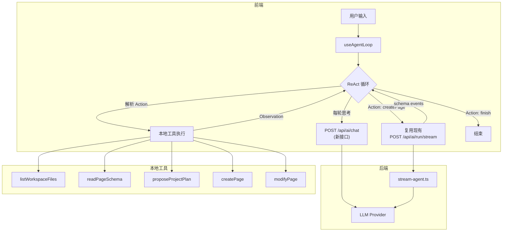

# Shenbi AI 项目级生成：统一 Agent Loop + ReAct 架构设计文档

> 版本: V6-Final | 日期: 2026-03-16 | 状态: 待用户确认

---

## 一、项目背景与目标

### 1.1 现有能力

| 能力 | 现状 |
|------|------|
| AI 单页面创建 | ✅ `pageBuilderOrchestrator` — 规划→骨架→并发区块→组装→修复 |
| AI 单页面修改 | ✅ `modifyOrchestrator` — 规划→简单 op + 复杂 op 并发→应用 |
| AI 对话 | ✅ `chatOrchestrator` |
| 多文件管理 | ✅ `useFileWorkspace` — 列表/打开/保存 |
| 附件上传 | ✅ 支持 doc/pdf/图片，转为 dataUrl 发送 |
| 调试系统 | ✅ `.ai-debug/` 目录（traces/memory/errors/invalid-json） |
| 对话记忆 | ✅ `InMemoryAgentMemoryStore` — 对话历史持久化 |

### 1.2 功能目标

| # | 目标 | 优先级 |
|---|------|--------|
| 1 | 根据文档/需求一次性生成整个工程的所有页面 | P0 |
| 2 | AI 扫描已有页面，判断功能避免重复 | P0 |
| 3 | 规划后展示给用户确认，确认后再执行 | P0 |
| 4 | 中断后通过自然语言恢复（"继续"） | P0 |
| 5 | 统一单页面/多页面逻辑（一套代码） | P0 |
| 6 | 完整调试系统，可定位每步生成质量问题 | P0 |
| 7 | 可扩展到 API 接口/数据库设计/数据字典等 | P1（架构预留） |

---

## 二、核心架构：Agent Loop + ReAct

### 2.1 为什么选 ReAct 而非 Function Calling

| 维度 | Function Calling | ReAct |
|------|-----------------|-------|
| 模型依赖 | 需模型原生支持 FC API | **任何指令跟随模型均可** |
| 调试性 | 工具调用是黑盒 | **Thought 步骤天然可见** |
| 可控性 | 参数类型/格式易出错 | **文本解析更灵活容错** |
| 降级方案 | 需多级降级 | **本身就是通用方案** |
| 过程可见性 | 需额外设计 | **可输出 Status / Reasoning Summary 作为可选过程说明** |

### 2.2 ReAct 协议格式

LLM 按 `Action → Observation` 循环执行，`Status / Reasoning Summary` 仅作为可选展示字段，不参与核心控制流。

```
Action: listWorkspaceFiles
Action Input: {}
Observation: [{"fileId":"page-1","name":"首页","updatedAt":1710000000}]

Status: 正在检查当前工作区页面，避免重复创建
Action: readPageSchema
Action Input: {"fileId": "page-1"}
Observation: {"summary": "pageId=page-1; pageName=首页; nodeCount=5; ..."}

Reasoning Summary: 首页只是通用欢迎页，不含考勤功能，先给出项目规划等待确认
Action: proposeProjectPlan
Action Input: {"projectName":"考勤管理系统","pages":[...]}
Observation: 用户已确认

Action: createPage
Action Input: {"name":"attendance-check","prompt":"考勤打卡页面，包含..."}
Observation: {"fileId":"attendance-check","success":true}

...

Action: finish
Action Input: {"summary":"已创建4个页面"}
```

> [!IMPORTANT]
> Agent Loop 的执行只强依赖 `Action` 和 `Action Input`。`Status` / `Reasoning Summary` 缺失、为空或格式波动时，前端必须能够降级显示默认状态并继续执行。

### 2.3 数据流架构



### 2.4 统一单页面/多页面

| 场景 | Agent Loop 中 LLM 的行为 |
|------|--------------------------|
| 单页面创建 | `createPage()` × 1 |
| 单页面修改 | `modifyPage()` × 1 |
| 多页面创建 | `listWorkspaceFiles()` → `readPageSchema()` × N → `proposeProjectPlan()` → `createPage()` × N |
| 混合操作 | `proposeProjectPlan()` → `createPage()` × A + `modifyPage()` × B |
| 恢复中断 | 用户说"继续" → LLM 从对话历史读取进度 → 继续 `createPage()` |

**同一个 `useAgentLoop` hook，同一套 UI，同一个调试系统。**

---

## 三、关键架构决策与解决方案

### 3.1 ReAct Loop 运行在前端

**问题**：现有 SSE 协议是单次 POST → 单向事件流，不支持 ReAct 需要的多轮交互。

**方案**：ReAct Loop 在前端执行，通过多次 HTTP 调用 `/api/ai/chat` 完成多轮 LLM 对话。生成页面时复用现有 `/api/ai/run/stream` SSE。

```
前端循环:
  1. POST /api/ai/chat {messages} → LLM 回复 (Thought + Action)
  2. 前端解析 Action → 执行本地工具 → Observation
  3. Observation 追加到 messages → 回步骤 1
  4. 直到 Action: finish
```

### 3.2 后端新增 `/api/ai/chat` 接口

**需要原因**：现有 `/api/ai/run/stream` 走完整的 classify → orchestrate → memory 流程，不适合做 ReAct 单轮调用。

**接口设计**：

```typescript
// POST /api/ai/chat — 轻量级 LLM 对话，支持 SSE 流式
// Request:
interface ChatRequest {
  messages: Array<{ role: 'system' | 'user' | 'assistant'; content: string }>;
  model: string;
  maxTokens?: number;
  thinking?: ThinkingConfig;
  stream?: boolean;  // 是否流式返回
}
// Response (非流式):
interface ChatResponse {
  content: string;
  tokensUsed: { input: number; output: number };
}
// Response (流式): text/event-stream，data: { delta: string } 逐片返回
```

> [!IMPORTANT]
> 建议支持 `stream: true`，这样前端可以在 LLM 输出 Thought 时实时展示，而不是等整段回复完毕。大幅提升用户体验。

### 3.3 生成页面时不切换编辑器

**问题**：多页面生成过程中切换编辑器会丢失用户当前编辑状态。

**方案**：生成页面时只操作文件存储，不切换编辑器焦点。

1. 调用 `file.writeSchema` 创建文件并写入 schema（**新命令**）
2. 通过 `/api/ai/run/stream` 生成页面 schema（不经过编辑器 DOM）
3. 将生成的 `PageSchema` 直接写入存储
4. **全部完成后**，切换到第一个新页面让用户查看

> **需要新增命令**：`file.writeSchema` (静默写入) + `file.readSchema` (读取指定文件)

### 3.4 上下文窗口管理

**问题**：ReAct 每轮追加 Thought/Action/Observation，5-10 轮后可能超出上下文窗口。

**方案：滑动窗口 + 摘要压缩**

```typescript
function compactMessages(messages: Message[], maxTokens: number): Message[] {
  // 1. 始终保留: system prompt + 用户原始需求 + projectPlan（如已生成）
  // 2. 保留最近 3 轮完整的 Thought/Action/Observation
  // 3. 更早的轮次压缩为一行摘要:
  //    "已执行: listWorkspaceFiles(3文件), readPageSchema(首页=通用), createPage(打卡页=成功)"
}
```

### 3.5 中断恢复机制

**问题**：生成中断后如何从断点继续？

**方案**：对话记忆只提供语义上下文，真正的恢复能力需要补充**结构化持久化状态**，不能只依赖 LLM 读历史自行推断。

```
对话历史:
  用户: 创建一个考勤管理系统
  助手: [规划5页，完成3个（首页、打卡、请假），第4个（审批）生成时中断]
  用户: 继续
  助手: Thought: 从对话历史看，已完成3/5页面，继续生成审批页...
```

建议持久化的最小状态：

```typescript
interface LoopSessionState {
  conversationId: string;
  status: 'planning' | 'awaiting_confirmation' | 'executing' | 'done' | 'failed' | 'cancelled';
  approvedPlan?: ProjectPlan;
  createdFileIds: string[];
  completedPageIds: string[];
  failedPageIds: string[];
  currentPageId?: string;
  lastCompletedAction?: string;
  updatedAt: string;
}
```

恢复时优先读取 `LoopSessionState`，再结合对话历史补充语义上下文：

1. 若存在 `awaiting_confirmation` 状态，则直接恢复确认卡片
2. 若存在 `executing` 状态，则跳过已完成页面，从 `currentPageId` 或下一待执行页继续
3. 若只有对话历史、没有结构化状态，则仅作为降级恢复，提示用户可能需要重新确认规划

### 3.6 多页面撤销 / 回退

- Agent Loop 结束后记录 `createdFileIds: string[]`
- `RunResultCard` 中提供"撤销项目生成"按钮
- 撤销 = 批量删除 `createdFileIds` 对应文件
- 修改类操作保持现有单页面 undo

### 3.7 安全防护

| 风险 | 防护措施 |
|------|---------|
| ReAct 无限循环 | `MAX_LOOP_ITERATIONS = 30`，超过则强制 finish |
| 文件命名冲突 | `createPage` 工具内检测重名，自动追加后缀（`-2`、`-3`...） |
| 网络中断 | 每次 `/api/ai/chat` 调用失败时重试 2 次，最终失败则暂停 loop 并保存状态 |
| 大文档附件 | 文档摘要后注入 system prompt（现有 `extractedTextPreview` 已支持），不直接传全文 |
| `/api/ai/chat` 滥用 | 后端加 rate limiting + token 额度检查 |

### 3.8 附件在 ReAct 中的流转

用户上传的 doc/pdf 文档：
1. 前端 `materializePendingAttachments()` 提取文档文本摘要（现有逻辑）
2. 文档摘要注入 ReAct 的 **system prompt** 末尾，作为需求上下文
3. LLM 在 Thought 中引用文档内容进行规划
4. `createPage` 的 prompt 中引用文档相关章节

### 3.9 跨页面引用与导航

多个页面可能需要相互导航（如侧边栏菜单跳转）。

**方案**：
- `proposeProjectPlan` 的 `pages` 数组定义了所有页面的 `pageId`/`pageName`
- `createPage` 的 prompt 中包含所有页面列表，让 LLM 生成导航组件时引用正确的 `pageId`
- 后期可增加 `generateNavigation` 工具专门生成导航配置

### 3.10 成本可见性

- 每次 `/api/ai/chat` 调用记录 token 使用量
- Tracer 汇总总 token 消耗
- 在 `RunResultCard` 和 `LoopTraceViewer` 中展示总成本

---

## 四、可插拔工具注册（扩展性设计）

**核心原则**：Agent Loop 不感知具体工具类型。工具通过注册表动态注入。

```typescript
interface ToolDefinition {
  name: string;
  category: 'workspace' | 'page' | 'artifact' | 'query';
  description: string;           // 自动注入 system prompt
  parameters: Record<string, unknown>;
  execute: (input: Record<string, unknown>) => Promise<unknown>;
}

const registry = new ToolRegistry();

// === 当前实现 ===
registry.register({ name: 'listWorkspaceFiles', category: 'workspace', ... });
registry.register({ name: 'readPageSchema',     category: 'workspace', ... });
registry.register({ name: 'proposeProjectPlan', category: 'workspace', ... });
registry.register({ name: 'createPage',         category: 'page', ... });
registry.register({ name: 'modifyPage',         category: 'page', ... });
registry.register({ name: 'getCurrentPageSchema', category: 'query', ... });
registry.register({ name: 'getAvailableComponents', category: 'query', ... });
registry.register({ name: 'finish',             category: 'workspace', ... });

// === 未来扩展 —— 只需新增注册，Agent Loop 零改动 ===
registry.register({ name: 'generateAPI',            category: 'artifact', ... });
registry.register({ name: 'designDatabase',         category: 'artifact', ... });
registry.register({ name: 'generateDataDictionary', category: 'artifact', ... });
registry.register({ name: 'generateNavigation',     category: 'artifact', ... });
```

**System Prompt 自动组装**：从 `registry.getAll()` 动态生成工具列表，新注册工具自动对 LLM 可见。

---

## 五、ReAct System Prompt 模板

```
你是 Shenbi 低代码平台的 AI 助手。你通过使用工具来完成用户的需求。

## 可用工具
{{由 ToolRegistry 动态生成}}

## 输出格式
每次回复必须严格按以下格式（不要输出其他内容）：

[可选]
Status: [一句面向用户的当前状态说明]
或
Reasoning Summary: [一句简短原因说明]

Action: [工具名称]
Action Input: [JSON 格式参数]

等待系统返回 Observation 后继续下一轮。

## 重要规则
1. 创建页面前，必须先 listWorkspaceFiles + readPageSchema 检查已有页面
2. 涉及多个页面/文件时，必须先 proposeProjectPlan 等待用户确认
3. createPage 的 prompt 要详细具体（组件、布局、数据字段、交互逻辑）
4. 用户说"继续"时，从对话历史判断进度并从断点继续
5. 每次只调用一个工具
6. 不要虚构工具结果，必须等待真实 Observation
7. `Status` / `Reasoning Summary` 是可选字段；即使不输出，也必须始终输出合法的 `Action` 和 `Action Input`

{{如果有用户上传的文档}}
## 参考文档
{{文档文本摘要}}
```

---

## 六、调试系统

### 6.1 AgentLoopTracer

```typescript
interface AgentLoopTrace {
  sessionId: string;
  conversationId: string;
  startedAt: string;
  endedAt?: string;
  status: 'running' | 'completed' | 'failed' | 'cancelled';
  stats: {
    totalSteps: number;
    llmCalls: number;
    toolCalls: number;
    pagesGenerated: number;
    pagesFailed: number;
    totalTokensInput: number;
    totalTokensOutput: number;
    totalDurationMs: number;
  };
  steps: Array<{
    stepIndex: number;
    timestamp: string;
    status?: string;
    reasoningSummary?: string;
    action: string;
    actionInput: Record<string, unknown>;
    observation?: string;
    llmDurationMs?: number;
    toolDurationMs?: number;
    tokensInput?: number;
    tokensOutput?: number;
    // 嵌套 trace（页面生成时指向 .ai-debug/traces/ 文件）
    nestedTraceFile?: string;
    error?: string;
  }>;
}
```

### 6.2 日志存储

| 目录 | 用途 |
|------|------|
| `.ai-debug/agent-loop/` | Agent Loop 完整 trace（**新增**） |
| `.ai-debug/traces/` | 单页面生成 trace（现有） |
| `.ai-debug/memory/` | 对话记忆 dump（现有） |
| `.ai-debug/errors/` | 错误 dump（现有） |

### 6.3 前端 LoopTraceViewer

可折叠步骤列表，每步显示：
- 💭 Status / Reasoning Summary（如有）— 点击展开完整文本
- 🔧 Action（工具名 + 参数）— 点击展开入参/出参
- ⏱️ 耗时 + Token 用量
- ❌ 错误步骤红色高亮
- 📊 底部统计摘要

---

## 七、UI 改动清单

### 7.1 当前 UI 结构

```
AIPanel.tsx
├── Header (标题 + 清除)
├── Model Selectors (Planner / Block)
├── Thinking Toggle
├── Concurrency Slider
├── Message Area
│   ├── ChatMessageList.tsx (用户/助手消息 + 附件)
│   ├── Running Card (内联 — block/modify 进度)
│   └── RunResultCard.tsx (完成后汇总)
├── Status Bar
└── ChatInput.tsx (预设 + 历史 + 附件 + 输入框)
```

### 7.2 改动项

| 组件 | 改动 | 说明 |
|------|------|------|
| **ReActStepList.tsx** | 🆕 新建 | ReAct 实时步骤展示（💭可选状态说明/🔧Action/📋Observation） |
| **ProjectPlanCard.tsx** | 🆕 新建 | 确认卡片：操作类型 + 名称 + 描述 + 确认/取消 |
| **ProjectProgressCard.tsx** | 🆕 新建 | 多页面进度卡片：每页状态 + 嵌套 block 进度 + 总进度条 |
| **LoopTraceViewer.tsx** | 🆕 新建 | 完成后的调试日志查看器 |
| **AIPanel.tsx** | ✏️ 修改 | hook 替换为 `useAgentLoop`，根据 phase 条件渲染 |
| **ChatMessageList.tsx** | ✏️ 小改 | 新增状态说明类型消息气泡（可选展示，浅色背景 + 💭 图标） |
| **RunResultCard.tsx** | ✏️ 扩展 | 支持多页面汇总 + agentLoopTrace 链接 + 撤销按钮 |
| ChatInput.tsx | ✅ 不改 | 已满足需求 |
| Header / ModelSelector | ✅ 不改 | 通用 |
| Thinking Toggle | ✅ 不改 | 仍有效 |

### 7.3 UIPhase 状态驱动

```typescript
type UIPhase =
  | 'idle'                  // 空闲，显示欢迎 + 输入框
  | 'thinking'              // ReAct 循环中，显示 ReActStepList
  | 'awaiting_confirmation' // 等待用户确认规划，显示 ProjectPlanCard
  | 'executing'             // 逐页生成中，显示 ProjectProgressCard
  | 'done'                  // 完成，显示 RunResultCard
  | 'error';                // 错误
```

---

## 八、代码改动清单

### 8.1 后端

| 文件 | 操作 | 内容 |
|------|------|------|
| `apps/ai-api/src/routes/chat.ts` | 🆕 | `/api/ai/chat` 路由 |
| `apps/ai-api/src/app.ts` | ✏️ | 注册 chat 路由 |
| `apps/ai-api/src/adapters/debug-dump.ts` | ✏️ | 新增 `writeAgentLoopDump` |

### 8.2 协议层

| 文件 | 操作 | 内容 |
|------|------|------|
| `packages/ai-contracts/src/index.ts` | ✏️ | `ChatRequest`/`ChatResponse`/`ProjectPlan`/`ReActStep` 类型，扩展 `AgentEvent` |

### 8.3 前端 AI 核心

| 文件 | 操作 | 内容 |
|------|------|------|
| `packages/editor-plugins/ai-chat/src/ai/react-parser.ts` | 🆕 | ReAct 文本解析器（正则提取 Thought/Action/ActionInput） |
| `packages/editor-plugins/ai-chat/src/ai/agent-tools.ts` | 🆕 | 可插拔工具注册表 + 8 个工具实现 |
| `packages/editor-plugins/ai-chat/src/ai/agent-loop-tracer.ts` | 🆕 | 调试日志追踪器 |
| `packages/editor-plugins/ai-chat/src/hooks/useAgentLoop.ts` | 🆕 | 统一 Agent Loop hook |
| `packages/editor-plugins/ai-chat/src/ai/sse-client.ts` | ✏️ | 新增 `chat()` 方法 |
| `packages/editor-plugins/ai-chat/src/ai/mock-ai-client.ts` | ✏️ | Mock ReAct 输出 + chat mock |
| `packages/editor-plugins/ai-chat/src/ai/api-types.ts` | ✏️ | 导出新类型 |

### 8.4 前端 UI

| 文件 | 操作 |
|------|------|
| `src/ui/ReActStepList.tsx` | 🆕 |
| `src/ui/ProjectPlanCard.tsx` | 🆕 |
| `src/ui/ProjectProgressCard.tsx` | 🆕 |
| `src/ui/LoopTraceViewer.tsx` | 🆕 |
| `src/ui/AIPanel.tsx` | ✏️ |
| `src/ui/ChatMessageList.tsx` | ✏️ |
| `src/ui/RunResultCard.tsx` | ✏️ |

### 8.5 文件系统 / 编辑器

| 文件 | 操作 | 内容 |
|------|------|------|
| `packages/editor-plugins/files/src/use-file-workspace.ts` | ✏️ | 新增命令处理 |
| 编辑器核心 | ✏️ | 新增 `file.writeSchema` + `file.readSchema` 命令 |

### 8.6 i18n

| 文件 | 操作 |
|------|------|
| `src/locales/zh-CN.json` | ✏️ 新增 agent loop 相关翻译 |
| `src/locales/en-US.json` | ✏️ 同上 |

---

## 九、实施分期

| Phase | 内容 | 产出 | 预计 |
|-------|------|------|------|
| **0** | 协议与恢复状态建模 | `ChatRequest`/`ChatResponse`/`ProjectPlan`/`ReActStep`/`LoopSessionState` 类型；恢复语义文档；状态持久化方案 | 2-3h |
| **1** | 后端 chat primitive + `/api/ai/chat` 薄路由 | `chat.ts` + app 路由 + provider 封装复用 + 测试 | 2-3h |
| **2** | 文件系统与编辑器后台读写语义 | `file.readSchema` / `file.writeSchema` 或等价能力；dirty/history/event 契约；编辑器测试 | 2-4h |
| **3** | ReAct 解析器 + 工具注册表 | `react-parser.ts`, `agent-tools.ts`，先接只读工具与 `proposeProjectPlan` | 2-3h |
| **4** | Agent Loop 核心最小闭环 | `useAgentLoop.ts` + 上下文压缩 + 计划确认 + 委托现有 `createPage` / `modifyPage` 流程 | 3-5h |
| **5** | 调试系统 | `agent-loop-tracer.ts`, `debug-dump.ts` 扩展, `LoopTraceViewer.tsx` | 2-3h |
| **6** | UI 接入 | `ReActStepList.tsx`, `ProjectPlanCard.tsx`, `ProjectProgressCard.tsx`, `AIPanel.tsx`, `RunResultCard.tsx`, i18n | 3-4h |
| **7** | 恢复/取消/失败硬化 + 全量回归 | Mock 扩展、恢复测试、幂等性验证、单页面回归 | 3-5h |

**总计**：约 19-30h

> [!IMPORTANT]
> `Phase 0` 和 `Phase 2` 是前置门槛。未明确恢复状态模型与后台文件写入语义前，不建议开始完整 UI 接入或“继续恢复”功能开发。

---

## 十、测试计划

### 10.1 自动化测试

```bash
# ReAct 解析器
npx vitest run src/ai/react-parser.test.ts

# 工具注册表 + 各工具执行/错误处理
npx vitest run src/ai/agent-tools.test.ts

# Agent Loop 完整流程
npx vitest run src/hooks/useAgentLoop.test.tsx
# 测试场景：单页面 / 多页面 / 恢复 / 取消 / 错误 / 超过最大迭代

# Tracer
npx vitest run src/ai/agent-loop-tracer.test.ts

# 现有测试回归
npx vitest run  # ai-chat 包全部测试

# 后端 chat 路由
cd apps/ai-api && npx vitest run src/routes/chat.test.ts

# 类型检查
cd packages/ai-contracts && npx tsc --noEmit
```

### 10.2 手动验证

- [ ] Mock 模式下：单页面生成（验证统一逻辑不退化）
- [ ] Mock 模式下：多页面项目生成全流程
- [ ] 中断恢复：生成中取消 → 输入"继续" → 验证从断点继续
- [ ] 调试：检查 `.ai-debug/agent-loop/` trace 文件完整性
- [ ] UI：ProjectPlanCard 确认/取消交互
- [ ] UI：ProjectProgressCard 进度展示
- [ ] UI：LoopTraceViewer 步骤展开/折叠

---

## 十一、风险与缓解

| 风险 | 影响 | 缓解措施 |
|------|------|---------|
| ReAct 说明字段格式不稳定 | UI 文案缺失或解析失败 | 执行层只依赖 `Action` / `Action Input`；`Status` / `Reasoning Summary` 解析失败时降级显示默认文案 |
| LLM 不遵循"每次一个工具"规则 | 多工具调用混乱 | 只取第一个 Action；在 prompt 中强调 |
| 上下文窗口溢出 | LLM 回复质量下降 | 滑动窗口摘要压缩 |
| createPage 耗时长 | 用户感觉卡死 | 嵌套进度展示 + 计时器 |
| 批量生成中某页失败 | 整体中断 | 记录失败，跳过继续下一页，最终汇总 |
| 浏览器标签关闭 | 进度丢失 | 对话记忆已持久化，重新打开后可"继续" |
| `/api/ai/chat` 被滥用 | 服务端资源耗尽 | Rate limiting + token 额度限制 |
