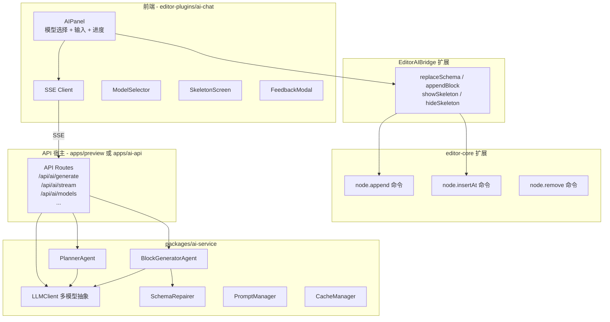

# AI 生成 JSON 页面 - 全量集成改造方案

## 架构总览



## 适配当前仓库边界

这份方案按当前仓库已经冻结的边界落地：

- `editor-core` 负责纯 schema 结构编辑能力，适合新增 `node.append / node.insertAt / node.remove`
- `editor-plugins/ai-chat` 继续作为 AI 主业务包，负责 AI 面板、SSE 客户端、bridge 适配和交互状态
- `editor-ui` 只作为宿主壳层与插件运行时兑现层，不新增 AI 主业务实现
- `editor-plugins/api` 仍是唯一插件协议来源，AI 插件继续只依赖 `document / selection / commands / notifications`

当前首版默认目标为 **Shell 正式编辑模式**：

- `shell` 模式必须完整支持 AI 生成、流式插入和最终 schema 替换
- `scenarios` 模式当前仅作为测试/演示模式，不作为 AI 能力首版验收范围
- 若 `scenarios` 下仍展示 AI 面板，则应显式禁用流式增量命令，或退化为最终 `schema.replace`


## 一、类型对齐（前提条件）

设计文档中的类型需要与现有 `@shenbi/schema` 对齐：

- `LowCodeNode` (设计文档) --> `SchemaNode` (现有, [packages/schema/types/node.ts](packages/schema/types/node.ts))
- `ComponentContractV1` (设计文档) --> `ComponentContract` (现有, [packages/schema/types/contract.ts](packages/schema/types/contract.ts))
- `PageSchema` 已存在于 [packages/schema/types/page.ts](packages/schema/types/page.ts)，可直接复用
- 新增类型 `PagePlan`, `PlanBlock` 等放在 `packages/ai-service/src/types.ts`

## 二、packages/ai-service - 新建后端服务包

**定位**：纯逻辑库，不包含 API 路由框架代码，可被任意宿主（Next.js / Express / Hono）调用。

```
packages/ai-service/
├── src/
│   ├── index.ts                  # 统一导出
│   ├── types.ts                  # PagePlan, PlanBlock, GenerateOptions, StreamEvent 等
│   ├── llm/
│   │   ├── client.ts             # LLMClient 统一调用层
│   │   ├── types.ts              # LLMProvider, LLMResponse, Message
│   │   └── providers/
│   │       ├── openai.ts
│   │       ├── anthropic.ts
│   │       ├── google.ts          # Gemini (gemini-pro, gemini-flash)
│   │       ├── deepseek.ts
│   │       └── aliyun.ts
│   ├── errors/
│   │   └── index.ts              # ValidationError, RateLimitError, LLMError 等结构化错误类型
│   ├── agents/
│   │   ├── planner.ts            # PlannerAgent - 页面规划
│   │   ├── block-generator.ts    # BlockGeneratorAgent - 区块生成
│   │   └── assembler.ts          # 区块组装为完整 PageSchema
│   ├── validator/
│   │   └── schema-repairer.ts    # 自动修复不合法 schema
│   ├── prompt/
│   │   ├── manager.ts            # PromptManager (模板管理/渲染)
│   │   └── templates/            # 内置 prompt 模板文件
│   │       ├── planner.txt
│   │       └── block-generator.txt
│   ├── cache/
│   │   └── manager.ts            # CacheManager (L1内存 + L2 Redis 可选)
│   └── registry/
│       └── component-registry.ts # ComponentContract 适配层（优先复用/注入现有 contracts）
├── package.json                  # 依赖: openai, @anthropic-ai/sdk, @shenbi/schema
└── tsconfig.json
```

**核心导出**：

```typescript
// packages/ai-service/src/index.ts
export { LLMClient } from './llm/client';
export { PlannerAgent } from './agents/planner';
export { BlockGeneratorAgent } from './agents/block-generator';
export { SchemaRepairer } from './validator/schema-repairer';
export { PromptManager } from './prompt/manager';
export { CacheManager } from './cache/manager';
export { ComponentRegistry } from './registry/component-registry';
export * from './types';

// 高层 API - 一键生成
export async function generatePage(prompt: string, options: GenerateOptions): Promise<GenerateResult>;
export async function* generatePageStream(prompt: string, options: GenerateOptions): AsyncGenerator<StreamEvent>;
```

**组件契约来源约束**：

- `ai-service` 不应维护一套与前端脱节的独立组件真相
- 首选直接复用 `@shenbi/schema` 中的 `builtinContracts`
- 若后续存在宿主级自定义组件，使用“宿主注入 contracts”方式扩展，而不是在 `ai-service` 内再维护平行注册表

**Provider 覆盖范围**：

- OpenAI (gpt-4o, gpt-4o-mini)
- Anthropic (claude-3-opus, claude-3-sonnet, claude-3-haiku)
- Google (gemini-pro, gemini-flash)
- DeepSeek (deepseek-chat, deepseek-coder)
- Alibaba (qwen-max, qwen-plus)
- 本地模型 (Ollama / LM Studio)：首版暂不实现，预留 `LocalProvider` 扩展点，后续通过 OpenAI 兼容接口接入

**Prompt 管理路线决策**：

后端设计文档采用数据库驱动（PostgreSQL）+ 版本管理 + A/B 测试的方式，但这对首版来说过重。分两阶段推进：

- **首版**：文件驱动。Prompt 模板以 `.txt` 文件内嵌在 `packages/ai-service/src/prompt/templates/` 中，`PromptManager` 负责读取和变量渲染（`{{userPrompt}}`、`{{availableComponents}}` 等占位符替换）。不引入数据库依赖。
- **二期**：升级为数据库驱动。引入 `prompts` 表实现版本管理、A/B 测试、在线编辑。`PromptManager` 接口保持不变，仅切换底层存储实现。届时同步新增 `/api/prompts` CRUD 路由。

**关键设计**：`generatePageStream` 返回 AsyncGenerator，使用方式：

```typescript
for await (const event of generatePageStream(prompt, options)) {
  switch (event.type) {
    case 'plan': // PagePlan
    case 'block': // { blockId, node: SchemaNode }
    case 'done': // { schema: PageSchema }
    case 'error': // { message }
  }
}
```

## 三、editor-core 扩展 - 增量节点操作

修改文件：[packages/editor-core/src/schema-editor.ts](packages/editor-core/src/schema-editor.ts) 和 [packages/editor-core/src/create-editor.ts](packages/editor-core/src/create-editor.ts)

这部分方向保持不变。`node.append / node.insertAt / node.remove` 属于纯 schema 结构操作，放在 `editor-core` 是合理的，AI 插件通过 `commands.execute(...)` 复用这些命令即可。

### 3.1 新增 schema-editor 函数

```typescript
// schema-editor.ts 新增

/** 向指定父节点的 children 末尾追加子节点 */
export function appendSchemaNode(
  schema: PageSchema,
  parentTreeId: string | undefined, // undefined 时追加到 body
  node: SchemaNode,
): PageSchema;

/** 在指定位置插入节点 */
export function insertSchemaNodeAt(
  schema: PageSchema,
  parentTreeId: string | undefined,
  index: number,
  node: SchemaNode,
): PageSchema;

/** 删除指定节点 */
export function removeSchemaNode(
  schema: PageSchema,
  treeId: string,
): PageSchema;
```

### 3.1.1 首版语义约束

为了贴合当前 schema 结构，首版先收敛支持范围：

- `parentTreeId === undefined` 时，仅向 `schema.body` 追加或插入顶层节点
- 命中的父节点必须是 `SchemaNode`，且其 `children` 必须是数组；若 `children` 是表达式或其他非数组值，则返回原 schema
- `remove` 首版仅删除真实树节点，不处理 `slots`、`templates` 等其他容器
- `dialogs`、`slots.*`、`templates.*` 是否纳入支持，放到二期再扩

这样能先覆盖 AI 页面生成最主要的“向 body 逐块插入”场景，避免一次把所有 schema 容器都做复杂。

### 3.2 注册新命令

```typescript
// create-editor.ts 中 registerBuiltinCommands 新增

// node.append - AI 流式生成时逐个追加区块
commands.register({
  id: 'node.append',
  label: 'Append Node',
  execute(state, args: { parentTreeId?: string; node: SchemaNode }) {
    const prev = state.getSchema();
    const next = appendSchemaNode(prev, args.parentTreeId, args.node);
    if (next === prev) return;
    state.setSchema(next);
    state.setDirty(true);
    eventBus.emit('schema:changed', { schema: next });
  },
});

// node.insertAt
commands.register({
  id: 'node.insertAt',
  label: 'Insert Node At',
  execute(state, args: { parentTreeId?: string; index: number; node: SchemaNode }) { ... },
});

// node.remove
commands.register({
  id: 'node.remove',
  label: 'Remove Node',
  execute(state, args: { treeId: string }) { ... },
});
```

### 3.3 History 原子性 - AI 生成与 Undo 的关系

当前 `CommandManager` 每次 `execute` 都会 push 一个 history 快照。如果 AI 流式生成 5 个 block，调用 5 次 `node.append`，会产生 5 条 history 记录，用户想撤销整次 AI 生成需要 undo 5 次，体验很差。

**首版方案**：在 `node.append` / `node.insertAt` 命令注册时设置 `recordHistory: false`，跳过中间态的 history 记录。整次 AI 生成完成后，由最终的 `schema.replace` 命令产生唯一一条 history 记录。

```typescript
commands.register({
  id: 'node.append',
  label: 'Append Node',
  recordHistory: false, // 不记录中间态
  execute(state, args) { ... },
});
```

这样用户只需一次 undo 就能回退整次 AI 生成。

**二期可选**：如果需要更精细的控制（比如保留中间 block 的 undo 能力），可在 `CommandManager` 中增加 `beginBatch()` / `endBatch()` 事务模式，将批次内的多次操作合并为一个 history 快照。但首版用 `recordHistory: false` 已足够。

## 四、editor-plugins/ai-chat 全面改造

这是改动量最大的部分。现有 [packages/editor-plugins/ai-chat/](packages/editor-plugins/ai-chat/) 结构改造为：

```
packages/editor-plugins/ai-chat/
├── src/
│   ├── index.ts
│   ├── plugin.tsx              # 改造: 增加配置项 (apiBaseUrl 等)
│   ├── ai/
│   │   ├── editor-ai-bridge.ts # 扩展: appendBlock, streaming 相关
│   │   ├── useEditorAIBridge.ts
│   │   ├── demo-schema.ts
│   │   ├── ai-api.ts           # 新增: 后端 API 调用封装
│   │   └── sse-client.ts       # 新增: SSE 流式客户端
│   ├── ui/
│   │   ├── AIPanel.tsx          # 重写: 完整 AI 面板
│   │   ├── ModelSelector.tsx    # 新增: 模型选择器
│   │   ├── SkeletonScreen.tsx   # 新增: 骨架屏
│   │   ├── BlockFadeIn.tsx      # 新增: 区块渐入动画
│   │   ├── FeedbackModal.tsx    # 新增: 反馈弹窗
│   │   └── ProgressBar.tsx      # 新增: 进度条
│   ├── hooks/
│   │   ├── useModels.ts         # 新增: 模型列表（含 localStorage 缓存，TTL 1h）
│   │   └── useAIGeneration.ts   # 新增: AI 生成状态管理（isGenerating, progress, cancel）
│   └── utils/
│       ├── error-handler.ts     # 新增: 错误处理（区分 429/503/400 等状态码）
│       ├── retry.ts             # 新增: 指数退避重试（maxRetries=3）
│       └── dedupe.ts            # 新增: 请求去重（防止重复提交）
```

### 4.1 EditorAIBridge 接口扩展

```typescript
// editor-ai-bridge.ts 扩展
interface EditorAIBridge {
  // 已有
  getSchema(): PageSchema;
  getSelectedNodeId(): string | undefined;
  getAvailableComponents(): ComponentContract[];
  execute(commandId: string, args?: unknown): Promise<ExecuteResult>;
  replaceSchema(schema: PageSchema): void;
  subscribe(listener: (snapshot: EditorBridgeSnapshot) => void): () => void;

  // 新增 - 增量操作
  appendBlock(node: SchemaNode, parentTreeId?: string): Promise<ExecuteResult>;
  removeNode(treeId: string): Promise<ExecuteResult>;
}
```

`appendBlock` 内部调用 `execute('node.append', { parentTreeId, node })`。

### 4.1.1 与当前插件协议的关系

- `EditorAIBridge` 仍然只是 `ai-chat` 包内的适配层，不是新的宿主协议来源
- AI 插件继续只通过 `PluginContext.commands.execute(...)`、`document.getSchema()`、`document.replaceSchema(...)` 与宿主交互
- 不为 AI 单独扩 `PluginContext`

### 4.2 SSE 客户端

```typescript
// ai/sse-client.ts
export function createSSEClient(baseUrl: string) {
  return {
    generateStream(prompt: string, options: StreamOptions): {
      onPlan: (cb: (plan: PagePlan) => void) => void;
      onBlock: (cb: (blockId: string, node: SchemaNode) => void) => void;
      onDone: (cb: (schema: PageSchema) => void) => void;
      onError: (cb: (error: string) => void) => void;
      cancel: () => void;
    }
  };
}
```

**SSE 连接生命周期管理**：

- 组件卸载时（React useEffect cleanup）必须调用 `cancel()` 关闭 EventSource，避免内存泄漏
- 路由切换、面板折叠等场景同理，需确保连接被正确关闭
- `cancel()` 内部调用 `eventSource.close()` 并清理所有回调引用
- 首版使用原生 `EventSource`（GET + query params）；若后续需要 POST body 或自定义 headers（如认证 token），切换为 `fetch` + `ReadableStream` 实现，SSE 客户端接口保持不变

### 4.3 AIPanel 重写

AIPanel 组件结构：

```
┌─────────────────────────────────────┐
│  AI 页面生成助手                      │
├─────────────────────────────────────┤
│  Planning 模型: [GPT-4o       ▼]   │
│  Block 模型:    [Claude Sonnet ▼]   │
├─────────────────────────────────────┤
│  ┌───────────────────────────────┐  │
│  │ 描述你想要的页面...            │  │
│  │                               │  │
│  └───────────────────────────────┘  │
│  [生成页面]                          │
├─────────────────────────────────────┤
│  ████████████░░░░░░░░ 60%           │
│  Planning ✓ | Block 3/5            │
├─────────────────────────────────────┤
│  生成历史 / 反馈                      │
└─────────────────────────────────────┘
```

核心流程（流式生成）：

1. 用户输入 prompt，选择模型，点击"生成页面"
2. 按钮变为"取消生成"，禁止重复提交
3. 调用 SSE 接口，画布显示占位反馈
4. 收到 `plan` 事件 → 显示区块占位符，进度更新到 10%
5. 收到每个 `block` 事件 → 调用 `bridge.appendBlock(node)` 增量渲染，进度递增
6. 收到 `done` 事件 → 调用 `bridge.replaceSchema(finalSchema)` 确保一致性，隐藏占位反馈
7. 显示生成结果 metadata（耗时、token 消耗等），弹出反馈入口
8. 错误时显示提示，支持重试

**非流式生成**：作为降级路径。当 SSE 连接不可用或用户主动选择时，调用 `POST /api/ai/generate` 一次性返回完整 schema，直接调用 `bridge.replaceSchema()`。不经过 `node.append` 增量流程。

### 4.3.2 取消生成与并发保护

- **取消按钮**：生成过程中，"生成页面"按钮切换为"取消生成"。点击后调用 SSE 客户端的 `cancel()` 关闭连接，清理已插入的临时节点（通过 `bridge.replaceSchema()` 回退到生成前的 schema 快照），恢复 UI 状态
- **并发保护**：同一时间只允许一个生成任务。`useAIGeneration` hook 维护 `isGenerating` 状态，生成期间禁用"生成页面"按钮
- **画布编辑锁定**：流式生成期间，用户不应手动编辑画布节点（否则最终 `replaceSchema` 会覆盖手动编辑）。首版通过 UI 提示告知用户"生成中请勿编辑"；二期可考虑在 `editor-core` 层增加 `lock` / `unlock` 机制

### 4.3.3 GenerateResult metadata 展示

后端返回的 metadata（`sessionId`, `tokensUsed`, `duration`, `repairs`）需要在 AI 面板中呈现：

- 生成完成后在进度条下方显示耗时和 token 消耗
- `sessionId` 传递给 `FeedbackModal`，关联反馈与生成记录
- `repairs` 如果非空，显示"AI 自动修复了 N 处问题"的提示

### 4.3.4 骨架屏实现边界

按当前目录能力，首版不要假设插件能直接在画布层渲染 overlay：

- 当前插件系统已有 `auxiliaryPanels`，但没有 canvas overlay 扩展点
- 因此首版“骨架屏/占位块”优先通过临时 `SchemaNode` 或 AI 面板内状态反馈完成
- 若后续确实需要插件级画布 overlay，再单独评审是否为 `editor-plugin-api` 和 `editor-ui` 增加通用 canvas contribution

### 4.4 plugin.tsx 配置扩展

```typescript
interface CreateAIChatPluginOptions {
  // 已有
  id?: string; name?: string; ...
  getAvailableComponents?: () => ComponentContract[];

  // 新增
  apiBaseUrl?: string;          // AI 后端 URL，默认 '/api/ai'
  defaultPlannerModel?: string; // 默认规划模型
  defaultBlockModel?: string;   // 默认生成模型
  enableFeedback?: boolean;     // 是否启用反馈
  enableModelSelector?: boolean;// 是否显示模型选择器
}
```

## 五、API 宿主层

`packages/ai-service` 是纯逻辑库，需要一个宿主暴露 HTTP API。按当前仓库形态，推荐 **新建 `apps/ai-api`** 作为独立服务宿主。

原因：

- `apps/preview` 当前是纯 Vite 前端应用，不具备直接承载服务端 API 路由的能力
- `preview` 可通过 dev proxy 或环境变量访问 `ai-api`
- 这样也能避免把服务端依赖和密钥管理混进前端预览应用

API 路由直接复用设计文档中的定义：

**AI 核心路由**：

- `POST /api/ai/generate` - 非流式生成
- `GET /api/ai/stream` - SSE 流式生成
- `POST /api/ai/validate` - Schema 验证
- `GET /api/ai/models` - 模型列表
- `GET /api/ai/components?types=Button,Table` - 组件契约（不传 types 返回全部）
- `POST /api/ai/feedback` - 用户反馈

**Prompt 管理路由（二期）**：

首版 Prompt 采用文件驱动，不需要这组路由。二期升级数据库驱动时新增：

- `GET /api/prompts` - 获取所有 Prompt 模板
- `PUT /api/prompts/:promptId` - 更新 Prompt（自动创建新版本）
- `POST /api/prompts/:promptId/test` - 测试 Prompt（不影响生产）

**限流中间件**：

API 宿主需实现限流中间件，防止滥用：

```typescript
// 基于 IP 的限流，10 req/min
// 首版可使用内存 Map 实现；生产环境切换为 Redis
```

- 触发限流返回 HTTP 429，前端 `error-handler.ts` 展示"请求过于频繁，请稍后再试"
- 限流粒度：首版按 IP；后续支持按用户

**本地开发联调**：

`apps/preview`（Vite 应用）通过 dev server proxy 访问 `apps/ai-api`：

```typescript
// apps/preview/vite.config.ts
export default defineConfig({
  server: {
    proxy: {
      '/api/ai': {
        target: 'http://localhost:3001', // ai-api 服务地址
        changeOrigin: true,
      },
    },
  },
});
```

生产环境通过环境变量 `VITE_AI_API_BASE_URL` 配置实际 API 地址。

路由实现只需组装 ai-service 的服务：

```typescript
import { generatePageStream, LLMClient, ComponentRegistry } from '@shenbi/ai-service';

export async function GET(request: Request) {
  const prompt = new URL(request.url).searchParams.get('prompt');
  const stream = new ReadableStream({
    async start(controller) {
      for await (const event of generatePageStream(prompt, options)) {
        controller.enqueue(encoder.encode(`data: ${JSON.stringify(event)}\n\n`));
      }
      controller.close();
    },
  });
  return new Response(stream, { headers: { 'Content-Type': 'text/event-stream' } });
}
```

**环境变量管理**：

```bash
# apps/ai-api/.env
OPENAI_API_KEY=sk-xxx
ANTHROPIC_API_KEY=sk-ant-xxx
GOOGLE_API_KEY=xxx
DEEPSEEK_API_KEY=xxx
# 二期
REDIS_URL=redis://...
DATABASE_URL=postgresql://...
```

API Key 仅存在于 `apps/ai-api` 服务端，前端不接触。

### 5.1 前后端并行开发约束

为了让 `editor-plugin-ai-chat` 前端和 `apps/ai-api` 后端可以并行推进，先冻结下列契约：

- `POST /api/ai/generate` 的请求体与响应体
- `GET /api/ai/stream` 的 query 参数
- SSE 事件类型：`plan | block | done | error`
- `done` 事件中的 `schema` 与 `metadata` 结构
- `/api/ai/models` 返回的 `ModelInfo[]`
- `/api/ai/components` 返回的 `ComponentContract[]`

前端允许先用 mock 数据和 mock SSE 事件流开发；后端只需保证最终契约与 mock 一致即可接入。

## 六、不需要修改的部分

与设计文档一致，以下模块原则上保持不变：

- `@shenbi/engine` (渲染器)
- `@shenbi/schema` (核心类型，仅可能微调 contract 类型；并继续作为内置 contracts 来源)
- `editor-ui/AppShell` (首版不改；除非后续新增通用 canvas overlay 扩展点)
- `editor-plugins/setter` 和 `editor-plugins/files`
- 组件库

## 七、潜在问题与解决方案

### 7.1 流式响应中断后无法恢复

**问题**：SSE 连接因网络波动断开，已生成的 block 丢失。

**首版方案**：断开后提示用户重新生成。已通过 `node.append` 插入画布的 block 保留，用户可选择"在当前基础上重新生成"或"清空重来"。

**二期方案**：引入 sessionId 机制，Redis 存储中间状态，支持断点续传。

### 7.2 缓存 key 冲突

**问题**：相同 prompt 但不同模型、不同 prompt 模板版本，可能命中错误缓存。

**解决**：缓存 key = `hash(prompt + plannerModel + blockModel + promptVersion)`。

### 7.3 组件契约更新后 Prompt 未同步

**问题**：新增或修改组件后，AI 仍使用旧的契约信息生成。

**解决**：组件契约通过 `{{componentSchemas}}` 占位符在 Prompt 渲染时动态注入，不硬编码到模板中。每次生成时从 `@shenbi/schema` 实时获取最新 contracts。

### 7.4 成本控制

**问题**：大量请求导致 LLM API 费用暴涨。

**解决**：
- 限流（每用户 10 req/min）
- 缓存（目标 60%+ 命中率）
- 模型分级（简单任务用低成本模型如 deepseek-chat）
- 二期增加成本监控和超阈值告警

### 7.5 多 Provider API 格式不统一

**问题**：不同 LLM 厂商的请求/响应格式差异大。

**解决**：`LLMProvider` 抽象层统一接口，各 Provider 内部做格式转换。对外只暴露统一的 `LLMResponse { text, usage, finishReason }`。

### 7.6 AI 生成期间用户编辑画布

**问题**：流式生成过程中用户手动编辑节点，最终 `replaceSchema(finalSchema)` 会覆盖手动编辑。

**首版方案**：生成期间 UI 层提示"生成中请勿编辑"，不做硬锁。

**二期方案**：`editor-core` 增加 `lock()` / `unlock()` API，生成期间锁定画布编辑。

### 7.7 并发请求导致资源争抢

**问题**：多用户同时请求生成，LLM API 并发压力大。

**解决**：API 宿主层实现请求队列。首版依赖限流控制并发量；二期可引入任务队列（如 BullMQ）做异步处理。

## 八、监控指标

### 8.1 性能指标

- API 响应时间（P50 / P95 / P99）
- LLM 调用耗时（Planning + Block Generation 分开统计）
- 缓存命中率
- SSE 连接成功率

### 8.2 业务指标

- 生成成功率（成功 / 总请求）
- 用户满意度（feedback rating 平均分）
- 每日生成次数
- 各模型使用占比
- Schema 自动修复率（repairs 非空的比例）

### 8.3 成本指标

- 每日 token 消耗（按 Provider 分组）
- 各模型成本占比
- 缓存节省成本（缓存命中次数 * 预估单次成本）
- 平均单次生成成本

首版通过 `generation_logs`（二期引入数据库后）或结构化日志收集这些指标。不强制要求首版接入监控系统，但 `ai-service` 的 `generatePage` / `generatePageStream` 返回值中应包含 `metadata`（tokensUsed, duration 等）供上层消费。

## 九、实施顺序建议

由于选择全量实现，建议按依赖关系分层推进：

**Phase 1 (Day 1-2)**: 基础层

- editor-core: 新增 `node.append` / `node.insertAt` / `node.remove` 命令和 schema-editor 函数
- packages/ai-service: 搭建包结构，实现 LLMClient + Provider 抽象层

**Phase 2 (Day 3-4)**: 核心逻辑

- ai-service: 实现 PlannerAgent, BlockGeneratorAgent, SchemaRepairer
- ai-service: 实现 PromptManager + 内置模板
- ai-service: 实现 generatePage / generatePageStream 高层 API

**Phase 3 (Day 5-6)**: 前端改造

- ai-chat 插件: SSE 客户端、API 封装
- ai-chat 插件: AIPanel 重写 (模型选择 + 输入 + 进度)
- ai-chat 插件: EditorAIBridge 扩展 (appendBlock)
- ai-chat 插件: SkeletonScreen, BlockFadeIn 组件
- shell 模式联通；scenarios 模式显式禁用或降级 AI 生成能力

**Phase 4 (Day 7)**: API 宿主 + 串联

- `apps/ai-api` 路由实现 (generate, stream, models, components, validate, feedback)
- 前后端联调
- FeedbackModal, 错误处理, 重试机制

**Phase 5 (Day 8)**: 优化 + 收尾

- CacheManager 实现（L1 内存 + L2 可选 Redis）
- 请求去重（dedupe）、AI 面板懒加载（React.lazy）
- 模型列表 localStorage 缓存（TTL 1h）
- 端到端测试（见下方测试清单）

### 9.1 测试清单

**非流式生成测试**：

- [ ] 输入 Prompt → 选择模型 → 点击生成 → 验证返回 schema 合法且可渲染
- [ ] 空 Prompt 时按钮禁用
- [ ] 后端返回错误时，前端展示对应错误提示

**流式生成测试**：

- [ ] 点击生成后按钮切换为"取消生成"
- [ ] 收到 plan 事件后进度更新到 10%
- [ ] 每收到一个 block 事件，画布增量渲染对应节点
- [ ] 全部完成后进度到 100%，画布 schema 与最终 schema 一致
- [ ] 取消生成时 SSE 连接关闭，画布回退到生成前状态
- [ ] 组件卸载时 SSE 连接自动关闭（无内存泄漏）

**错误处理测试**：

- [ ] 网络断开时显示"连接丢失"提示
- [ ] 触发限流（429）时显示"请求过于频繁"
- [ ] LLM 服务不可用（503）时显示"AI 服务暂时不可用"
- [ ] 无效 Prompt（400）时显示"请求参数错误"
- [ ] 自动重试（指数退避，最多 3 次）

**模型切换测试**：

- [ ] 切换 Planning / Block 模型后生成正常
- [ ] 模型列表从 API 正确加载
- [ ] 模型列表缓存生效（第二次加载走 localStorage）

**History 测试**：

- [ ] AI 生成完成后，一次 undo 即可回退整次生成
- [ ] undo 后 redo 可恢复

**反馈测试**：

- [ ] 生成完成后弹出反馈入口
- [ ] 提交评分和反馈文字，后端正确接收

## 附录 A：数据库设计（二期）

首版采用文件驱动 Prompt + 结构化日志，不依赖数据库。二期引入 PostgreSQL 时使用以下表结构：

### A.1 Prompt 版本表

```sql
CREATE TABLE prompts (
  id VARCHAR(255) PRIMARY KEY,
  type VARCHAR(50) NOT NULL,           -- 'planner' | 'blockGenerator'
  version VARCHAR(50) NOT NULL,
  template TEXT NOT NULL,
  active BOOLEAN DEFAULT FALSE,
  created_at TIMESTAMP DEFAULT NOW(),
  created_by VARCHAR(255),
  INDEX idx_type_active (type, active)
);
```

### A.2 生成日志表

```sql
CREATE TABLE generation_logs (
  id BIGSERIAL PRIMARY KEY,
  session_id VARCHAR(255) NOT NULL,
  user_id VARCHAR(255),
  prompt TEXT NOT NULL,
  planner_model VARCHAR(50),
  block_model VARCHAR(50),
  planner_prompt_id VARCHAR(255),
  block_prompt_id VARCHAR(255),
  tokens_used INTEGER,
  duration_ms INTEGER,
  success BOOLEAN,
  error_message TEXT,
  created_at TIMESTAMP DEFAULT NOW(),
  INDEX idx_session (session_id),
  INDEX idx_user (user_id),
  INDEX idx_created (created_at)
);
```

### A.3 用户反馈表

```sql
CREATE TABLE feedbacks (
  id BIGSERIAL PRIMARY KEY,
  session_id VARCHAR(255) NOT NULL,
  user_id VARCHAR(255),
  rating INTEGER CHECK (rating BETWEEN 1 AND 5),
  feedback TEXT,
  created_at TIMESTAMP DEFAULT NOW(),
  INDEX idx_session (session_id)
);
```

### A.4 Prompt A/B 测试（二期）

基于 userId hash 的一致性哈希分流，确保同一用户始终命中同一 Prompt 版本。配合 `generation_logs` 中的 `planner_prompt_id` / `block_prompt_id` 字段追踪效果。

