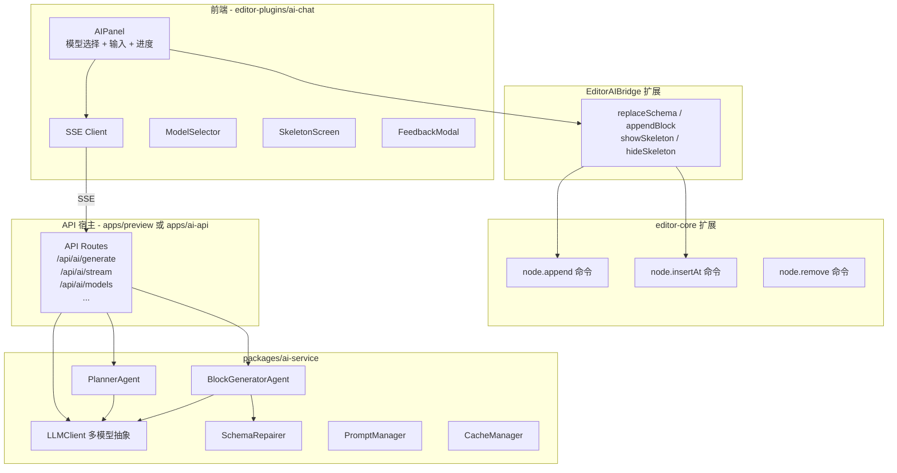

# AI 生成 JSON 页面 - 全量集成改造方案

## 架构总览



## 适配当前仓库边界

这份方案按当前仓库已经冻结的边界落地：

- `editor-core` 负责纯 schema 结构编辑能力，适合新增 `node.append / node.insertAt / node.remove`
- `editor-plugins/ai-chat` 继续作为 AI 主业务包，负责 AI 面板、SSE 客户端、bridge 适配和交互状态
- `editor-ui` 只作为宿主壳层与插件运行时兑现层，不新增 AI 主业务实现
- `editor-plugins/api` 仍是唯一插件协议来源，AI 插件继续只依赖 `document / selection / commands / notifications`

当前首版默认目标为 **Shell 正式编辑模式**：

- `shell` 模式必须完整支持 AI 生成、流式插入和最终 schema 替换
- `scenarios` 模式当前仅作为测试/演示模式，不作为 AI 能力首版验收范围
- 若 `scenarios` 下仍展示 AI 面板，则应显式禁用流式增量命令，或退化为最终 `schema.replace`


## 一、类型对齐（前提条件）

设计文档中的类型需要与现有 `@shenbi/schema` 对齐：

- `LowCodeNode` (设计文档) --> `SchemaNode` (现有, [packages/schema/types/node.ts](packages/schema/types/node.ts))
- `ComponentContractV1` (设计文档) --> `ComponentContract` (现有, [packages/schema/types/contract.ts](packages/schema/types/contract.ts))
- `PageSchema` 已存在于 [packages/schema/types/page.ts](packages/schema/types/page.ts)，可直接复用
- 新增类型 `PagePlan`, `PlanBlock` 等放在 `packages/ai-service/src/types.ts`

## 二、packages/ai-service - 新建后端服务包

**定位**：纯逻辑库，不包含 API 路由框架代码，可被任意宿主（Next.js / Express / Hono）调用。

```
packages/ai-service/
├── src/
│   ├── index.ts                  # 统一导出
│   ├── types.ts                  # PagePlan, PlanBlock, GenerateOptions, StreamEvent 等
│   ├── llm/
│   │   ├── client.ts             # LLMClient 统一调用层
│   │   ├── types.ts              # LLMProvider, LLMResponse, Message
│   │   └── providers/
│   │       ├── openai.ts
│   │       ├── anthropic.ts
│   │       ├── deepseek.ts
│   │       └── aliyun.ts
│   ├── agents/
│   │   ├── planner.ts            # PlannerAgent - 页面规划
│   │   ├── block-generator.ts    # BlockGeneratorAgent - 区块生成
│   │   └── assembler.ts          # 区块组装为完整 PageSchema
│   ├── validator/
│   │   └── schema-repairer.ts    # 自动修复不合法 schema
│   ├── prompt/
│   │   ├── manager.ts            # PromptManager (模板管理/渲染)
│   │   └── templates/            # 内置 prompt 模板文件
│   │       ├── planner.txt
│   │       └── block-generator.txt
│   ├── cache/
│   │   └── manager.ts            # CacheManager (L1内存 + L2 Redis 可选)
│   └── registry/
│       └── component-registry.ts # ComponentContract 适配层（优先复用/注入现有 contracts）
├── package.json                  # 依赖: openai, @anthropic-ai/sdk, @shenbi/schema
└── tsconfig.json
```

**核心导出**：

```typescript
// packages/ai-service/src/index.ts
export { LLMClient } from './llm/client';
export { PlannerAgent } from './agents/planner';
export { BlockGeneratorAgent } from './agents/block-generator';
export { SchemaRepairer } from './validator/schema-repairer';
export { PromptManager } from './prompt/manager';
export { CacheManager } from './cache/manager';
export { ComponentRegistry } from './registry/component-registry';
export * from './types';

// 高层 API - 一键生成
export async function generatePage(prompt: string, options: GenerateOptions): Promise<GenerateResult>;
export async function* generatePageStream(prompt: string, options: GenerateOptions): AsyncGenerator<StreamEvent>;
```

**组件契约来源约束**：

- `ai-service` 不应维护一套与前端脱节的独立组件真相
- 首选直接复用 `@shenbi/schema` 中的 `builtinContracts`
- 若后续存在宿主级自定义组件，使用“宿主注入 contracts”方式扩展，而不是在 `ai-service` 内再维护平行注册表

**关键设计**：`generatePageStream` 返回 AsyncGenerator，使用方式：

```typescript
for await (const event of generatePageStream(prompt, options)) {
  switch (event.type) {
    case 'plan': // PagePlan
    case 'block': // { blockId, node: SchemaNode }
    case 'done': // { schema: PageSchema }
    case 'error': // { message }
  }
}
```

## 三、editor-core 扩展 - 增量节点操作

修改文件：[packages/editor-core/src/schema-editor.ts](packages/editor-core/src/schema-editor.ts) 和 [packages/editor-core/src/create-editor.ts](packages/editor-core/src/create-editor.ts)

这部分方向保持不变。`node.append / node.insertAt / node.remove` 属于纯 schema 结构操作，放在 `editor-core` 是合理的，AI 插件通过 `commands.execute(...)` 复用这些命令即可。

### 3.1 新增 schema-editor 函数

```typescript
// schema-editor.ts 新增

/** 向指定父节点的 children 末尾追加子节点 */
export function appendSchemaNode(
  schema: PageSchema,
  parentTreeId: string | undefined, // undefined 时追加到 body
  node: SchemaNode,
): PageSchema;

/** 在指定位置插入节点 */
export function insertSchemaNodeAt(
  schema: PageSchema,
  parentTreeId: string | undefined,
  index: number,
  node: SchemaNode,
): PageSchema;

/** 删除指定节点 */
export function removeSchemaNode(
  schema: PageSchema,
  treeId: string,
): PageSchema;
```

### 3.1.1 首版语义约束

为了贴合当前 schema 结构，首版先收敛支持范围：

- `parentTreeId === undefined` 时，仅向 `schema.body` 追加或插入顶层节点
- 命中的父节点必须是 `SchemaNode`，且其 `children` 必须是数组；若 `children` 是表达式或其他非数组值，则返回原 schema
- `remove` 首版仅删除真实树节点，不处理 `slots`、`templates` 等其他容器
- `dialogs`、`slots.*`、`templates.*` 是否纳入支持，放到二期再扩

这样能先覆盖 AI 页面生成最主要的“向 body 逐块插入”场景，避免一次把所有 schema 容器都做复杂。

### 3.2 注册新命令

```typescript
// create-editor.ts 中 registerBuiltinCommands 新增

// node.append - AI 流式生成时逐个追加区块
commands.register({
  id: 'node.append',
  label: 'Append Node',
  execute(state, args: { parentTreeId?: string; node: SchemaNode }) {
    const prev = state.getSchema();
    const next = appendSchemaNode(prev, args.parentTreeId, args.node);
    if (next === prev) return;
    state.setSchema(next);
    state.setDirty(true);
    eventBus.emit('schema:changed', { schema: next });
  },
});

// node.insertAt
commands.register({
  id: 'node.insertAt',
  label: 'Insert Node At',
  execute(state, args: { parentTreeId?: string; index: number; node: SchemaNode }) { ... },
});

// node.remove
commands.register({
  id: 'node.remove',
  label: 'Remove Node',
  execute(state, args: { treeId: string }) { ... },
});
```

## 四、editor-plugins/ai-chat 全面改造

这是改动量最大的部分。现有 [packages/editor-plugins/ai-chat/](packages/editor-plugins/ai-chat/) 结构改造为：

```
packages/editor-plugins/ai-chat/
├── src/
│   ├── index.ts
│   ├── plugin.tsx              # 改造: 增加配置项 (apiBaseUrl 等)
│   ├── ai/
│   │   ├── editor-ai-bridge.ts # 扩展: appendBlock, streaming 相关
│   │   ├── useEditorAIBridge.ts
│   │   ├── demo-schema.ts
│   │   ├── ai-api.ts           # 新增: 后端 API 调用封装
│   │   └── sse-client.ts       # 新增: SSE 流式客户端
│   ├── ui/
│   │   ├── AIPanel.tsx          # 重写: 完整 AI 面板
│   │   ├── ModelSelector.tsx    # 新增: 模型选择器
│   │   ├── SkeletonScreen.tsx   # 新增: 骨架屏
│   │   ├── BlockFadeIn.tsx      # 新增: 区块渐入动画
│   │   ├── FeedbackModal.tsx    # 新增: 反馈弹窗
│   │   └── ProgressBar.tsx      # 新增: 进度条
│   ├── hooks/
│   │   ├── useModels.ts         # 新增: 模型列表
│   │   └── useAIGeneration.ts   # 新增: AI 生成状态管理
│   └── utils/
│       ├── error-handler.ts     # 新增: 错误处理
│       └── retry.ts             # 新增: 重试逻辑
```

### 4.1 EditorAIBridge 接口扩展

```typescript
// editor-ai-bridge.ts 扩展
interface EditorAIBridge {
  // 已有
  getSchema(): PageSchema;
  getSelectedNodeId(): string | undefined;
  getAvailableComponents(): ComponentContract[];
  execute(commandId: string, args?: unknown): Promise<ExecuteResult>;
  replaceSchema(schema: PageSchema): void;
  subscribe(listener: (snapshot: EditorBridgeSnapshot) => void): () => void;

  // 新增 - 增量操作
  appendBlock(node: SchemaNode, parentTreeId?: string): Promise<ExecuteResult>;
  removeNode(treeId: string): Promise<ExecuteResult>;
}
```

`appendBlock` 内部调用 `execute('node.append', { parentTreeId, node })`。

### 4.1.1 与当前插件协议的关系

- `EditorAIBridge` 仍然只是 `ai-chat` 包内的适配层，不是新的宿主协议来源
- AI 插件继续只通过 `PluginContext.commands.execute(...)`、`document.getSchema()`、`document.replaceSchema(...)` 与宿主交互
- 不为 AI 单独扩 `PluginContext`

### 4.2 SSE 客户端

```typescript
// ai/sse-client.ts
export function createSSEClient(baseUrl: string) {
  return {
    generateStream(prompt: string, options: StreamOptions): {
      onPlan: (cb: (plan: PagePlan) => void) => void;
      onBlock: (cb: (blockId: string, node: SchemaNode) => void) => void;
      onDone: (cb: (schema: PageSchema) => void) => void;
      onError: (cb: (error: string) => void) => void;
      cancel: () => void;
    }
  };
}
```

### 4.3 AIPanel 重写

AIPanel 组件结构：

```
┌─────────────────────────────────────┐
│  AI 页面生成助手                      │
├─────────────────────────────────────┤
│  Planning 模型: [GPT-4o       ▼]   │
│  Block 模型:    [Claude Sonnet ▼]   │
├─────────────────────────────────────┤
│  ┌───────────────────────────────┐  │
│  │ 描述你想要的页面...            │  │
│  │                               │  │
│  └───────────────────────────────┘  │
│  [生成页面]                          │
├─────────────────────────────────────┤
│  ████████████░░░░░░░░ 60%           │
│  Planning ✓ | Block 3/5            │
├─────────────────────────────────────┤
│  生成历史 / 反馈                      │
└─────────────────────────────────────┘
```

核心流程：

1. 用户输入 prompt，选择模型，点击"生成页面"
2. 调用 SSE 接口，画布显示占位反馈
3. 收到 `plan` 事件 → 显示区块占位符，进度更新到 10%
4. 收到每个 `block` 事件 → 调用 `bridge.appendBlock(node)` 增量渲染，进度递增
5. 收到 `done` 事件 → 调用 `bridge.replaceSchema(finalSchema)` 确保一致性，隐藏骨架屏
6. 错误时显示提示，支持重试

### 4.3.1 骨架屏实现边界

按当前目录能力，首版不要假设插件能直接在画布层渲染 overlay：

- 当前插件系统已有 `auxiliaryPanels`，但没有 canvas overlay 扩展点
- 因此首版“骨架屏/占位块”优先通过临时 `SchemaNode` 或 AI 面板内状态反馈完成
- 若后续确实需要插件级画布 overlay，再单独评审是否为 `editor-plugin-api` 和 `editor-ui` 增加通用 canvas contribution

### 4.4 plugin.tsx 配置扩展

```typescript
interface CreateAIChatPluginOptions {
  // 已有
  id?: string; name?: string; ...
  getAvailableComponents?: () => ComponentContract[];

  // 新增
  apiBaseUrl?: string;          // AI 后端 URL，默认 '/api/ai'
  defaultPlannerModel?: string; // 默认规划模型
  defaultBlockModel?: string;   // 默认生成模型
  enableFeedback?: boolean;     // 是否启用反馈
  enableModelSelector?: boolean;// 是否显示模型选择器
}
```

## 五、API 宿主层

`packages/ai-service` 是纯逻辑库，需要一个宿主暴露 HTTP API。按当前仓库形态，推荐 **新建 `apps/ai-api`** 作为独立服务宿主。

原因：

- `apps/preview` 当前是纯 Vite 前端应用，不具备直接承载服务端 API 路由的能力
- `preview` 可通过 dev proxy 或环境变量访问 `ai-api`
- 这样也能避免把服务端依赖和密钥管理混进前端预览应用

API 路由直接复用设计文档中的定义：

- `POST /api/ai/generate` - 非流式生成
- `GET /api/ai/stream` - SSE 流式生成
- `POST /api/ai/validate` - Schema 验证
- `GET /api/ai/models` - 模型列表
- `GET /api/ai/components` - 组件契约
- `POST /api/ai/feedback` - 用户反馈

路由实现只需组装 ai-service 的服务：

```typescript
import { generatePageStream, LLMClient, ComponentRegistry } from '@shenbi/ai-service';

export async function GET(request: Request) {
  const prompt = new URL(request.url).searchParams.get('prompt');
  const stream = new ReadableStream({
    async start(controller) {
      for await (const event of generatePageStream(prompt, options)) {
        controller.enqueue(encoder.encode(`data: ${JSON.stringify(event)}\n\n`));
      }
      controller.close();
    },
  });
  return new Response(stream, { headers: { 'Content-Type': 'text/event-stream' } });
}
```

## 六、不需要修改的部分

与设计文档一致，以下模块原则上保持不变：

- `@shenbi/engine` (渲染器)
- `@shenbi/schema` (核心类型，仅可能微调 contract 类型；并继续作为内置 contracts 来源)
- `editor-ui/AppShell` (首版不改；除非后续新增通用 canvas overlay 扩展点)
- `editor-plugins/setter` 和 `editor-plugins/files`
- 组件库

## 七、实施顺序建议

由于选择全量实现，建议按依赖关系分层推进：

**Phase 1 (Day 1-2)**: 基础层

- editor-core: 新增 `node.append` / `node.insertAt` / `node.remove` 命令和 schema-editor 函数
- packages/ai-service: 搭建包结构，实现 LLMClient + Provider 抽象层

**Phase 2 (Day 3-4)**: 核心逻辑

- ai-service: 实现 PlannerAgent, BlockGeneratorAgent, SchemaRepairer
- ai-service: 实现 PromptManager + 内置模板
- ai-service: 实现 generatePage / generatePageStream 高层 API

**Phase 3 (Day 5-6)**: 前端改造

- ai-chat 插件: SSE 客户端、API 封装
- ai-chat 插件: AIPanel 重写 (模型选择 + 输入 + 进度)
- ai-chat 插件: EditorAIBridge 扩展 (appendBlock)
- ai-chat 插件: SkeletonScreen, BlockFadeIn 组件
- shell 模式联通；scenarios 模式显式禁用或降级 AI 生成能力

**Phase 4 (Day 7)**: API 宿主 + 串联

- `apps/ai-api` 路由实现 (generate, stream, models, components, validate, feedback)
- 前后端联调
- FeedbackModal, 错误处理, 重试机制

**Phase 5 (Day 8)**: 优化 + 收尾

- CacheManager 实现
- 请求去重、组件懒加载
- 端到端测试

