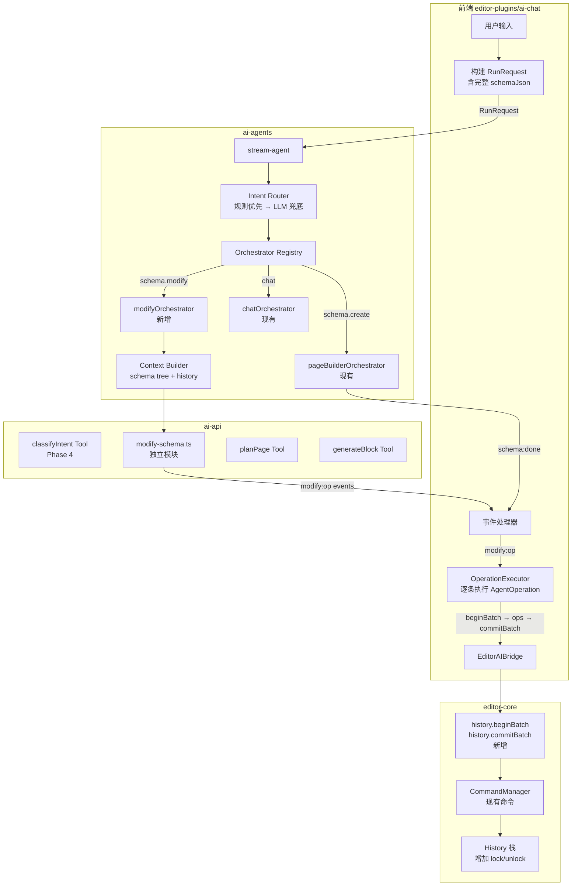

# 对话式修改系统 — 面向扩展的完整架构方案（v2）

## 现状分析

当前系统有一条完整的生成管线，但存在四个结构性缺陷和一个隐患：

1. **无意图路由** — 所有请求都走 `pageBuilderOrchestrator`，硬编码的 `hasPageBuilderTools` 判断（[stream-agent.ts#L10](packages/ai-agents/src/runtime/stream-agent.ts)）
2. **对话历史断路** — `AgentMemoryStore` 已存历史，`AgentRuntimeContext.recentConversation` 已有字段，但 planner prompt 和 block prompt **完全不使用它**（[build-context.ts#L3](packages/ai-agents/src/context/build-context.ts)、[agent-runtime.ts 的 createPlannerMessages/createBlockMessages](apps/ai-api/src/runtime/agent-runtime.ts)）
3. **Schema 上下文太薄** — 只传 `pageId=xxx; nodeCount=N; components=...` 摘要，LLM 看不到页面结构（[ai-contracts index.ts#L13](packages/ai-contracts/src/index.ts)）
4. **只有"全量替换"一种输出模式** — 无论改一个字还是建整页，都走 plan→generate→assemble→schema.replace
5. **History 事务缺失** — 前端已调用 `history.lock/unlock`（[useAgentRun.ts#L130-140](packages/editor-plugins/ai-chat/src/hooks/useAgentRun.ts)），但 editor-core 中**没有注册这些命令**，`History` 类也没有 lock 能力，这些调用目前**静默失败**。更严重的是，`node.patchProps` 等命令默认记录 history，而 `node.insertAt/remove` 不记录，一轮多操作修改会产生**碎片化的 undo 记录**

---

## 核心设计决策

### 决策 1："操作指令"作为一等公民

AI 的输出不再只是"一个完整的 PageSchema"，而是**一组操作指令（AgentOperation）**。全量生成是操作指令的一种特例（`schema.replace`）。

每个 AgentOperation **严格对齐一条现有的 editor-core 命令**，不发明编辑器没有的操作。

```
当前：  LLM → PageSchema → schema.replace（唯一路径）
目标：  LLM → AgentOperation[] → 逐条执行（灵活路径）
         ├─ schema.replace（全量生成）
         ├─ schema.patchProps（修改属性）
         ├─ schema.patchColumns（修改表格列，高频操作）
         ├─ schema.insertNode（插入节点）
         ├─ schema.removeNode（删除节点）
         └─ file.*（未来：多文件操作）
```

### 决策 2：修改操作的"单一真相源"是 editor-core

服务端（agent 层）**不做 `applyOperations`**。`modify:done` 事件仅表示"操作流结束"，不携带最终 schema。最终状态以前端 editor-core 实际执行结果为准。

理由：editor-core 的命令实现（`patchSchemaNodeProps`、`insertSchemaNodeAt` 等）包含校验、不可变更新等语义，如果服务端维护一套独立的 apply 逻辑，两边会不可避免地漂移。

```
服务端：  modifyOrchestrator → LLM → AgentOperation[] → yield modify:op events
前端：    收到 modify:op → 通过 bridge.execute() → 调用 editor-core 命令 → 页面更新
          收到 modify:done → 确认完成（不做 schema 替换）
```

### 决策 3：History 批处理是前置条件

在做修改编排器之前，必须先让 editor-core 具备"一组操作算一次 undo"的能力。否则一轮修改发 6 个 patch，撤销栈会碎成 6 片。

### 决策 4：Intent 使用带命名空间的格式

从一开始就用 `schema.create` / `schema.modify` / `chat` 而非 `create` / `modify` / `chat`，为未来的 `api.create`、`api.modify`、`file.create` 等意图预留空间，避免下一轮再拆。

### 决策 5：意图分类最后上，先用规则路由

修改编排器的质量远比意图分类的准确性重要。前期用简单规则（有现有 schema + 非首轮对话 + 修改型动词 → `schema.modify`），等 modify 管线稳定后再换 LLM 分类。

---

## 整体架构



---

## Phase 1: 基础层 — 契约 + History 批处理

先补地基，两件事并行做。

### 1.1 ai-contracts 类型扩展

**改动文件**：[packages/ai-contracts/src/index.ts](packages/ai-contracts/src/index.ts)

#### AgentIntent — 带命名空间

```typescript
export type AgentIntent =
  | 'schema.create'
  | 'schema.modify'
  | 'chat';
// 未来扩展：'api.create' | 'api.modify' | 'file.create' | ...
```

#### AgentOperation — 严格对齐编辑器命令

```typescript
export type AgentOperation =
  // 对应 node.patchProps 命令
  | { op: 'schema.patchProps'; nodeId: string; patch: Record<string, unknown> }
  // 对应 node.patchStyle 命令
  | { op: 'schema.patchStyle'; nodeId: string; patch: Record<string, unknown> }
  // 对应 node.patchEvents 命令
  | { op: 'schema.patchEvents'; nodeId: string; patch: Record<string, unknown> }
  // 对应 node.patchLogic 命令
  | { op: 'schema.patchLogic'; nodeId: string; patch: Record<string, unknown> }
  // 对应 node.patchColumns 命令（表格列修改高频场景，单列 op）
  | { op: 'schema.patchColumns'; nodeId: string; columns: unknown }
  // 对应 node.insertAt 命令
  | { op: 'schema.insertNode'; parentId: string; index?: number; node: SchemaNode }
  // 对应 node.remove 命令
  | { op: 'schema.removeNode'; nodeId: string }
  // 对应 schema.replace 命令（全量替换，pageBuilder 的特例）
  | { op: 'schema.replace'; schema: PageSchema };
```

注意：**不包含 `schema.replaceNode`**，因为 editor-core 没有对应命令。需要替换节点时，LLM 应输出 `removeNode` + `insertNode` 组合。

#### AgentEvent 扩展

```typescript
export type AgentEvent =
  // ... 现有事件不变
  | { type: 'intent'; data: { intent: AgentIntent; confidence: number } }
  | { type: 'modify:start'; data: { operationCount: number; explanation: string } }
  | { type: 'modify:op'; data: { index: number; operation: AgentOperation } }
  | { type: 'modify:done'; data: {} };
  //  ↑ 注意：modify:done 不携带 schema，最终状态以前端实际执行结果为准
```

#### RunRequest 扩展

```typescript
export interface RunRequest {
  prompt: string;
  conversationId?: string;
  selectedNodeId?: string;
  plannerModel?: string;
  blockModel?: string;
  thinking?: ThinkingConfig;
  context: {
    schemaSummary: string;
    componentSummary: string;
    schemaJson?: PageSchema;       // 新增：完整 schema
    workspaceFileIds?: string[];   // 预留：工作区文件列表
  };
}
```

#### ModifyResult — modifySchema tool 的输出格式

```typescript
export interface ModifyResult {
  explanation: string;
  operations: AgentOperation[];
}
```

### 1.2 editor-core History 批处理

这是让多操作修改能正确 undo 的**前置条件**。

#### 1.2a History 类增加 lock/unlock

**改动文件**：[packages/editor-core/src/history.ts](packages/editor-core/src/history.ts)

```typescript
export class History<T> {
  // ... 现有字段
  private locked = false;
  private snapshotBeforeLock: T | undefined;
  private batchDirty = false;

  lock(): void {
    if (this.locked) return;
    this.locked = true;
    this.snapshotBeforeLock = this.current;
    this.batchDirty = false;
  }

  unlock(): void {
    if (!this.locked) return;
    this.locked = false;
    this.snapshotBeforeLock = undefined;
    this.batchDirty = false;
  }

  commit(): void {
    if (!this.locked || !this.snapshotBeforeLock) return;
    if (!this.batchDirty) {
      // 批处理期间没有任何 push → 不入栈，避免空 undo 点
      this.locked = false;
      this.snapshotBeforeLock = undefined;
      return;
    }
    // 锁定期间的所有变更合并为一次 undo 记录
    this.undoStack.push(this.snapshotBeforeLock);
    if (this.undoStack.length > this.maxSize) {
      this.undoStack.shift();
    }
    // this.current 已经在 push() 中被持续同步为最新快照
    this.redoStack = [];
    this.locked = false;
    this.snapshotBeforeLock = undefined;
    this.batchDirty = false;
  }

  discard(): void {
    if (!this.locked || !this.snapshotBeforeLock) return;
    this.current = this.snapshotBeforeLock;
    this.locked = false;
    this.snapshotBeforeLock = undefined;
    this.batchDirty = false;
  }

  isLocked(): boolean {
    return this.locked;
  }

  push(state: T): void {
    if (this.locked) {
      // 锁定期间：只同步 current，不压 undo 栈，标记 dirty
      this.current = state;
      this.batchDirty = true;
      return;
    }
    // 原有逻辑不变
    this.undoStack.push(this.current);
    if (this.undoStack.length > this.maxSize) {
      this.undoStack.shift();
    }
    this.current = state;
    this.redoStack = [];
  }
}
```

核心语义：
- `lock()` → 开始批处理，记住当前快照，`batchDirty = false`
- 锁定期间的 `push()` → 同步 `current` 为最新快照，标记 `batchDirty = true`，**不压 undo 栈**
- `commit()` → 结束批处理；**如果 `batchDirty === false`（从未 push 过），不入栈**；否则 lock 前的快照入 undo 栈，`current` 已经是最新
- `discard()` → 放弃批处理，将 `current` 恢复到 lock 前状态
- `unlock()` → 不提交直接解锁（用于异常恢复）

#### 1.2b CommandManager 集成

**改动文件**：[packages/editor-core/src/command.ts](packages/editor-core/src/command.ts)

批处理期间，`CommandManager.execute` 需要解决两个问题：
1. 不让单条命令独立产生 undo 记录（由 `commit()` 统一管理）
2. **无论命令的 `recordHistory` 是什么值**，只要状态变了就要同步 `History.current`

```typescript
async execute(commandId: string, args?: unknown): Promise<unknown> {
  // ... 现有逻辑
  if (isRootExecution) {
    const afterSnapshot = this.state.getSnapshot();
    const stateChanged = beforeSnapshot && !snapshotsEqual(beforeSnapshot, afterSnapshot);

    if (this.history.isLocked()) {
      // 批处理模式：忽略 recordHistory 标志，只要状态变了就 push
      // History.push() 在 locked 时只同步 current，不压 undo 栈
      if (stateChanged) {
        this.history.push(afterSnapshot);
      }
    } else {
      // 正常模式：尊重 recordHistory 标志（原有逻辑）
      if (command.recordHistory !== false && stateChanged) {
        this.history.push(afterSnapshot);
        this.eventBus.emit('history:pushed', undefined);
      }
    }
    this.syncHistoryFlags();
  }
}
```

**这解决了 `node.insertAt`（`recordHistory: false`）在批处理中不更新 `History.current` 的问题**。批处理模式下，`recordHistory` 标志被忽略——反正不会产生独立 undo 点，所有变更都由 `commit()` 统一收口。

#### 1.2c 注册批处理命令

**改动文件**：[packages/editor-core/src/create-editor.ts](packages/editor-core/src/create-editor.ts)

```typescript
commands.register({
  id: 'history.beginBatch',
  label: 'Begin History Batch',
  recordHistory: false,
  execute() {
    history.lock();
  },
});

commands.register({
  id: 'history.commitBatch',
  label: 'Commit History Batch',
  recordHistory: false,
  execute(currentState) {
    history.commit();
    // commit 后同步 undo/redo 标志
    currentState.setHistoryFlags(history.canUndo(), history.canRedo());
  },
});

commands.register({
  id: 'history.discardBatch',
  label: 'Discard History Batch',
  recordHistory: false,
  execute(currentState) {
    const restoredSnapshot = history.discard();
    if (restoredSnapshot) {
      currentState.restoreSnapshot({
        ...restoredSnapshot,
        canUndo: history.canUndo(),
        canRedo: history.canRedo(),
      });
    }
  },
});
```

这同时解决了前端 `useAgentRun.ts` 中已有的 `history.lock/unlock` 调用——现在它们会真正生效。可以将前端代码中的 `history.lock` → `history.beginBatch`、`history.unlock` → `history.commitBatch`/`history.discardBatch`。

---

## Phase 2: 上下文质量 — Schema 树 + 对话历史

这是修改质量的根基。如果 LLM 看不到页面结构、不知道之前聊了什么，修改就是瞎改。

### 2.1 Schema 树序列化

**新增文件**：`packages/ai-agents/src/context/schema-tree.ts`

将 `PageSchema` 转为紧凑树形文本，LLM 通过 nodeId 定位修改目标：

```
[body]
  Row#row-1
    Col#col-1(span=12)
      Card#card-1(title="用户统计")
        Statistic#stat-1(title="总用户数", value="{{state.total}}")
    Col#col-2(span=12)
      Table#table-1(columns=["姓名","年龄","操作"], dataSource="{{state.users}}")
        → 3 column definitions
[dialogs]
  Modal#modal-1(title="编辑用户")
    Form#form-1
      Form.Item#fi-1(label="姓名") → Input#input-1
      Form.Item#fi-2(label="年龄") → InputNumber#input-2
[state]
  total: number, users: array
```

设计要点：

- 每个节点格式：`ComponentType#id(关键props)`
- **"关键 props"由组件类型决定**（借助组件契约中的 `description` 筛选）：
  - Card → title
  - Table → columns 名称列表、dataSource
  - Form.Item → label、name
  - Button → type、children text
  - Statistic → title、value
  - Modal/Drawer → title
  - Col → span
- Token 控制参数：`maxDepth`（默认 8）、`maxNodes`（默认 200）
- 超限时深层节点折叠为 `→ N children`
- 同时输出 `[state]` 段摘要，让 LLM 了解数据绑定
- API：`serializeSchemaTree(schema: PageSchema, options?: SerializeOptions): string`

### 2.2 对话历史格式化

**新增文件**：`packages/ai-agents/src/context/conversation-history.ts`

```typescript
export interface FormatHistoryOptions {
  maxTurns?: number;        // 默认 6
  maxCharsPerTurn?: number; // 默认 500
  includeOperations?: boolean; // 默认 true
}

export function formatConversationHistory(
  messages: AgentMemoryMessage[],
  options?: FormatHistoryOptions,
): string
```

输出示例：

```
[对话历史 - 共 3 轮]
---
用户: 帮我做一个用户管理页面
助手: 已生成用户管理页面，包含搜索表单和用户数据表格。
      [执行: schema.replace → 整页生成]
---
用户: 表格加一列"操作"，里面放编辑和删除按钮
助手: 已在表格末尾添加"操作"列。
      [执行: schema.patchColumns(table-1)]
---
用户: 把标题改成"活跃用户管理"       ← 当前请求
```

当 `includeOperations: true` 时，从 `AgentMemoryMessage.meta.operations` 中提取操作摘要，让 LLM 知道之前具体改了什么。

### 2.3 AgentRuntimeContext 增强

**改动文件**：[packages/ai-agents/src/types.ts](packages/ai-agents/src/types.ts)

```typescript
export interface AgentRuntimeContext {
  prompt: string;
  selectedNodeId?: string;

  // 文档上下文（取代薄弱的 schemaSummary）
  document: {
    exists: boolean;
    summary: string;          // 原 schemaSummary（兼容）
    tree?: string;            // 结构化树形表示（新增）
    schema?: PageSchema;      // 完整 schema（新增）
  };

  componentSummary: string;

  // 对话上下文（强化）
  conversation: {
    history: AgentMemoryMessage[];
    turnCount: number;
    lastOperations?: AgentOperation[];
  };

  lastRunMetadata?: RunMetadata;
  lastBlockIds: string[];
}
```

**改动文件**：[packages/ai-agents/src/context/build-context.ts](packages/ai-agents/src/context/build-context.ts)

从 `BuildContextInput` 构建增强的 context，包括：
- 调用 `serializeSchemaTree` 生成 `document.tree`
- 从 memory 提取 `conversation.turnCount`
- 从上一轮 assistant message 的 `meta.operations` 填充 `conversation.lastOperations`

**改动文件**：[packages/ai-agents/src/types.ts](packages/ai-agents/src/types.ts)

```typescript
export interface AgentMemoryMessage {
  role: 'user' | 'assistant';
  text: string;
  meta?: {
    intent?: AgentIntent;
    operations?: AgentOperation[];
    schemaDigest?: string;
    failed?: boolean;  // 标记本轮修改是否失败，防止脏历史
  };
}
```

---

## Phase 3: 修改管线 — 编排器 + 工具 + 前端执行

先跑通"用户说一句修改意图 → 页面局部更新"的完整链路。此阶段暂不做 LLM 意图分类，手动触发 modify 流程即可。

### 3.1 modifyOrchestrator

**新增文件**：`packages/ai-agents/src/orchestrators/modify-orchestrator.ts`

```typescript
export async function* modifyOrchestrator(
  request: RunRequest,
  context: AgentRuntimeContext,
  deps: AgentRuntimeDeps,
  metadata: RunMetadata,
): AsyncGenerator<AgentEvent> {
  const modifySchema = getRequiredTool<ModifySchemaInput, ModifyResult>(deps, 'modifySchema');

  yield { type: 'message:start', data: { role: 'assistant' } };
  yield { type: 'tool:start', data: { tool: 'modifySchema', label: '分析修改意图' } };

  const result = await modifySchema.execute({ request, context });

  yield { type: 'tool:result', data: { tool: 'modifySchema', ok: true, summary: result.explanation } };
  yield { type: 'message:delta', data: { text: result.explanation } };
  yield { type: 'modify:start', data: {
    operationCount: result.operations.length,
    explanation: result.explanation,
  } };

  // 逐条发射操作事件（渐进式反馈，前端逐条执行）
  for (const [index, operation] of result.operations.entries()) {
    yield { type: 'modify:op', data: { index, operation } };
  }

  // modify:done 不携带 schema —— 单一真相源在前端
  yield { type: 'modify:done', data: {} };
}
```

### 3.2 modifySchema Tool（独立模块）

**新增文件**：`apps/ai-api/src/runtime/modify-schema.ts`

不塞进已经很重的 `agent-runtime.ts`，独立模块，只负责：
- 构建修改场景的 system prompt + user prompt
- 调用 LLM
- 解析输出为 `ModifyResult`

```typescript
export async function modifySchemaWithModel(
  input: ModifySchemaInput,
  trace?: RunTraceRecord,
): Promise<ModifyResult>
```

**System prompt 核心结构**：

```
你是一个低代码页面修改助手。根据用户的修改意图，输出最小化的操作指令集。

## 当前页面结构
{schemaTree}

## 对话历史
{conversationHistory}

## 可用操作
- schema.patchProps: 修改节点 props
  格式: { "op": "schema.patchProps", "nodeId": "xxx", "patch": { ... } }
- schema.patchStyle: 修改节点 style
- schema.patchEvents: 修改节点事件
- schema.patchColumns: 修改表格列定义（仅 Table 组件）
- schema.insertNode: 在指定父节点下插入新节点
  格式: { "op": "schema.insertNode", "parentId": "xxx", "index": 0, "node": { ... } }
- schema.removeNode: 删除指定节点

## 相关组件契约
{relevantContracts}  ← 只注入 schema tree 中出现的组件

## 输出格式
严格输出 JSON：
{
  "explanation": "简要说明做了什么修改",
  "operations": [ ... ]
}

## 规则
1. nodeId 必须是当前页面中存在的节点 id
2. 新增节点的 props 必须符合组件契约
3. 用最少的操作完成修改
4. 需要替换节点时，用 removeNode + insertNode 组合
5. 如果用户选中了节点（selectedNodeId），优先以选中节点为操作目标
```

**注册到 createRuntimeDeps**：

**改动文件**：[apps/ai-api/src/runtime/agent-runtime.ts](apps/ai-api/src/runtime/agent-runtime.ts)

在 `createToolRegistry` 中增加一个 tool：

```typescript
{
  name: 'modifySchema',
  async execute(input) {
    return modifySchemaWithModel(input as ModifySchemaInput, trace);
  },
},
```

### 3.3 operation-executor（前端）

**新增文件**：`packages/editor-plugins/ai-chat/src/ai/operation-executor.ts`

将 `AgentOperation` 映射为 editor-core 命令，**用 history batch 包装**：

```typescript
import { getTreeIdBySchemaNodeId } from '@shenbi/editor-core';

function resolveTreeId(schema: PageSchema, nodeId: string): string {
  const treeId = getTreeIdBySchemaNodeId(schema, nodeId);
  if (!treeId) {
    throw new Error(`Node not found: ${nodeId}`);
  }
  return treeId;
}

const OP_TO_COMMAND: Record<string, string> = {
  'schema.patchProps':   'node.patchProps',
  'schema.patchStyle':   'node.patchStyle',
  'schema.patchEvents':  'node.patchEvents',
  'schema.patchLogic':   'node.patchLogic',
  'schema.patchColumns': 'node.patchColumns',
  'schema.insertNode':   'node.insertAt',
  'schema.removeNode':   'node.remove',
  'schema.replace':      'schema.replace',
};

export async function executeSingleOperation(
  bridge: EditorAIBridge,
  operation: AgentOperation,
): Promise<ExecuteResult> {
  switch (operation.op) {
    case 'schema.patchProps':
    case 'schema.patchStyle':
    case 'schema.patchEvents':
    case 'schema.patchLogic': {
      const treeId = resolveTreeId(bridge.getSchema(), operation.nodeId);
      return bridge.execute(OP_TO_COMMAND[operation.op], { treeId, patch: operation.patch });
    }
    case 'schema.patchColumns': {
      const treeId = resolveTreeId(bridge.getSchema(), operation.nodeId);
      return bridge.execute('node.patchColumns', { treeId, columns: operation.columns });
    }
    case 'schema.insertNode': {
      const parentTreeId = resolveTreeId(bridge.getSchema(), operation.parentId);
      return bridge.execute('node.insertAt', {
        node: operation.node,
        index: operation.index ?? -1,
        parentTreeId,
      });
    }
    case 'schema.removeNode': {
      const treeId = resolveTreeId(bridge.getSchema(), operation.nodeId);
      return bridge.execute('node.remove', { treeId });
    }
    case 'schema.replace':
      return bridge.execute('schema.replace', { schema: operation.schema });
    default:
      return { success: false, error: `Unknown operation: ${(operation as any).op}` };
  }
}
```

### 3.4 前端事件处理

**改动文件**：[packages/editor-plugins/ai-chat/src/hooks/useAgentRun.ts](packages/editor-plugins/ai-chat/src/hooks/useAgentRun.ts)

在事件处理 switch 中增加 modify 系列事件。**关键点：任何 op 失败都必须走 discard，不能留下半完成的脏状态。**

```typescript
// 新增状态跟踪
let modifyBatchActive = false;
let modifyFailed = false;

case 'intent':
  // 可选：UI 显示当前识别的意图
  break;

case 'modify:start':
  // 开始 history batch（一轮修改 = 一次 undo）
  await bridge.execute('history.beginBatch');
  modifyBatchActive = true;
  modifyFailed = false;
  break;

case 'modify:op':
  if (modifyFailed) break;  // 已失败，跳过后续操作
  const result = await executeSingleOperation(bridge, event.data.operation);
  if (!result.success) {
    modifyFailed = true;
    // 立即回滚：丢弃整个 batch，恢复到修改前状态
    await bridge.execute('history.discardBatch');
    modifyBatchActive = false;
    // 通知用户
    onError(`修改失败：操作 ${event.data.operation.op} 执行出错 — ${result.error}`);
  }
  break;

case 'modify:done':
  if (modifyBatchActive) {
    if (modifyFailed) {
      // 已经在 modify:op 失败时 discard 过了，这里只做清理
      modifyBatchActive = false;
    } else {
      // 全部成功 → 提交 batch（空批次不会产生 undo 点）
      await bridge.execute('history.commitBatch');
      modifyBatchActive = false;
    }
  }
  break;
```

取消逻辑也需适配：

```typescript
// cancelRun 中
if (modifyBatchActive) {
  await bridge.execute('history.discardBatch');
  modifyBatchActive = false;
}
```

#### 失败时的 Memory 处理 — finalize 闭环

**问题**：SSE 是服务端到客户端的单向推送。`modify:op` 的操作指令虽然成功发送了，但**客户端是否成功执行了这些操作，服务端并不知道**。当前 `stream-agent.ts` 在流结束后直接写 memory（[stream-agent.ts#L72](packages/ai-agents/src/runtime/stream-agent.ts)），所以服务端会乐观地认为所有操作都成功了。如果客户端执行失败并 `discardBatch`，memory 里就会出现"助手说改了，但页面没改"的脏数据。

**解决方案**：新增 `POST /api/ai/run/finalize` 接口，让客户端在流结束后回报执行结果。需要解决两个子问题：**精确定位目标消息**和**写入时序**。

##### 精确定位：按 sessionId patch，不按"最后一条"

"找最后一条 assistant 消息打补丁"在以下场景会出错：
- 同一 conversationId 下连续快速发起两次运行
- finalize 延迟到下一轮消息已写入

**修正**：每条 assistant 消息在写入时携带 `meta.sessionId`，finalize 按 `sessionId` 精确匹配。

##### 写入时序：memory 写入必须在 yield done 之前

当前 `stream-agent.ts` 的顺序是：

```
yield done → 写 memory    （现有代码，stream-agent.ts#L68-L84）
```

客户端收到 `done` 后立即 POST `/finalize`，但此时服务端可能还没完成 memory 写入，finalize 找不到目标消息。

**修正**：将 assistant memory 写入挪到 `yield done` 之前：

```
写 memory（带 sessionId）→ yield done → 客户端 POST /finalize
```

##### 新增路由

**新增文件**：`apps/ai-api/src/routes/finalize.ts`

```typescript
export interface FinalizeRequest {
  conversationId: string;
  sessionId: string;
  success: boolean;
  failedOpIndex?: number;
  error?: string;
}
```

路由处理：
- 收到 `success: true` → 不做额外处理（memory 中已有正确记录）
- 收到 `success: false` → 调用 `memory.patchAssistantMessage(conversationId, sessionId, ...)` 按 sessionId 精确定位目标消息，将 `meta.failed` 设为 `true`，`text` 前缀加 `[修改失败]`，清空 `meta.operations`

##### AgentMemoryStore 接口扩展

**改动文件**：[packages/ai-agents/src/types.ts](packages/ai-agents/src/types.ts)

```typescript
export interface AgentMemoryStore {
  // ... 现有方法
  patchAssistantMessage?(
    conversationId: string,
    sessionId: string,
    patch: { text?: string; meta?: Partial<AgentMemoryMessage['meta']> },
  ): Promise<void>;
}
```

`InMemoryAgentMemoryStore` 实现：遍历 conversation 找到 `meta.sessionId === sessionId` 的消息，合并 patch。找不到则忽略（幂等）。

##### stream-agent 中的 Memory 写入（调整顺序 + 带 sessionId）

**改动文件**：[packages/ai-agents/src/runtime/stream-agent.ts](packages/ai-agents/src/runtime/stream-agent.ts)

```typescript
// ① 先写 memory（在 yield done 之前）
const assistantText = assistantDeltas.join('');
await Promise.all([
  ...(assistantText
    ? [
        deps.memory.appendConversationMessage(conversationId, {
          role: 'assistant',
          text: assistantText,
          meta: {
            sessionId,               // 精确定位用
            intent: classification.intent,
            operations: collectedOperations.length > 0 ? collectedOperations : undefined,
          },
        }),
      ]
    : []),
  deps.memory.setLastRunMetadata(conversationId, metadata),
  deps.memory.setLastBlockIds(conversationId, finalSchemaBlocks),
]);

// ② 再 yield done（客户端收到后才会 POST /finalize）
metadata.durationMs = Date.now() - startedAt;
const doneEvent: AgentEvent = { type: 'done', data: { metadata } };
yield doneEvent;
```

##### 前端 finalize 调用

**改动文件**：[packages/editor-plugins/ai-chat/src/hooks/useAgentRun.ts](packages/editor-plugins/ai-chat/src/hooks/useAgentRun.ts)

在 `done` 事件处理中：

```typescript
case 'done':
  // ... 现有逻辑
  // 如果是 modify 流程，回报执行结果
  if (wasModifyRun) {
    await aiClient.finalize({
      conversationId,
      sessionId: event.data.metadata.sessionId,
      success: !modifyFailed,
      ...(modifyFailed ? { failedOpIndex: failedAtIndex, error: failedError } : {}),
    });
  }
  break;
```

##### AgentMemoryMessage meta 类型（同步更新）

```typescript
meta?: {
  sessionId?: string;     // 精确定位用
  intent?: AgentIntent;
  operations?: AgentOperation[];
  schemaDigest?: string;
  failed?: boolean;
};
```

##### 数据流（修正后）

```
服务端发 modify:op events → 客户端逐条执行
         ↓                            ↓
服务端写 memory（带 sessionId）  客户端记录成功/失败
         ↓
服务端 yield done event
                              → 客户端收到 done
                              → 客户端 POST /finalize(sessionId)
                                       ↓
                              服务端收到 finalize
                              按 sessionId 精确定位 assistant 消息
                              success=true → 无操作
                              success=false → patch 该消息标记失败
```

关键保证：
- **定位可靠**：按 `sessionId` 匹配，不受其他消息干扰
- **时序安全**：memory 写入在 `yield done` 之前完成，客户端收到 done 时消息一定已存在
- **幂等安全**：finalize 重复调用不会产生副作用

##### 容错

- 如果客户端崩溃导致 finalize 未发送 → memory 中为乐观记录（假成功），下一轮对话时 LLM 看到的页面结构（来自 `schemaTree`）和上一轮的操作记录会不一致，但不会比当前"完全没有历史"的情况更差
- 可以在 finalize 中增加 `schemaDigest`（页面 hash），服务端存入 `meta.schemaDigest`，后续校验时如果请求带来的 schema 和 memory 中记录的 digest 不匹配，可以自动标记该轮为不可信

#### 发送完整 Schema

同样在 `useAgentRun.ts` 中，构建 RunRequest 时传入完整 schema：

```typescript
const schema = bridgeRef.current.getSchema();
const request: RunRequest = {
  prompt,
  conversationId,
  selectedNodeId,
  context: {
    schemaSummary: summarizeSchema(schema),
    componentSummary: summarizeComponents(contracts),
    schemaJson: schema,  // 新增
  },
};
```

---

## Phase 4: 意图路由 — 编排器注册 + 分类

### 4.1 编排器注册表

**新增文件**：`packages/ai-agents/src/orchestrators/registry.ts`

```typescript
export interface OrchestratorRegistration {
  id: string;
  intents: AgentIntent[];
  canHandle?(context: AgentRuntimeContext, deps: AgentRuntimeDeps): boolean;
  orchestrate: OrchestratorFunction;
}

export type OrchestratorFunction = (
  request: RunRequest,
  context: AgentRuntimeContext,
  deps: AgentRuntimeDeps,
  metadata: RunMetadata,
) => AsyncGenerator<AgentEvent>;

export interface OrchestratorRegistry {
  register(registration: OrchestratorRegistration): void;
  resolve(intent: AgentIntent, context: AgentRuntimeContext, deps: AgentRuntimeDeps): OrchestratorFunction | undefined;
}
```

注册现有编排器：

```typescript
registry.register({
  id: 'page-builder',
  intents: ['schema.create'],
  canHandle: (_ctx, deps) => hasPageBuilderTools(deps),
  orchestrate: pageBuilderOrchestrator,
});

registry.register({
  id: 'page-modifier',
  intents: ['schema.modify'],
  canHandle: (ctx, deps) => Boolean(deps.tools.get('modifySchema')) && ctx.document.exists,
  orchestrate: modifyOrchestrator,
});

registry.register({
  id: 'chat',
  intents: ['chat'],
  orchestrate: chatOrchestrator,
});
```

### 4.2 规则路由（先行）

**新增文件**：`packages/ai-agents/src/intent/rule-classifier.ts`

简单规则，不调 LLM，零延迟：

```typescript
export function classifyIntentByRules(context: AgentRuntimeContext): IntentClassification {
  // 没有现有 schema → 新建
  if (!context.document.exists) {
    return { intent: 'schema.create', confidence: 0.9 };
  }

  // ① create 关键词优先级最高（即使是 follow-up，"再生成一个订单页"也是 create）
  const createKeywords = ['做一个', '生成一个', '创建一个', '新建', '帮我做', '帮我生成',
    '重新生成', '重新做', '再做一个', '再生成'];
  const hasCreateIntent = createKeywords.some(kw => context.prompt.includes(kw));
  if (hasCreateIntent) {
    return { intent: 'schema.create', confidence: 0.85 };
  }

  // ② 明确的修改型关键词
  const modifyKeywords = ['改', '修改', '调整', '换', '加上', '删除', '去掉', '移除',
    '添加', '增加', '变成', '设为', '更新', '替换', '移动', '隐藏', '显示'];
  const hasModifyIntent = modifyKeywords.some(kw => context.prompt.includes(kw));

  // ③ 选中了节点 → 强修改信号
  const hasSelection = Boolean(context.selectedNodeId);

  if (hasModifyIntent || hasSelection) {
    return { intent: 'schema.modify', confidence: 0.85 };
  }

  // ④ follow-up 是弱修改信号，仅在排除 create 后生效
  const isFollowUp = context.conversation.turnCount > 0;
  if (isFollowUp) {
    return { intent: 'schema.modify', confidence: 0.6 };
  }

  // ⑤ 有 schema 但无明确意图信号 → 默认 chat
  return { intent: 'chat', confidence: 0.5 };
}
```

**优先级说明**：create 关键词 > modify 关键词 / 选中节点 > follow-up（弱信号）> 默认 chat。这样"再生成一个订单页"不会被误判为 modify。

### 4.3 stream-agent 路由改造

**改动文件**：[packages/ai-agents/src/runtime/stream-agent.ts](packages/ai-agents/src/runtime/stream-agent.ts)

```typescript
export async function* runAgentStream(
  request: RunRequest,
  deps: AgentRuntimeDeps,
): AsyncGenerator<AgentEvent> {
  // ... existing setup (memory, context, etc.)

  // 意图分类：优先 LLM tool，降级到规则，最终降级到原有逻辑
  let classification: IntentClassification;
  const classifyIntentTool = deps.tools.get('classifyIntent');
  if (classifyIntentTool) {
    classification = await classifyIntentTool.execute({ ... });
  } else if (context.document.schema) {
    classification = classifyIntentByRules(context);
  } else {
    // 终极降级：原有逻辑
    classification = {
      intent: hasPageBuilderTools(deps) ? 'schema.create' : 'chat',
      confidence: 1.0,
    };
  }
  yield { type: 'intent', data: classification };

  // 编排器选择
  const orchestrator = deps.orchestratorRegistry?.resolve(
    classification.intent, context, deps
  );
  if (!orchestrator) {
    // fallback to original logic
    const fallback = hasPageBuilderTools(deps)
      ? pageBuilderOrchestrator : chatOrchestrator;
    yield* fallback(request, context, deps, metadata);
    return;
  }

  yield* orchestrator(request, context, deps, metadata);
}
```

三层降级保证兼容：
1. 有 `classifyIntent` tool → LLM 分类
2. 有 schema context → 规则分类
3. 都没有 → 原有的 `hasPageBuilderTools` 逻辑

### 4.4 LLM 意图分类（Phase 4 后期）

**新增文件**：`apps/ai-api/src/runtime/classify-intent.ts`

在 modify 管线稳定后，实现 `classifyIntent` tool。这是一个轻量 LLM 调用（输入短、输出短），延迟在 500ms 以内。

```typescript
export async function classifyIntentWithModel(
  input: ClassifyIntentInput,
  trace?: RunTraceRecord,
): Promise<IntentClassification>
```

注册到 `createRuntimeDeps` 的 `createToolRegistry` 中即可激活，规则路由自动降级为 fallback。

---

## Phase 5: Memory 增强

### 5.1 记录结构化操作历史

**改动文件**：[packages/ai-agents/src/runtime/stream-agent.ts](packages/ai-agents/src/runtime/stream-agent.ts)

在 `modify:done` 后，将本轮的 intent 和 operations 写入 assistant 消息的 meta：

```typescript
// 从事件流中收集 modify:op 的操作
const collectedOperations: AgentOperation[] = [];
for await (const event of generator) {
  if (event.type === 'modify:op') {
    collectedOperations.push(event.data.operation);
  }
  // ... yield event
}

// append assistant 消息时带上 meta
await deps.memory.appendConversationMessage(conversationId, {
  role: 'assistant',
  text: assistantText,
  meta: {
    intent: classification.intent,
    operations: collectedOperations.length > 0 ? collectedOperations : undefined,
  },
});
```

### 5.2 AgentMemoryStore 接口兼容

`AgentMemoryMessage` 增加了可选的 `meta` 字段，`InMemoryAgentMemoryStore` 不需要改——它只做存取，不解析字段。但如果未来要做持久化（如写数据库），需要确保 `meta` 字段被正确序列化。

---

## 扩展性分析

### 场景 A：多文件操作（每个页面是一个文件）

- `AgentIntent` 扩展：`'file.create'`、`'file.switch'`
- `AgentOperation` 扩展 `file.*` 命名空间：

```typescript
| { op: 'file.create'; name: string; schema: PageSchema }
| { op: 'file.open'; fileId: string }
| { op: 'file.save'; fileId?: string }
```

- `operation-executor.ts` 中增加对应分支，映射到 `file.saveAs`、`file.openSchema` 等已有命令
- 编排器注册表自然容纳，不需要改 stream-agent

### 场景 B：API / 后端代码生成

- `AgentIntent` 扩展：`'api.create'`、`'api.modify'`
- 新编排器：`apiBuilderOrchestrator`
- 新工具：`generateApiSpec`
- `AgentRuntimeContext.document.type` 扩展为 `'page-schema' | 'api-spec' | ...`
- 新 `AgentOperation` 命名空间：`api.addEndpoint`、`api.modifyEndpoint`
- 可能需要新的 editor-core 适配器（非 PageSchema 的文件类型）

### 场景 C：前后台混合生成

- 复合编排器 `fullStackOrchestrator` 内部串联/并行调用 page 和 api 子编排器
- `AgentOperation` 的命名空间天然支持混合：`schema.*` + `api.*` + `file.*`
- 事件流中混合不同类型的操作，前端按 op 命名空间分发到对应执行器

---

## 改动文件汇总

### 新增文件

| 文件 | 所属包 | 说明 |
|------|--------|------|
| `packages/ai-agents/src/context/schema-tree.ts` | ai-agents | Schema 树序列化 |
| `packages/ai-agents/src/context/conversation-history.ts` | ai-agents | 对话历史格式化 |
| `packages/ai-agents/src/orchestrators/modify-orchestrator.ts` | ai-agents | 修改编排器 |
| `packages/ai-agents/src/orchestrators/registry.ts` | ai-agents | 编排器注册表 |
| `packages/ai-agents/src/intent/rule-classifier.ts` | ai-agents | 规则意图分类 |
| `apps/ai-api/src/runtime/modify-schema.ts` | ai-api | modifySchema tool（独立模块） |
| `apps/ai-api/src/runtime/classify-intent.ts` | ai-api | LLM 意图分类（Phase 4 后期） |
| `apps/ai-api/src/routes/finalize.ts` | ai-api | finalize 路由 — 客户端回报修改执行结果 |
| `packages/editor-plugins/ai-chat/src/ai/operation-executor.ts` | ai-chat | AgentOperation 执行器 |

### 修改文件

| 文件 | 说明 |
|------|------|
| `packages/ai-contracts/src/index.ts` | AgentOperation、AgentIntent（命名空间）、AgentEvent、RunRequest、FinalizeRequest 类型扩展 |
| `packages/editor-core/src/history.ts` | History 增加 lock/unlock/commit/discard |
| `packages/editor-core/src/command.ts` | CommandManager 适配 locked 状态 |
| `packages/editor-core/src/create-editor.ts` | 注册 history.beginBatch/commitBatch/discardBatch |
| `packages/ai-agents/src/types.ts` | AgentRuntimeContext 增强、AgentMemoryMessage meta |
| `packages/ai-agents/src/context/build-context.ts` | 构建增强后的 context |
| `packages/ai-agents/src/runtime/stream-agent.ts` | 意图路由、编排器选择、操作记录 |
| `apps/ai-api/src/runtime/agent-runtime.ts` | 注册 modifySchema/classifyIntent tool（仅 registry 部分） |
| `apps/ai-api/src/routes/validate.ts` | 校验 RunRequest 新字段 |
| `apps/ai-api/src/app.ts` | 注册 finalize 路由 |
| `packages/ai-agents/src/types.ts` (AgentMemoryStore) | 增加可选 `patchAssistantMessage(conversationId, sessionId, patch)` 方法 |
| `packages/ai-agents/src/memory/memory-store.ts` | 实现 `patchAssistantMessage`：按 sessionId 精确定位 |
| `packages/ai-agents/src/runtime/stream-agent.ts` (写入顺序) | memory 写入挪到 yield done 之前，assistant message 带 `meta.sessionId` |
| `packages/editor-plugins/ai-chat/src/hooks/useAgentRun.ts` | 传完整 schema、处理 modify 事件、history batch |

### 不改动的部分

- `editor-core` 的 EditorState、EventBus、schema-editor 纯函数 — 已经足够
- `editor-ui` 的 Shell 布局和插件系统 — 不需要改
- `FileStorageAdapter` — 已有的抽象足够
- 现有的 `pageBuilderOrchestrator` — 包装注册，内部逻辑不改
- 现有的 `chatOrchestrator` — 同上

---

## 实施顺序总结

```mermaid
gantt
    title 实施路线
    dateFormat X
    axisFormat %s
    
    section Phase1_基础层
    ai-contracts类型扩展: p1a, 0, 2
    History批处理机制: p1b, 0, 3
    
    section Phase2_上下文
    Schema树序列化: p2a, 3, 5
    对话历史格式化: p2b, 3, 5
    Context增强_build-context: p2c, 5, 6
    
    section Phase3_修改管线
    modifyOrchestrator: p3a, 6, 8
    modifySchema_tool: p3b, 6, 8
    operation-executor: p3c, 8, 9
    前端集成与调试: p3d, 9, 11
    
    section Phase4_意图路由
    编排器注册表: p4a, 11, 12
    规则路由: p4b, 12, 13
    stream-agent改造: p4c, 13, 14
    LLM意图分类: p4d, 14, 16
    
    section Phase5_记忆
    Memory结构化: p5, 14, 16
```



**核心原则**：Phase 1-3 确保"修改能跑通且 undo 不乱"，Phase 4 解决"自动判断何时走修改"，Phase 5 让"多轮对话越改越准"。
