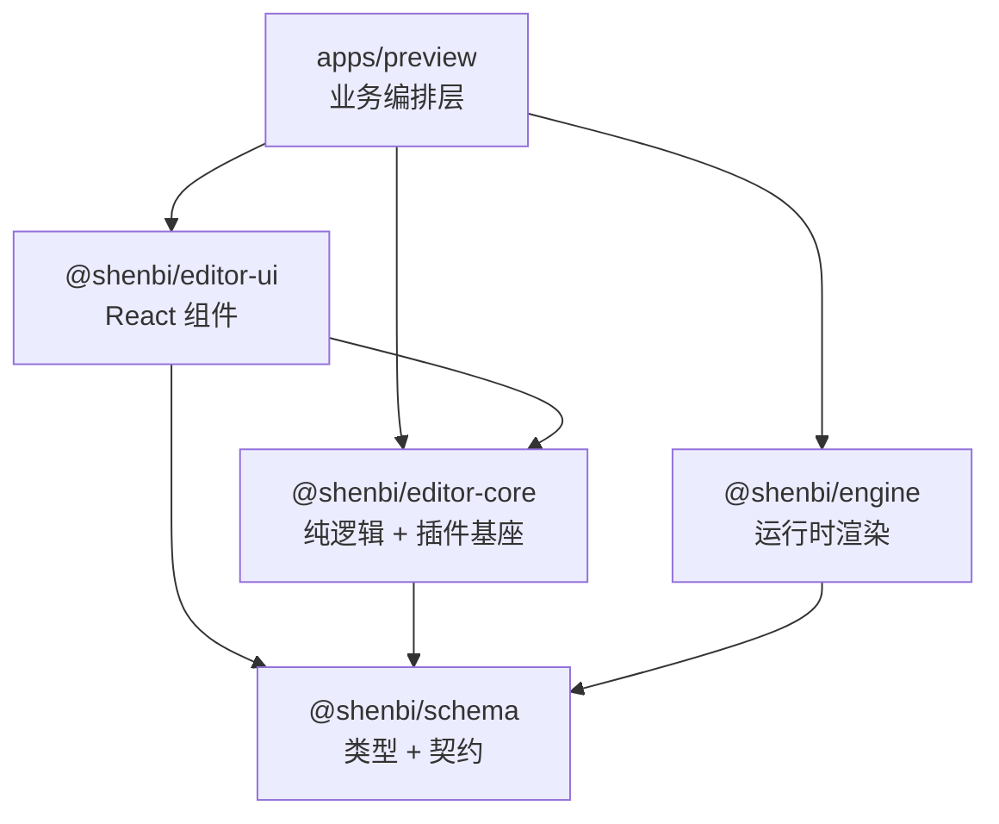
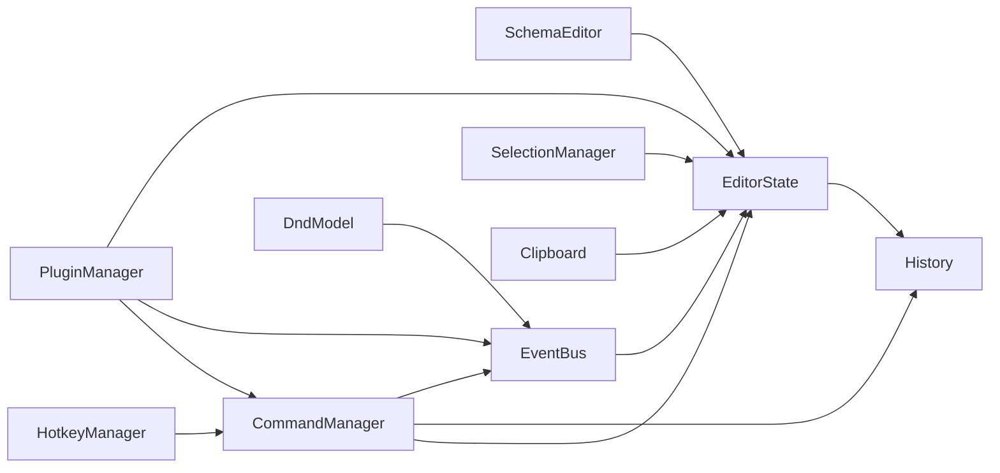

# Shenbi Editor 开发计划

建议执行顺序如下（调整版）：

Phase 0.5 -> Phase 1-MVP -> AI 并行接入 -> Phase 2 -> Phase 3 -> Phase 3.5

- Phase 0.5：Preview 增加 `shell mode`（兼容过渡，不立即移除多场景）
- Phase 1-MVP：先抽最小闭环核心（`schema-editor`/`editor-state`/`history`/`command`/`create-editor`）
- AI 并行接入：先冻结 AI 接口，避免等到全面插件化后再接导致接口漂移
- Phase 2：迁移 `editor-ui`（先增后删，保留兼容窗口）
- Phase 3：分层插件化（Inspector -> Sidebar -> ActivityBar）
- Phase 3.5：移除过渡适配层与旧入口，完成收口

> 本文档后续内容如与本段冲突，以本段为准。

## 目录

1. [架构总览](#一架构总览)
2. [Phase 0.5：Preview 兼容空壳模式](#二phase-05preview-兼容空壳模式)
3. [AI 接口冻结与适配层](#三ai-接口冻结与适配层)
4. [Phase 1-MVP：@shenbi/editor-core](#四phase-1-mvp-shenbi-editor-core)
5. [Phase 2：@shenbi/editor-ui](#五phase-2shenbi-editor-ui)
6. [Phase 3：分层插件化](#六phase-3分层插件化)
7. [并行开发与分支策略](#七并行开发与分支策略)
8. [验证计划 + DoD + 回滚策略](#八验证计划--dod--回滚策略)

---

## 一、架构总览

### 包依赖关系



### editor-core 内部模块拓扑



### 当前需要改造的硬编码点

| 文件 | 硬编码内容 | Phase 3 改造方案 |
|------|-----------|-----------------|
| [Inspector.tsx](file:///c:/Users/zk/Code/lowcode/shenbi-codes/shenbi/apps/preview/src/ui/Inspector.tsx) L32-36 | 5 个 Tab 固定写死 | `useContributions('inspector')` |
| [Sidebar.tsx](file:///c:/Users/zk/Code/lowcode/shenbi-codes/shenbi/apps/preview/src/ui/Sidebar.tsx) L27-41 | 3 个 Tab 固定写死 | `useContributions('sidebar')` |
| [ActivityBar.tsx](file:///c:/Users/zk/Code/lowcode/shenbi-codes/shenbi/apps/preview/src/ui/ActivityBar.tsx) L25-29 | 6 个图标固定写死 | `useContributions('activityBar')` |
| [AppShell.tsx](file:///c:/Users/zk/Code/lowcode/shenbi-codes/shenbi/apps/preview/src/ui/AppShell.tsx) L146-209 | Panel 插槽全部硬编码 | LayoutSlot 注册表 |
| [SetterPanel.tsx](file:///c:/Users/zk/Code/lowcode/shenbi-codes/shenbi/apps/preview/src/panels/SetterPanel.tsx) L5-14 | 5 个 `onPatch*` 回调 | `commands.execute()` |

---

## 二、Phase 0.5：Preview 兼容空壳模式

> **目的**：在不破坏现有多场景验收入口的前提下，引入 `shell mode`，让 AI 分支可以并行接入。

### 改动清单

#### [MODIFY] [App.tsx](file:///c:/Users/zk/Code/lowcode/shenbi-codes/shenbi/apps/preview/src/App.tsx)

**当前状态**（~227 行）：
- 管理 7 个场景 schema（user-management, form-list, tabs-detail 等）
- 场景下拉切换
- ScenarioRuntimeView 渲染

**目标状态（兼容过渡）**：

```tsx
const emptySchema: PageSchema = { id: 'page', name: 'page', body: [] };

export function App() {
  // 兼容模式：保留多场景 + shell mode
  const isShellMode = useMemo(() => getShellModeFromUrlOrFlag(), []);
  const [schema, setSchema] = useState<PageSchema>(
    isShellMode ? emptySchema : scenarioSchemas.userManagement,
  );
  const [selectedNodeId, setSelectedNodeId] = useState<string>();

  // 保留编辑器功能
  const treeNodes = useMemo(() => buildEditorTree(schema), [schema]);
  const selectedNode = useMemo(
    () => getSchemaNodeByTreeId(schema, selectedNodeId),
    [schema, selectedNodeId],
  );
  const selectedContract = useMemo(
    () => selectedNode ? getBuiltinContract(selectedNode.component) : undefined,
    [selectedNode],
  );

  // schema + setSchema 可传递给 AI 组件
  return (
    <AppShell
      sidebarProps={{ contracts: builtinContracts, treeNodes, onSelectNode: setSelectedNodeId, selectedNodeId }}
      inspectorProps={{ selectedNode, contract: selectedContract, onPatchProps: ..., ... }}
      onCanvasSelectNode={handleCanvasSelectNode}
    >
      <ScenarioRuntimeView schema={schema} />
    </AppShell>
  );
}
```

核心变化：
1. 保留多场景管理，同时新增 `shell mode` 开关（URL 参数或 feature flag）
2. `shell mode` 下使用单 `schema` + `setSchema` 状态
3. 保留所有编辑器功能（节点选择、属性修改、画布点击等）
4. `ScenarioRuntimeView` 保留不变
5. demo schema 文件保留（`src/schemas/`）供手动导入

#### 不动的文件

以下文件在 Phase 0.5 中**不改动**：

- `src/ui/*` — 所有 UI 组件保持原样
- `src/panels/*` — 所有面板保持原样
- `src/editor/schema-editor.ts` — 编辑器核心逻辑保持原样
- `src/hooks/*` — hooks 保持原样
- `src/styles/*` — 样式保持原样
- `src/schemas/*` — 保留但不自动加载
- `src/mock/*` — 保留

#### 验证标准

```bash
pnpm --filter @shenbi/preview type-check  # 通过
pnpm --filter @shenbi/preview test        # 通过（可能需更新 App.test.tsx）
pnpm --filter @shenbi/preview dev         # 默认多场景可用；shell mode 可切入
```

---

## 三、AI 接口冻结与适配层

> **目的**：不等 Phase 3 全面插件化，先冻结 AI 接口，避免并行开发期间接口反复改动。

### 3.1 冻结接口（v1）

```typescript
export interface EditorAIBridge {
  getSchema(): PageSchema;
  getSelectedNodeId(): string | undefined;
  execute(commandId: string, args?: unknown): void;
  subscribe(listener: () => void): () => void;
}
```

- AI 侧只依赖 `EditorAIBridge`，不直接操作 UI 组件或内部状态细节。
- 后续即使从回调模式迁移到插件模式，AI 侧只需替换适配层实现。

### 3.2 适配策略

- Phase 0.5~2：由 `apps/preview` 提供 bridge adapter。
- Phase 3 后：由 plugin context 提供 bridge adapter（接口保持不变）。
- 禁止 AI 分支直接耦合 `panels/*`、`ui/*` 内部实现。

---

## 四、Phase 1-MVP：@shenbi/editor-core

> **纯逻辑层**，零 UI 依赖，只依赖 `@shenbi/schema` 类型。

### 4.0 MVP 边界（先做 / 延后）

先做（阻断项）：
- `schema-editor.ts`（从 preview 迁移）
- `editor-state.ts`
- `history.ts`
- `command.ts`
- `create-editor.ts`

延后（非阻断项，放 Phase 1.x / 3）：
- `selection.ts`
- `clipboard.ts`
- `hotkeys.ts`
- `dnd.ts`
- `plugin.ts`（先保留最小注册能力，后续再做完整 contribution 体系）

说明：
- 目标是先跑通“状态管理 + 命令执行 + 撤销重做”的最小闭环。
- `history` 默认可先用快照方案落地，但建议命令层逐步收敛为 `patch/inversePatch`，避免后续大页面内存抖动。

### 5.1 包配置

#### [NEW] [packages/editor-core/package.json](file:///c:/Users/zk/Code/lowcode/shenbi-codes/shenbi/packages/editor-core/package.json)

```json
{
  "name": "@shenbi/editor-core",
  "version": "0.1.0",
  "type": "module",
  "main": "./src/index.ts",
  "types": "./src/index.ts",
  "exports": { ".": "./src/index.ts" },
  "scripts": {
    "type-check": "tsc -p tsconfig.json --noEmit",
    "test": "vitest run --passWithNoTests"
  },
  "dependencies": { "@shenbi/schema": "workspace:*" },
  "devDependencies": {
    "typescript": "^5.7.3",
    "vitest": "^2.1.9"
  }
}
```

#### [NEW] [packages/editor-core/tsconfig.json](file:///c:/Users/zk/Code/lowcode/shenbi-codes/shenbi/packages/editor-core/tsconfig.json)

继承根 tsconfig，paths 复用 workspace 约定。

### 4.2 模块详情

---

#### [NEW] `src/schema-editor.ts`

**来源**：从 [apps/preview/src/editor/schema-editor.ts](file:///c:/Users/zk/Code/lowcode/shenbi-codes/shenbi/apps/preview/src/editor/schema-editor.ts) 迁移，内容不变。

**导出**：

```typescript
// 类型
export interface EditorTreeNode { id, type, name, children?, isHidden? }

// 树操作
export function buildEditorTree(schema: PageSchema): EditorTreeNode[]
export function getSchemaNodeByTreeId(schema, treeId): SchemaNode | undefined
export function getTreeIdBySchemaNodeId(schema, nodeId): string | undefined
export function getDefaultSelectedNodeId(treeNodes): string | undefined

// 不可变 patch 操作
export function patchSchemaNodeProps(schema, treeId, patch): PageSchema
export function patchSchemaNodeEvents(schema, treeId, patch): PageSchema
export function patchSchemaNodeStyle(schema, treeId, patch): PageSchema
export function patchSchemaNodeLogic(schema, treeId, patch): PageSchema
export function patchSchemaNodeColumns(schema, treeId, columns): PageSchema
```

**测试**：从 [schema-editor.test.ts](file:///c:/Users/zk/Code/lowcode/shenbi-codes/shenbi/apps/preview/src/editor/schema-editor.test.ts) 迁移。

---

#### [NEW] `src/types.ts`

```typescript
/** 资源释放接口，所有注册操作返回 Disposable */
export interface Disposable {
  dispose(): void;
}

/** Contribution Points 扩展点类型 */
export interface PanelContribution {
  id: string;
  slot: 'sidebar' | 'inspector' | 'bottom' | 'ai';
  title: string;
  icon: string;
  order?: number;
  component: unknown; // React.ComponentType，core 层不直接引 React 类型
  when?: () => boolean;
}

export interface TabContribution {
  id: string;
  slot: 'sidebar' | 'inspector';
  label: string;
  icon?: string;
  order?: number;
  component: unknown;
  when?: () => boolean;
}

export interface ActivityBarContribution {
  id: string;
  icon: string;
  tooltip: string;
  order?: number;
  onClick?: () => void;
  badge?: () => number | string | undefined;
}
```

---

#### [NEW] `src/event-bus.ts`

**职责**：类型安全事件总线，模块间解耦通信。

```typescript
export type EditorEventMap = {
  'node:selected':     { nodeId: string };
  'node:deselected':   { nodeId: string };
  'schema:changed':    { schema: PageSchema };
  'command:executed':  { commandId: string };
  'history:pushed':    void;
  'history:undo':      void;
  'history:redo':      void;
  'plugin:activated':  { pluginId: string };
};

export class EventBus<T extends Record<string, unknown>> {
  private handlers: Map<keyof T, Set<Function>>;

  on<K extends keyof T>(event: K, handler: (payload: T[K]) => void): () => void;
  emit<K extends keyof T>(event: K, payload: T[K]): void;
  off<K extends keyof T>(event: K, handler: Function): void;
  clear(): void;
}
```

**测试用例**：
- on/emit 基本收发
- off 取消订阅
- 返回的 unsubscribe 函数正确取消
- clear 清除所有
- 不存在的事件 emit 不报错

---

#### [NEW] `src/editor-state.ts`

**职责**：编辑器状态中枢，管理 schema + 选中节点 + 发布订阅。

```typescript
export interface EditorStateSnapshot {
  schema: PageSchema;
  selectedNodeId?: string;
}

export class EditorState {
  constructor(initialSchema: PageSchema);

  // Schema
  getSchema(): PageSchema;
  setSchema(schema: PageSchema): void;

  // 选择
  getSelectedNodeId(): string | undefined;
  setSelectedNodeId(id: string | undefined): void;

  // 快照
  getSnapshot(): EditorStateSnapshot;
  restoreSnapshot(snapshot: EditorStateSnapshot): void;

  // 订阅
  subscribe(listener: (state: EditorStateSnapshot) => void): () => void;
}
```

每次 `setSchema` / `setSelectedNodeId` 时自动通知所有 subscriber。

**测试用例**：
- 初始状态正确
- setSchema 触发 subscriber
- setSelectedNodeId 触发 subscriber
- unsubscribe 后不再通知
- getSnapshot / restoreSnapshot 往返正确

---

#### [NEW] `src/history.ts`

**职责**：基于快照栈的 Undo/Redo，泛型设计可复用。

```typescript
export interface HistoryOptions {
  maxSize?: number;  // 默认 50
}

export class History<T> {
  constructor(initial: T, options?: HistoryOptions);

  push(state: T): void;      // 记录新快照（清除 redo 栈）
  undo(): T | undefined;     // 返回上一个快照，无则返回 undefined
  redo(): T | undefined;     // 返回下一个快照
  canUndo(): boolean;
  canRedo(): boolean;
  getCurrent(): T;
  clear(initial: T): void;   // 重置
  getSize(): number;          // 当前 undo 栈深度
}
```

**实现要点**：
- `undoStack: T[]` + `redoStack: T[]`
- `push()` 清空 `redoStack`
- 超过 `maxSize` 时丢弃最早的快照
- 使用 `structuredClone` 或引用直存（由调用方决定是否 clone）

**测试用例**：
- push → undo → redo 完整链路
- canUndo / canRedo 边界
- maxSize 超出时自动丢弃
- undo 后 push 清空 redo 栈
- clear 重置

---

#### [NEW] `src/command.ts`

**职责**：命令注册与执行，所有编辑操作标准化。

```typescript
export interface EditorCommand {
  id: string;
  label: string;
  icon?: string;
  execute(state: EditorState, args?: unknown): void;
  canExecute?(state: EditorState): boolean;
}

export class CommandManager {
  constructor(state: EditorState, history: History<EditorStateSnapshot>, eventBus: EventBus);

  register(command: EditorCommand): Disposable;
  execute(commandId: string, args?: unknown): void;
  has(commandId: string): boolean;
  getAll(): EditorCommand[];
}
```

**内置命令**（在 `src/commands/` 子目录或直接内联）：

| Command ID | 说明 |
|-----------|------|
| `editor.undo` | 撤销 |
| `editor.redo` | 重做 |
| `editor.delete` | 删除选中节点 |
| `editor.duplicate` | 复制选中节点 |
| `editor.copy` | 复制到剪贴板 |
| `editor.cut` | 剪切 |
| `editor.paste` | 粘贴 |
| `editor.selectAll` | 全选 |
| `node.patchProps` | 修改属性 |
| `node.patchStyle` | 修改样式 |
| `node.patchEvents` | 修改事件 |
| `node.patchLogic` | 修改逻辑 |
| `node.patchColumns` | 修改列配置 |

每次 `execute()` 自动：
1. 记录快照到 History
2. 执行命令
3. 通过 EventBus emit `command:executed`

**测试用例**：
- register + execute 基本流程
- execute 不存在的命令抛错
- canExecute 返回 false 时不执行
- execute 后 History 新增快照
- EventBus 收到 `command:executed` 事件

---

#### [NEW] `src/selection.ts`

**职责**：节点选区管理（单选/多选/范围选）。

```typescript
export class SelectionManager {
  constructor(state: EditorState, eventBus: EventBus);

  select(nodeId: string): void;          // 单选（清除其他）
  toggle(nodeId: string): void;          // Ctrl+Click 切换
  selectRange(fromId: string, toId: string, flatTree: string[]): void;  // Shift+Click
  selectAll(flatTree: string[]): void;
  clear(): void;
  getSelectedIds(): string[];
  isSelected(nodeId: string): boolean;
  getPrimary(): string | undefined;      // 主选中（最后选的）
}
```

**测试用例**：
- select 清除旧选区
- toggle 切换选中/取消
- selectAll 全选
- clear 清空
- EventBus 收到 `node:selected` / `node:deselected`

---

#### [NEW] `src/clipboard.ts`

**职责**：Schema 节点的复制/剪切/粘贴。

```typescript
export class Clipboard {
  copy(nodes: SchemaNode[]): void;
  cut(nodes: SchemaNode[]): void;        // 标记来源以便 paste 时删除
  paste(): SchemaNode[] | null;          // 返回 clone 的副本
  hasContent(): boolean;
  clear(): void;
  isCut(): boolean;
}
```

**实现要点**：
- 内部存储 `structuredClone` 后的副本
- `paste()` 每次返回新 clone，支持多次粘贴
- `cut` 后的首次 `paste` 标记 `isCut=true`，通知调用方删除原节点

---

#### [NEW] `src/hotkeys.ts`

**职责**：快捷键注册、分发、冲突检测。

```typescript
export interface HotkeyBinding {
  key: string;              // e.g. 'ctrl+z', 'meta+shift+d'
  commandId: string;
  label?: string;
  when?: () => boolean;     // 条件激活
}

export class HotkeyManager {
  constructor(commandManager: CommandManager);

  bind(binding: HotkeyBinding): Disposable;
  unbind(key: string): void;
  getBindings(): HotkeyBinding[];
  hasConflict(key: string): boolean;

  attach(target?: HTMLElement | Document): void;  // 默认 document
  detach(): void;
}
```

**性能设计**：

| 要点 | 实现 |
|------|------|
| 查找复杂度 | `Map<normalizedKey, HotkeyBinding>` — O(1) |
| 事件委托 | 单个 `keydown` listener 挂在 target 上 |
| key 标准化 | `normalizeKeyEvent(e)` 预计算，避免每次拼字符串 |
| when 短路 | 先查 Map 再求值 when，无匹配直接返回 |
| 避免冲突 | `hasConflict()` 在 bind 时检测 |
| passive | listener 使用 `{ passive: false }` 以便 `preventDefault` |

```typescript
// 内部实现要点
private handleKeyDown = (e: KeyboardEvent) => {
  const key = normalizeKeyEvent(e);       // "ctrl+z"
  const binding = this.bindingMap.get(key); // O(1)
  if (!binding) return;
  if (binding.when && !binding.when()) return;
  e.preventDefault();
  this.commandManager.execute(binding.commandId);
};
```

**内置热键**：

| 快捷键 | Command |
|--------|---------|
| `Ctrl+Z` | `editor.undo` |
| `Ctrl+Y` / `Ctrl+Shift+Z` | `editor.redo` |
| `Ctrl+C` | `editor.copy` |
| `Ctrl+X` | `editor.cut` |
| `Ctrl+V` | `editor.paste` |
| `Ctrl+D` | `editor.duplicate` |
| `Ctrl+A` | `editor.selectAll` |
| `Delete` / `Backspace` | `editor.delete` |

---

#### [NEW] `src/dnd.ts`

**职责**：拖拽逻辑数据层（与 UI 解耦）。

```typescript
export interface DragPayload {
  type: 'component-insert' | 'node-move';
  sourceNodeId?: string;
  componentType?: string;
}

export interface DropTarget {
  targetNodeId: string;
  position: 'before' | 'after' | 'inside';
}

export class DndModel {
  constructor(eventBus: EventBus);

  startDrag(payload: DragPayload): void;
  updateDrop(target: DropTarget | null): void;
  endDrag(): DropTarget | null;
  cancel(): void;
  isDragging(): boolean;
  getPayload(): DragPayload | null;
  getDropTarget(): DropTarget | null;
}
```

UI 层（Phase 2）会通过 HTML5 DnD API 或 pointer events 调用这些方法。

---

#### [NEW] `src/plugin.ts`

**职责**：插件生命周期管理 + PluginContext（DI 容器）+ Contribution 注册表。

```typescript
export interface EditorPlugin {
  id: string;
  name: string;
  activate(ctx: PluginContext): void;
  deactivate?(): void;
}

export interface PluginContext {
  // 核心服务
  state: EditorState;
  commands: CommandManager;
  eventBus: EventBus<EditorEventMap>;
  hotkeys: HotkeyManager;
  selection: SelectionManager;
  clipboard: Clipboard;

  // Contribution Points 注册
  registerPanel(contribution: PanelContribution): Disposable;
  registerTab(contribution: TabContribution): Disposable;
  registerActivityBarItem(contribution: ActivityBarContribution): Disposable;
  registerCommand(command: EditorCommand): Disposable;
  registerHotkey(binding: HotkeyBinding): Disposable;
}

export class PluginManager {
  constructor(deps: {
    state: EditorState;
    commands: CommandManager;
    eventBus: EventBus;
    hotkeys: HotkeyManager;
    selection: SelectionManager;
    clipboard: Clipboard;
  });

  register(plugin: EditorPlugin): void;
  activate(pluginId: string): void;
  activateAll(): void;
  deactivateAll(): void;

  // 查询已注册的 Contributions
  getPanels(slot?: string): PanelContribution[];
  getTabs(slot: string): TabContribution[];
  getActivityBarItems(): ActivityBarContribution[];
}
```

---

#### [NEW] `src/create-editor.ts`

**职责**：工厂函数，一键创建完整编辑器实例。

```typescript
export interface CreateEditorOptions {
  initialSchema?: PageSchema;
  plugins?: EditorPlugin[];
  historyMaxSize?: number;
}

export function createEditor(options?: CreateEditorOptions): {
  state: EditorState;
  history: History<EditorStateSnapshot>;
  commands: CommandManager;
  eventBus: EventBus<EditorEventMap>;
  hotkeys: HotkeyManager;
  selection: SelectionManager;
  clipboard: Clipboard;
  dnd: DndModel;
  plugins: PluginManager;
  destroy(): void;
}
```

---

#### [NEW] `src/index.ts`

```typescript
export * from './types';
export * from './schema-editor';
export * from './editor-state';
export * from './history';
export * from './command';
export * from './event-bus';
export * from './selection';
export * from './clipboard';
export * from './hotkeys';
export * from './dnd';
export * from './plugin';
export * from './create-editor';
```

---

## 五、Phase 2：@shenbi/editor-ui

> **React 组件层**，依赖 `editor-core` + `@shenbi/schema` + `lucide-react`。CSS 不打包，消费端提供 Tailwind。

### 4.1 包配置

#### [NEW] [packages/editor-ui/package.json](file:///c:/Users/zk/Code/lowcode/shenbi-codes/shenbi/packages/editor-ui/package.json)

```json
{
  "name": "@shenbi/editor-ui",
  "version": "0.1.0",
  "type": "module",
  "main": "./src/index.ts",
  "types": "./src/index.ts",
  "exports": { ".": "./src/index.ts" },
  "dependencies": {
    "@shenbi/schema": "workspace:*",
    "@shenbi/editor-core": "workspace:*",
    "lucide-react": "^0.575.0"
  },
  "peerDependencies": {
    "react": "^19.0.0",
    "react-dom": "^19.0.0"
  }
}
```

### 5.2 文件迁移清单

| 目标位置 | 来源 | 文件 |
|---------|------|------|
| `src/panels/` | `preview/src/panels/` | SetterPanel.tsx, ComponentPanel.tsx, SchemaTree.tsx, ActionPanel.tsx, PagePanel.tsx, index.ts |
| `src/shell/` | `preview/src/ui/` | AppShell.tsx, Sidebar.tsx, Inspector.tsx, TitleBar.tsx, ActivityBar.tsx, Console.tsx, StatusBar.tsx, EditorTabs.tsx, WorkbenchToolbar.tsx, AIPanel.tsx |
| `src/hooks/` | `preview/src/hooks/` | useResize.ts |
| `src/styles/` | `preview/src/styles/` | preview-ide.css |

### 5.3 新增文件

#### [NEW] `src/context/EditorProvider.tsx`

```tsx
import { createContext, useContext } from 'react';
import type { PluginContext } from '@shenbi/editor-core';

const EditorContext = createContext<PluginContext | null>(null);

export function EditorProvider({ editor, children }) {
  return (
    <EditorContext.Provider value={editor.plugins.getContext()}>
      {children}
    </EditorContext.Provider>
  );
}

export function useEditorContext(): PluginContext {
  const ctx = useContext(EditorContext);
  if (!ctx) throw new Error('useEditorContext must be used within EditorProvider');
  return ctx;
}
```

#### [NEW] `src/hooks/useEditor.ts`

```tsx
/** 获取 EditorState 的响应式 hook，state 变化自动 re-render */
export function useEditorState() {
  const ctx = useEditorContext();
  const [snapshot, setSnapshot] = useState(ctx.state.getSnapshot());
  useEffect(() => ctx.state.subscribe(setSnapshot), [ctx.state]);
  return snapshot;
}
```

#### [NEW] `src/hooks/useContributions.ts`

```tsx
/** 获取某个 slot 的已注册 Tab/Panel，用于动态渲染 */
export function useContributions<T>(slot: string): T[] { ... }
```

### 5.4 apps/preview 更新

#### [MODIFY] [package.json](file:///c:/Users/zk/Code/lowcode/shenbi-codes/shenbi/apps/preview/package.json)

```diff
 "dependencies": {
+  "@shenbi/editor-core": "workspace:*",
+  "@shenbi/editor-ui": "workspace:*",
   "@shenbi/engine": "workspace:*",
   "@shenbi/schema": "workspace:*",
```

#### [MODIFY] [App.tsx](file:///c:/Users/zk/Code/lowcode/shenbi-codes/shenbi/apps/preview/src/App.tsx)

```diff
-import { AppShell } from './ui/AppShell';
-import { buildEditorTree, ... } from './editor/schema-editor';
+import { AppShell, EditorProvider } from '@shenbi/editor-ui';
+import { createEditor, buildEditorTree, ... } from '@shenbi/editor-core';
```

#### [DELETE] 已迁移文件

- `src/editor/` → `@shenbi/editor-core`
- `src/panels/` → `@shenbi/editor-ui`
- `src/ui/` → `@shenbi/editor-ui`
- `src/hooks/` → `@shenbi/editor-ui`
- `src/styles/` → `@shenbi/editor-ui`

> [!TIP]
> 采用「先增后删」策略：Phase 2 第一个 PR 只增不删（改 import），第二个 PR 删旧文件。这样与 AI 分支不冲突。

---

## 六、Phase 3：分层插件化

> 所有 Panel/Tab/Icon 改为 Contribution Points 动态注册。

分层顺序（必须按顺序推进）：
1. 先改 `Inspector` 为动态 Tab（风险最小，收益最高）
2. 再改 `Sidebar` 为动态 Tab（验证左侧生态扩展）
3. 最后改 `ActivityBar` 为动态图标（全局导航改动最大）
4. `SetterPanel onPatch -> commands` 可提前落地，但需保留 fallback

### 6.1 UI 组件改造

**Inspector.tsx**：
```diff
-<TabItem label="Props" ... />
-<TabItem label="Style" ... />
-// ...硬编码 5 个 tab
+const tabs = useContributions<TabContribution>('inspector');
+{tabs.sort((a,b) => (a.order ?? 0) - (b.order ?? 0)).map(tab => (
+  <TabItem key={tab.id} label={tab.label} ... />
+))}
```

**Sidebar.tsx**：同理，`useContributions('sidebar')`。

**ActivityBar.tsx**：同理，`useContributions('activityBar')`。

**SetterPanel.tsx**：
```diff
-onPatchProps?.({ title: 'hello' });
+const { commands } = useEditorContext();
+commands.execute('node.patchProps', { title: 'hello' });
```

### 6.2 内置插件

现有功能以内置插件形式提供（向下兼容）：

```typescript
// builtin-plugins.ts
export const builtinPlugins: EditorPlugin[] = [
  {
    id: 'builtin.inspector.props',
    name: 'Props Inspector Tab',
    activate(ctx) {
      ctx.registerTab({
        id: 'inspector-props', slot: 'inspector',
        label: 'Props', order: 1,
        component: PropsSetter,
      });
    },
  },
  // ... style, events, logic, actions
  // ... sidebar 的 components, outline, data
  // ... activityBar 的 6 个图标
  // ... 所有内置热键
];
```

### 6.3 AI 插件接入

AI 分支开发完成后，只需添加：

```typescript
export const aiPlugin: EditorPlugin = {
  id: 'shenbi.ai-page-gen',
  name: 'AI Page Generator',
  activate(ctx) {
    ctx.registerPanel({
      id: 'ai-panel', slot: 'ai',
      title: 'AI 生成', icon: 'Sparkles',
      component: AIPageGenerator,
    });
    ctx.registerCommand({
      id: 'ai.generate', label: 'AI 生成页面',
      execute: (state) => { /* ... */ },
    });
    ctx.registerHotkey({ key: 'ctrl+shift+g', commandId: 'ai.generate' });
  },
};
```

在 `App.tsx` 中：
```typescript
const editor = createEditor({ plugins: [...builtinPlugins, aiPlugin] });
```

---

## 七、并行开发与分支策略

```
main ──────┬────────────────────────────────────────────►
           │
           ├─ feature/editor-shell-mode ── Phase 0.5 ── merge ─►
           │                                           │
           │                                           ├─ feature/ai-page-gen
           │                                           │    仅依赖 EditorAIBridge
           │                                           │
           │                                           ├─ feature/editor-core-mvp
           │                                           │    Phase 1-MVP
           │                                           │
           │                                           ├─ feature/editor-ui-migrate
           │                                           │    Phase 2（先增后删）
           │                                           │
           │                                           └─ feature/editor-plugins
           │                                                Phase 3（分层推进）
           │
           └─ feature/editor-cleanup ── Phase 3.5（收口）──►
```

**冲突规避原则**：
- Editor 分支：先增后删
- AI 分支：新代码放 `src/ai/`，不改 `panels/`、`ui/` 已有文件
- AI 只依赖 `EditorAIBridge`，禁止直接引用 preview 内部面板实现
- 统一以 `commands.execute()` 作为跨层修改入口，减少并发改动冲突

---

## 八、验证计划 + DoD + 回滚策略

### 8.1 验证命令

| Phase | 验证命令 | 预期 |
|-------|---------|------|
| 0.5 | `pnpm --filter @shenbi/preview type-check` | ✅ |
| 0.5 | `pnpm --filter @shenbi/preview test` | ✅ |
| 0.5 | `pnpm --filter @shenbi/preview dev` | 默认多场景可用；shell mode 可用 |
| 1-MVP | `pnpm --filter @shenbi/editor-core type-check` | ✅ |
| 1-MVP | `pnpm --filter @shenbi/editor-core test` | 核心模块单测通过 |
| 2 | `pnpm --filter @shenbi/editor-ui type-check` | ✅ |
| 2 | `pnpm --filter @shenbi/preview test` | ✅（迁移后无功能退化） |
| 3 | 同上 + 手动验证 contribution 注册 | Inspector/Sidebar/ActivityBar 分层生效 |
| 3.5 | `pnpm -r type-check && pnpm -r test` | ✅（收口后回归） |

### 8.2 DoD（Definition of Done）

| Phase | DoD |
|------|-----|
| 0.5 | 现有多场景链路可用；shell mode 可切入；无回归 |
| 1-MVP | 完成最小闭环（state/history/command/create-editor/schema-editor）；接口文档齐全 |
| 2 | `editor-ui` 接入后通过回归，旧实现保留一个兼容窗口 |
| 3 | 三层插件化按顺序落地，Setter 改走 command（保留 fallback） |
| 3.5 | 移除过渡 adapter/旧入口，代码路径收敛，文档同步 |

### 8.3 回滚策略

- Phase 0.5：通过 `shell mode` 开关回退到原多场景入口。
- Phase 1/2：保留旧 `preview` 实现一个兼容周期，必要时回切 import。
- Phase 3：每层插件化独立开关，支持按层回退（不一次性回滚全量）。
- Phase 3.5：仅在回归全绿后删除旧路径，删除前保留临时 tag。
