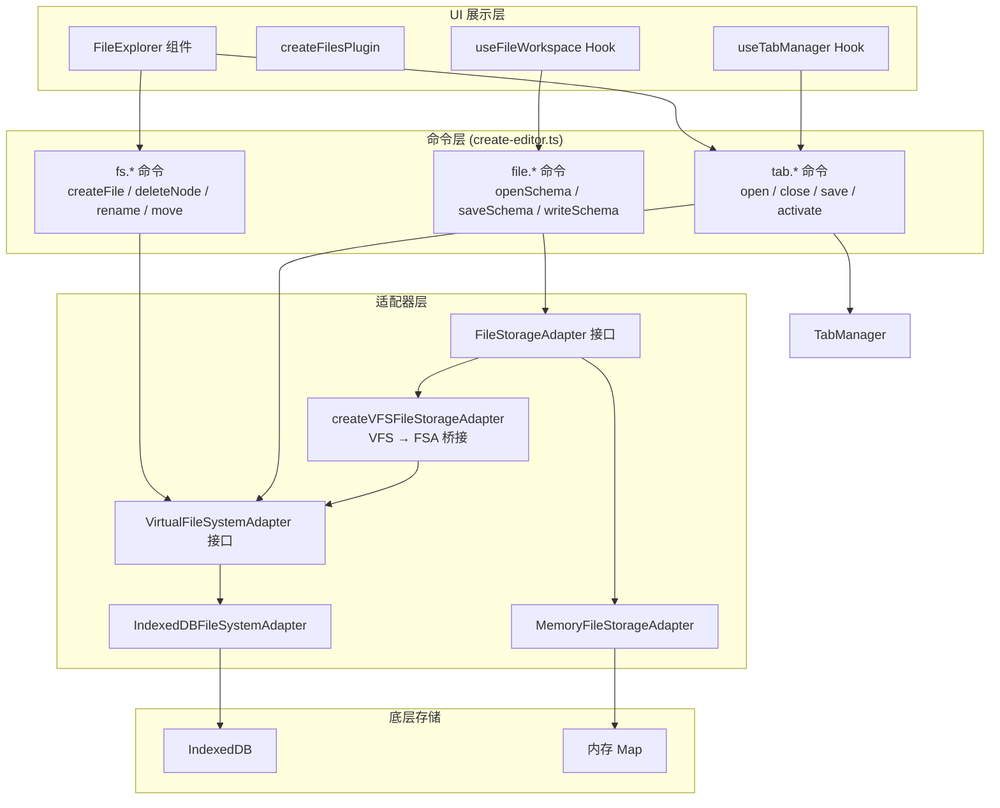

# Shenbi 文件系统架构全景

## 概览

Shenbi 编辑器的文件系统分为 **三层架构**：底层存储适配器 → 命令层 → UI 展示层。



---

## 1. 底层适配器层

### 1.1 [VirtualFileSystemAdapter](file:///d:/Code/lowcode/shenbi-codes/shenbi-gitlab-filesystem-push/packages/editor-core/src/adapters/virtual-fs.ts#3-40) 接口

> [virtual-fs.ts](file:///d:/Code/lowcode/shenbi-codes/shenbi-gitlab-filesystem-push/packages/editor-core/src/adapters/virtual-fs.ts)

完整的虚拟文件系统抽象，支持树形目录结构：

| 方法 | 说明 |
|------|------|
| [initialize(projectId)](file:///d:/Code/lowcode/shenbi-codes/shenbi-gitlab-filesystem-push/packages/editor-core/src/adapters/indexeddb-fs.ts#164-182) | 初始化项目 |
| [listTree(projectId)](file:///d:/Code/lowcode/shenbi-codes/shenbi-gitlab-filesystem-push/packages/editor-core/src/adapters/virtual-fs.ts#5-6) | 获取所有节点的扁平列表 |
| [createFile(projectId, parentId, name, fileType, content)](file:///d:/Code/lowcode/shenbi-codes/shenbi-gitlab-filesystem-push/packages/editor-core/src/adapters/indexeddb-fs.ts#191-234) | 创建文件 |
| `readFile / writeFile / deleteFile` | 文件 CRUD |
| `createDirectory / deleteDirectory` | 目录 CRUD（支持递归删除） |
| `rename / move` | 重命名和移动节点 |
| `getNode / getNodeByPath` | 按 ID 或路径查询节点 |

### 1.2 [FileStorageAdapter](file:///d:/Code/lowcode/shenbi-codes/shenbi-gitlab-filesystem-push/packages/editor-core/src/adapters/file-storage.ts#56-63) 接口（Legacy）

> [file-storage.ts](file:///d:/Code/lowcode/shenbi-codes/shenbi-gitlab-filesystem-push/packages/editor-core/src/adapters/file-storage.ts)

扁平的文件存储接口，不支持目录结构，仅有 `list / read / write / saveAs / delete`。

**关键类型定义：**
- **[FileType](file:///d:/Code/lowcode/shenbi-codes/shenbi-gitlab-filesystem-push/packages/editor-core/src/adapters/file-storage.ts#7-8)**: `'page' | 'api' | 'flow' | 'db' | 'dict'`，每种类型有对应扩展名 (`.page.json` 等)
- **[FSNodeMetadata](file:///d:/Code/lowcode/shenbi-codes/shenbi-gitlab-filesystem-push/packages/editor-core/src/adapters/file-storage.ts#21-33)**: 节点元数据，含 `id / name / type / fileType / parentId / path / sortOrder`
- **[FSTreeNode](file:///d:/Code/lowcode/shenbi-codes/shenbi-gitlab-filesystem-push/packages/editor-core/src/adapters/file-storage.ts#36-44)**: 树形结构节点，含 `children`
- **[MemoryFileStorageAdapter](file:///d:/Code/lowcode/shenbi-codes/shenbi-gitlab-filesystem-push/packages/editor-core/src/adapters/file-storage.ts#82-125)**: 内存实现，用于测试和 scenarios 模式

### 1.3 [IndexedDBFileSystemAdapter](file:///d:/Code/lowcode/shenbi-codes/shenbi-gitlab-filesystem-push/packages/editor-core/src/adapters/indexeddb-fs.ts#153-570)

> [indexeddb-fs.ts](file:///d:/Code/lowcode/shenbi-codes/shenbi-gitlab-filesystem-push/packages/editor-core/src/adapters/indexeddb-fs.ts) (570 行)

[VirtualFileSystemAdapter](file:///d:/Code/lowcode/shenbi-codes/shenbi-gitlab-filesystem-push/packages/editor-core/src/adapters/virtual-fs.ts#3-40) 的 **生产实现**，使用浏览器 IndexedDB 存储：

- **数据库名**: `shenbi-vfs-{projectId}`
- **两个 ObjectStore**:
  - `fs_nodes`: 存节点元数据，索引 `by-parent` 和 `by-path`
  - `fs_content`: 存文件内容，以 `fileId` 为主键
- **排序机制**: [move](file:///d:/Code/lowcode/shenbi-codes/shenbi-gitlab-filesystem-push/packages/editor-core/src/adapters/virtual-fs.ts#29-35) 操作支持 `afterNodeId` 参数，使用 `sortOrder` 字段实现拖拽排序，包含间距耗尽时的重新归一化逻辑
- **初始化时**清除旧版 localStorage 数据（[removeLegacyFiles](file:///d:/Code/lowcode/shenbi-codes/shenbi-gitlab-filesystem-push/packages/editor-core/src/adapters/indexeddb-fs.ts#132-148)）

### 1.4 [createVFSFileStorageAdapter](file:///d:/Code/lowcode/shenbi-codes/shenbi-gitlab-filesystem-push/packages/editor-core/src/create-editor.ts#242-280) 桥接函数

> [create-editor.ts:242-279](file:///d:/Code/lowcode/shenbi-codes/shenbi-gitlab-filesystem-push/packages/editor-core/src/create-editor.ts#L242-L279)

将 VFS 适配器包装为 legacy [FileStorageAdapter](file:///d:/Code/lowcode/shenbi-codes/shenbi-gitlab-filesystem-push/packages/editor-core/src/adapters/file-storage.ts#56-63)，使旧的 `file.*` 命令能透传到 VFS 后端。

### 1.5 [buildFSTree](file:///d:/Code/lowcode/shenbi-codes/shenbi-gitlab-filesystem-push/packages/editor-core/src/adapters/fs-tree-utils.ts#13-86) 工具函数

> [fs-tree-utils.ts](file:///d:/Code/lowcode/shenbi-codes/shenbi-gitlab-filesystem-push/packages/editor-core/src/adapters/fs-tree-utils.ts)

将 `FSNodeMetadata[]` 扁平列表构建为 `FSTreeNode[]` 嵌套树。排序规则：**目录优先 → sortOrder → 名称字典序**。

---

## 2. 命令层

### 2.1 `file.*` 命令（传统文件操作）

> [create-editor.ts:326-703](file:///d:/Code/lowcode/shenbi-codes/shenbi-gitlab-filesystem-push/packages/editor-core/src/create-editor.ts#L326-L703) — [registerBuiltinCommands](file:///d:/Code/lowcode/shenbi-codes/shenbi-gitlab-filesystem-push/packages/editor-core/src/create-editor.ts#326-704)

通过 [FileStorageAdapter](file:///d:/Code/lowcode/shenbi-codes/shenbi-gitlab-filesystem-push/packages/editor-core/src/adapters/file-storage.ts#56-63) 操作文件，不感知目录结构：

| 命令 ID | 功能 |
|---------|------|
| `file.listSchemas` | 列出所有文件 |
| `file.openSchema` | 打开文件并替换当前 schema |
| `file.readSchema` | 只读取文件内容 |
| `file.saveSchema` | 保存当前 schema 到文件 |
| `file.writeSchema` | 写入指定文件（不切换当前文件） |
| `file.saveAs` | 另存为新文件 |
| `file.deleteSchema` | 删除文件 |

### 2.2 `fs.*` 命令（VFS 文件系统操作）

> [create-editor.ts:705-872](file:///d:/Code/lowcode/shenbi-codes/shenbi-gitlab-filesystem-push/packages/editor-core/src/create-editor.ts#L705-L872) — [registerVFSCommands](file:///d:/Code/lowcode/shenbi-codes/shenbi-gitlab-filesystem-push/packages/editor-core/src/create-editor.ts#705-873)

直接操作 VFS 适配器，支持完整的文件系统语义：

| 命令 ID | 功能 | 触发事件 |
|---------|------|---------|
| `fs.createFile` | 创建文件 | `fs:nodeCreated` + `fs:treeChanged` |
| `fs.createDirectory` | 创建目录 | `fs:nodeCreated` + `fs:treeChanged` |
| `fs.deleteNode` | 删除节点（自动关闭关联 tab） | `fs:nodeDeleted` + `fs:treeChanged` |
| `fs.rename` | 重命名 | `fs:nodeRenamed` + `fs:treeChanged` |
| `fs.move` | 移动（支持 afterNodeId 排序） | `fs:nodeMoved` + `fs:treeChanged` |
| `fs.refreshTree` | 刷新文件树 | `fs:treeChanged` |
| `fs.readFile / fs.writeFile` | 读写文件内容 | — |
| `fs.listTree` | 列出文件树 | — |

### 2.3 `tab.*` 命令

> [create-editor.ts:874+](file:///d:/Code/lowcode/shenbi-codes/shenbi-gitlab-filesystem-push/packages/editor-core/src/create-editor.ts#L874) — [registerTabCommands](file:///d:/Code/lowcode/shenbi-codes/shenbi-gitlab-filesystem-push/packages/editor-core/src/create-editor.ts#874-1200)

管理多标签页编辑功能，由 [TabManager](file:///d:/Code/lowcode/shenbi-codes/shenbi-gitlab-filesystem-push/packages/editor-core/src/tab-manager.ts#25-187) 类驱动：

| 命令 ID | 功能 |
|---------|------|
| `tab.open` | 打开文件到新标签页（或激活已有标签） |
| `tab.close` | 关闭标签页 |
| `tab.activate` | 切换到指定标签页 |
| `tab.save` | 保存当前标签页内容到 VFS |
| `tab.syncState` | 同步标签页状态（schema/dirty/generating） |
| `tab.closeOthers / closeAll / closeSaved` | 批量关闭 |

### 2.4 [TabManager](file:///d:/Code/lowcode/shenbi-codes/shenbi-gitlab-filesystem-push/packages/editor-core/src/tab-manager.ts#25-187)

> [tab-manager.ts](file:///d:/Code/lowcode/shenbi-codes/shenbi-gitlab-filesystem-push/packages/editor-core/src/tab-manager.ts) (187 行)

纯逻辑状态管理，基于发布-订阅模式：
- 维护 `tabs: Map<string, TabState>` + `tabOrder: string[]` + `activeTabId`
- [TabState](file:///d:/Code/lowcode/shenbi-codes/shenbi-gitlab-filesystem-push/packages/editor-core/src/tab-manager.ts#4-17) 包含 `fileId / filePath / fileType / fileName / schema / isDirty / isGenerating / readOnlyReason`
- 支持快照 [getSnapshot() / restoreSnapshot()](file:///d:/Code/lowcode/shenbi-codes/shenbi-gitlab-filesystem-push/packages/editor-core/src/tab-manager.ts#105-111) 用于持久化

---

## 3. UI 展示层

### 3.1 [FileExplorer](file:///d:/Code/lowcode/shenbi-codes/shenbi-gitlab-filesystem-push/packages/editor-plugins/files/src/FileExplorer.tsx#740-1180) 组件

> [FileExplorer.tsx](file:///d:/Code/lowcode/shenbi-codes/shenbi-gitlab-filesystem-push/packages/editor-plugins/files/src/FileExplorer.tsx) (1180 行)

VS Code 风格的文件树 UI 组件，功能完整：

- **树形渲染**: 递归 [TreeNodeItem](file:///d:/Code/lowcode/shenbi-codes/shenbi-gitlab-filesystem-push/packages/editor-plugins/files/src/FileExplorer.tsx#354-611)，支持展开/折叠、缩进引导线
- **文件类型图标**: 5 种文件类型（page/api/flow/db/dict）各有独立图标和颜色
- **右键上下文菜单**: 新建文件（子菜单选文件类型）、新建文件夹、重命名、删除
- **内联创建/重命名**: [InlineCreateInput](file:///d:/Code/lowcode/shenbi-codes/shenbi-gitlab-filesystem-push/packages/editor-plugins/files/src/FileExplorer.tsx#263-325) 组件，回车确认、Esc 取消、失焦提交
- **拖拽排序**: HTML5 Drag & Drop，支持 before/after/inside 三种放置区域
- **键盘导航**: 方向键上下导航、左右展开折叠、Enter 打开/重命名、Delete 删除、F2 重命名
- **Dirty 状态**: 未保存文件显示斜体名称 + 圆点标记
- **删除确认**: 自定义 Dialog（非浏览器原生 confirm）
- **展开/聚焦状态持久化**: 通过 `onExpandedIdsChange / onFocusedIdChange` 回调外部保存

### 3.2 [createFilesPlugin](file:///d:/Code/lowcode/shenbi-codes/shenbi-gitlab-filesystem-push/packages/editor-plugins/files/src/plugin.tsx#23-63)

> [plugin.tsx](file:///d:/Code/lowcode/shenbi-codes/shenbi-gitlab-filesystem-push/packages/editor-plugins/files/src/plugin.tsx)

将文件管理注册为编辑器插件：
- 在 ActivityBar 添加 📂 图标按钮（order: 5）
- 注册 PrimaryPanel 显示 FileExplorer 或 FilePanel
- 支持 [renderPrimaryPanel](file:///d:/Code/lowcode/shenbi-codes/shenbi-gitlab-filesystem-push/apps/preview/src/App.tsx#973-994) 自定义渲染（用于注入 FileExplorer）

### 3.3 [useFileWorkspace](file:///d:/Code/lowcode/shenbi-codes/shenbi-gitlab-filesystem-push/packages/editor-plugins/files/src/use-file-workspace.ts#94-406) Hook

> [use-file-workspace.ts](file:///d:/Code/lowcode/shenbi-codes/shenbi-gitlab-filesystem-push/packages/editor-plugins/files/src/use-file-workspace.ts) (406 行)

文件工作区管理 Hook，提供：
- 文件列表刷新（`file.listSchemas`）
- 保存/另存为/撤销/重做
- Ctrl+S / Ctrl+Z / Ctrl+Shift+Z 快捷键绑定
- 离开页面前未保存提示（`beforeunload`）
- 状态文本（idle / saved / opened / error）

---

## 4. 集成层 ([App.tsx](file:///d:/Code/lowcode/shenbi-codes/shenbi-gitlab-filesystem-push/apps/preview/src/App.tsx))

> [App.tsx](file:///d:/Code/lowcode/shenbi-codes/shenbi-gitlab-filesystem-push/apps/preview/src/App.tsx) (1254 行)

[App.tsx](file:///d:/Code/lowcode/shenbi-codes/shenbi-gitlab-filesystem-push/apps/preview/src/App.tsx) 是所有文件系统组件的集成点：

```
初始化流程:
1. 创建 IndexedDBFileSystemAdapter 实例 (vfs)
2. 创建 TabManager 实例
3. vfs.initialize(PREVIEW_PROJECT_ID) → setVfsInitialized(true)
4. createEditor({ vfs, tabManager, projectId }) → 注册所有 fs.*/tab.*/file.* 命令
5. 恢复持久化的 shell session (tabs + expandedIds + focusedId)
6. 加载文件树 → buildFSTree → setFsTree
```

**关键状态：**
- `fsTree`（FSTreeNode[]）→ 传给 FileExplorer
- `tabSnapshot`（TabManagerSnapshot）→ 传给 AppShell 的标签栏
- `fileExplorerExpandedIds` / `fileExplorerFocusedId` → 持久化展开/聚焦状态

**文件操作回调链路**（以打开文件为例）:
1. 用户在 FileExplorer 点击文件 → `handleOpenFileFromTree(fileId)`
2. → `fileEditor.commands.execute('tab.open', { fileId })`
3. → VFS [readFile](file:///d:/Code/lowcode/shenbi-codes/shenbi-gitlab-filesystem-push/apps/preview/src/App.tsx#710-713) 获取内容 → TabManager 打开标签 → 恢复 EditorState
4. → EventBus 触发 `tab:activated` → UI 更新

**filesystemService**（提供给插件上下文）：
- `createFile / readFile / writeFile` 三个方法
- AI Chat 插件通过此服务直接操作 VFS

---

## 5. 文件类型体系

| FileType | 扩展名 | 图标 | 颜色 | 说明 |
|----------|--------|------|------|------|
| `page` | `.page.json` | FileCode | 蓝色 #519aba | 页面 Schema |
| `api` | `.api.json` | FileJson | 绿色 #4ade80 | API 配置 |
| `flow` | `.flow.json` | Workflow | 紫色 #c084fc | 流程定义 |
| [db](file:///d:/Code/lowcode/shenbi-codes/shenbi-gitlab-filesystem-push/packages/editor-core/src/adapters/indexeddb-fs.ts#20-23) | `.db.json` | Database | 黄色 #facc15 | 数据表 |
| `dict` | `.dict.json` | BookOpen | 橙色 #fb923c | 字典 |

---

## 6. 关键模块文件索引

| 模块 | 文件路径 |
|------|---------|
| VFS 接口 | [virtual-fs.ts](file:///d:/Code/lowcode/shenbi-codes/shenbi-gitlab-filesystem-push/packages/editor-core/src/adapters/virtual-fs.ts) |
| FileStorageAdapter | [file-storage.ts](file:///d:/Code/lowcode/shenbi-codes/shenbi-gitlab-filesystem-push/packages/editor-core/src/adapters/file-storage.ts) |
| IndexedDB 实现 | [indexeddb-fs.ts](file:///d:/Code/lowcode/shenbi-codes/shenbi-gitlab-filesystem-push/packages/editor-core/src/adapters/indexeddb-fs.ts) |
| 树构建工具 | [fs-tree-utils.ts](file:///d:/Code/lowcode/shenbi-codes/shenbi-gitlab-filesystem-push/packages/editor-core/src/adapters/fs-tree-utils.ts) |
| 命令注册 | [create-editor.ts](file:///d:/Code/lowcode/shenbi-codes/shenbi-gitlab-filesystem-push/packages/editor-core/src/create-editor.ts) |
| TabManager | [tab-manager.ts](file:///d:/Code/lowcode/shenbi-codes/shenbi-gitlab-filesystem-push/packages/editor-core/src/tab-manager.ts) |
| FileExplorer UI | [FileExplorer.tsx](file:///d:/Code/lowcode/shenbi-codes/shenbi-gitlab-filesystem-push/packages/editor-plugins/files/src/FileExplorer.tsx) |
| Files 插件 | [plugin.tsx](file:///d:/Code/lowcode/shenbi-codes/shenbi-gitlab-filesystem-push/packages/editor-plugins/files/src/plugin.tsx) |
| useFileWorkspace | [use-file-workspace.ts](file:///d:/Code/lowcode/shenbi-codes/shenbi-gitlab-filesystem-push/packages/editor-plugins/files/src/use-file-workspace.ts) |
| 集成入口 | [App.tsx](file:///d:/Code/lowcode/shenbi-codes/shenbi-gitlab-filesystem-push/apps/preview/src/App.tsx) |
