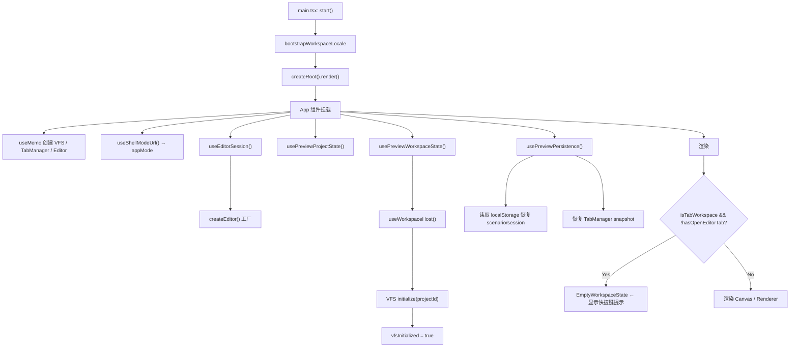
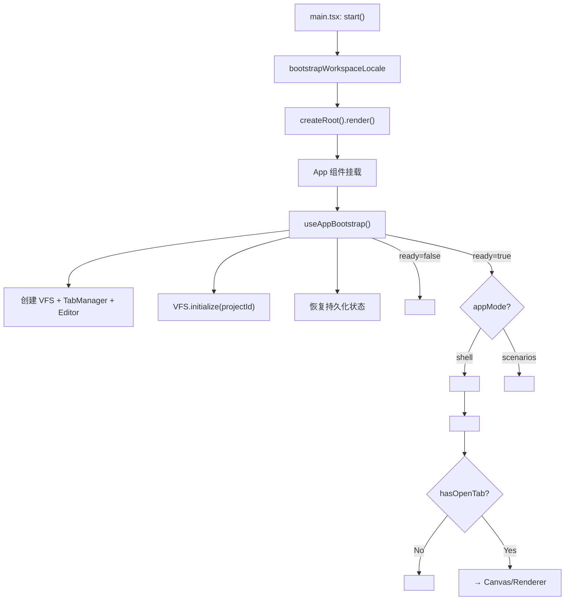

# 界面重构：理清初始进入流程

> Worktree: `shenbi-refactor-entry-ui` (`codex/refactor-entry-ui` 分支)
> 路径: `C:\Users\zhang\Code\LowCode\shenbi-codes\shenbi-refactor-entry-ui`

---

## 一、当前初始进入流程分析

### 启动链路



### 关键问题

| # | 问题 | 影响 |
|---|------|------|
| 1 | **App.tsx 502行承担过多职责** | 初始化逻辑、Scenario模式、Shell模式、toolbar、导出JSON、重置workspace、command策略全混在一起 |
| 2 | **两种模式代码交织** | `scenarios` 和 `shell` 模式的状态/分支逻辑散布在 App.tsx 中，条件判断多 |
| 3 | **AppShell.tsx 1793行** | 面板状态、插件收集、画布交互、快捷键、持久化、主题切换全混在一个组件 |
| 4 | **初始进入时串行等待多层异步** | locale → render → VFS init → persistence restore → 才能看到界面 |
| 5 | **EmptyWorkspaceState 硬编码在 AppShell 内** | 无法自定义初始欢迎页，不同模式无法展示不同内容 |
| 6 | **document ownership 复杂** | page文件由editor管、api文件由renderer管，两条路径都在AppShell里判断 |

---

## 二、重构目标

1. **理清启动流程**：明确 加载 → 初始化 → 恢复状态 → 渲染 各阶段
2. **分离模式入口**：Shell模式 和 Scenario模式 各有清晰的入口组件
3. **拆分 AppShell**：从 1793行 减到 ~500行，职责单一化
4. **改善初始体验**：初始进入时展示有意义的欢迎页，而非空白+快捷键

---

## 三、重构方案

### Phase 1: 启动层清理

**目标**: 把 `App.tsx` 从 502 行减到 ~150 行

```
apps/preview/src/
├── main.tsx                  ← 不变
├── App.tsx                   ← 简化为路由分发
├── modes/
│   ├── ShellMode.tsx         ← shell模式所有状态和逻辑
│   └── ScenarioMode.tsx      ← scenario模式所有状态和逻辑 (可后续做)
└── bootstrap/
    ├── useAppBootstrap.ts    ← 统一初始化：VFS、editor、persistence
    └── AppLoadingScreen.tsx  ← 加载中占位界面
```

#### App.tsx 重构后结构

```tsx
export function App() {
  const [appMode] = useShellModeUrl();
  const bootstrap = useAppBootstrap();   // VFS + editor + persistence

  if (!bootstrap.ready) {
    return <AppLoadingScreen />;          // 加载屏
  }

  if (appMode === 'scenarios') {
    return <ScenarioMode bootstrap={bootstrap} />;
  }

  return <ShellMode bootstrap={bootstrap} />;
}
```

### Phase 2: AppShell 拆分

**目标**: 从 1793 行减到 ~500 行

| 抽出模块 | 文件 | 职责 |
|---------|------|------|
| 面板状态管理 | `hooks/useShellLayout.ts` | sidebar/inspector/console/ai 的 show/hide/size/persist |
| 插件集成 | `hooks/useShellPlugins.ts` | 收集插件贡献、activity bar items、primary panels |
| 快捷键系统 | `hooks/useShellShortcuts.ts` | 快捷键匹配 + 执行 + command palette |
| 画布交互 | `hooks/useShellCanvas.ts` | selection overlay、context menu、pointer events |
| 命令系统 | `hooks/useShellCommands.ts` | hostCommands、menus、commandState |
| 初始欢迎页 | `ui/WelcomeScreen.tsx` | 替代 EmptyWorkspaceState，可按模式自定义 |

#### AppShell 重构后结构

```tsx
export function AppShell(props: AppShellProps) {
  const layout = useShellLayout(props);
  const plugins = useShellPlugins(props);
  const commands = useShellCommands(props, plugins);
  const shortcuts = useShellShortcuts(commands);
  const canvas = useShellCanvas(props, commands);

  return (
    <div className="h-screen w-screen flex flex-col">
      <TitleBar {...layout.titleBarProps} />
      <div className="flex-1 flex overflow-hidden">
        <ActivityBar {...plugins.activityBarProps} />
        {layout.showSidebar && <SidebarPanel {...layout.sidebarProps} />}
        <EditorArea
          canvas={canvas}
          commands={commands}
          layout={layout}
          plugins={plugins}
          tabs={props.tabs}
        />
        {layout.showInspector && <InspectorPanel {...layout.inspectorProps} />}
      </div>
      <StatusBar />
    </div>
  );
}
```

### Phase 3: 初始欢迎页

**现状**:
- 无 tab 时显示 `EmptyWorkspaceState`（仅快捷键列表 + logo）
- 没有引导用户下一步操作

**改进**: 引入 `WelcomeScreen` 组件

```
┌─────────────────────────────────────┐
│           Shenbi IDE Logo           │
│                                     │
│  ┌─ 快速操作 ────────────────────┐  │
│  │ 📄 新建页面    Ctrl+N         │  │
│  │ 📂 打开文件    Ctrl+O         │  │
│  │ 🤖 AI 生成页面 Ctrl+Shift+A   │  │
│  └───────────────────────────────┘  │
│                                     │
│  ┌─ 最近项目 ────────────────────┐  │
│  │ ✏️ Project A                   │  │
│  │ ✏️ Project B                   │  │
│  └───────────────────────────────┘  │
│                                     │
│  ┌─ 快捷键 ──────────────────────┐  │
│  │ Ctrl+Shift+P  命令面板        │  │
│  │ Ctrl+B        切换侧栏        │  │
│  │ ...                           │  │
│  └───────────────────────────────┘  │
└─────────────────────────────────────┘
```

---

## 四、文件影响清单

### 新建文件

| 文件 | 说明 |
|------|------|
| `apps/preview/src/modes/ShellMode.tsx` | Shell 模式入口，原 App.tsx 中 shell 相关逻辑 |
| `apps/preview/src/bootstrap/useAppBootstrap.ts` | 统一初始化 hook |
| `apps/preview/src/bootstrap/AppLoadingScreen.tsx` | 启动加载组件 |
| `packages/editor-ui/src/hooks/useShellLayout.ts` | 面板布局状态 |
| `packages/editor-ui/src/hooks/useShellPlugins.ts` | 插件收集 |
| `packages/editor-ui/src/hooks/useShellShortcuts.ts` | 快捷键管理 |
| `packages/editor-ui/src/hooks/useShellCanvas.ts` | 画布交互 |
| `packages/editor-ui/src/hooks/useShellCommands.ts` | 命令系统 |
| `packages/editor-ui/src/ui/WelcomeScreen.tsx` | 初始欢迎页 |

### 修改文件

| 文件 | 修改 |
|------|------|
| `apps/preview/src/App.tsx` | 大幅简化为路由分发 |
| `packages/editor-ui/src/ui/AppShell.tsx` | 逻辑抽到各 hook，保留组合层 |
| `packages/editor-ui/src/index.ts` | 导出新 hook |

### 不变文件

- `main.tsx` — 入口不变
- `usePreviewPersistence.ts` — 持久化逻辑不变
- `usePreviewPlugins.tsx` — preview 插件注册不变
- `useCanvasDocumentContext.ts` — 文档上下文不变
- 所有 `styles/` 文件 — CSS 不变

---

## 五、推荐执行顺序

> [!IMPORTANT]
> 每一步都应该保持功能等价，通过测试后再进行下一步

| 步骤 | 内容 | 风险 |
|------|------|------|
| **Step 1** | 创建 `useShellLayout.ts`，从 AppShell 抽出面板状态管理 | 🟢 低 |
| **Step 2** | 创建 `useShellCommands.ts`，抽出命令注册和状态解析 | 🟡 中 |
| **Step 3** | 创建 `useShellPlugins.ts`，抽出插件收集逻辑 | 🟢 低 |
| **Step 4** | 创建 `useShellCanvas.ts`，抽出画布交互 | 🟡 中 |
| **Step 5** | 创建 `useShellShortcuts.ts`，抽出快捷键匹配 | 🟢 低 |
| **Step 6** | 创建 `ShellMode.tsx`，从 App.tsx 抽出 shell 模式逻辑 | 🟡 中 |
| **Step 7** | 创建 `WelcomeScreen.tsx`，替代 EmptyWorkspaceState | 🟢 低 |
| **Step 8** | 创建 `useAppBootstrap.ts` + `AppLoadingScreen.tsx` | 🟢 低 |

---

## 六、初始进入流程（重构后）



> [!TIP]
> 重构后初始进入只有 3 层组件深度：App → ShellMode → AppShell，
> 而非现在的 App (所有逻辑) → AppShell (所有 UI)
